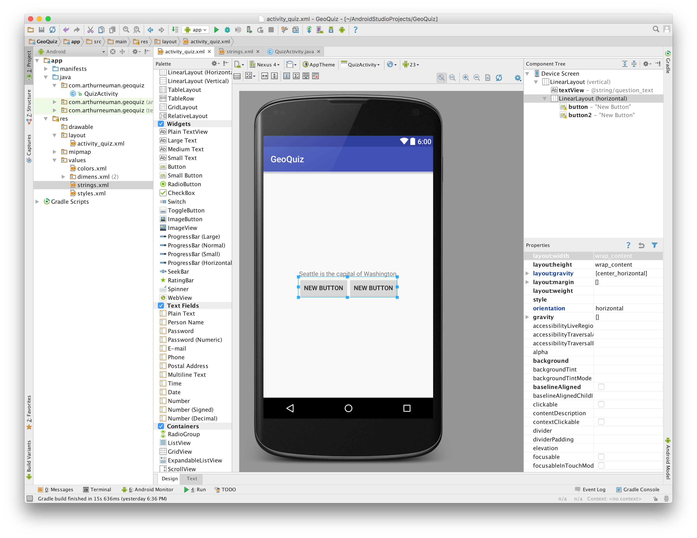
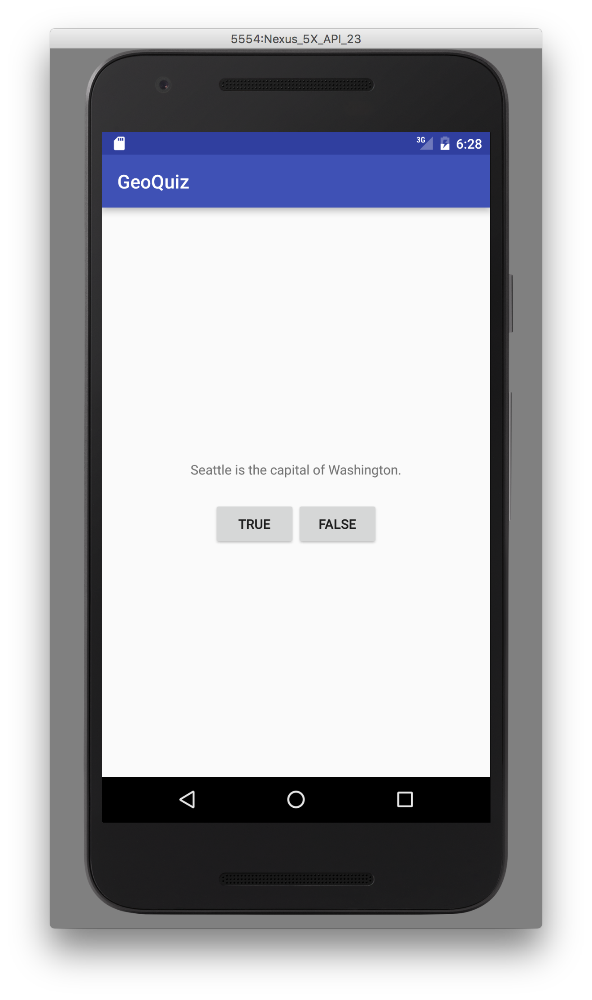

# Week 1 - Android Studio and Material Design

## Corresponding Text
*Android Programming*, pp. xxi-xxii, 1-29, 46-48
http://www.google.com/design/spec/material-design/introduction.html

##Android Studio
Android Studio is an integrated development environment (IDE) used to develop
Android applications.  Android Studio is based on the IntelliJ IDEA IDE and
most of Android Studio's features are available as an IntelliJ IDEA plugin.

### Download and Installation
Android Studio requires the Java Development Kit, which can be downloaded from
http://www.oracle.com/technetwork/java/javase/downloads/index.html.

Android Studio can be downloaded from https://developer.android.com/studio. The
Android Studio download page will provide installation instructions, which vary
depending on the operating system of the computer.

### Initial Configuration
After installing Android Studio, there is some initial configuration that must
be done before we can begin writing Android applications.  

When you start Android Studio for the first time, you will be presented with
the *Android Studio Setup Wizard*


Click **Next** to begin the setup process.  We'll use the standard settings;
with **Standard** selected, click **Next**.

On the next page of the setup wizard, we can select SDK components we'd like to
install.  Select all the available components, and click **Next**.


Click **Finish** to begin downloading and installing the SDK components.  When
installation is complete, click **Finish** again.

### Hello World!
The initial steps of developing a new application in Android Studio are similar
to the steps of developing a new application in IntelliJ.  When presented with
the Android Studio welcome screen, select **Start a new Android Studio
project**.


Next, choose an application name, a domain name, and a project location.  
Android Studio will use the domain name to create the appropriate package name.

For our first application, we'll be creating the same GeoQuiz app as is
presented in the *Android Programming* book.  


We can now chose the types of devices that our application will run on and
the minimum version of Android that will be required to run our application.
Choosing a lower API version will allow our app to target more devices but
will prevent us from using newer features.  For now, let's select
*API 21: Android 5.0 (Lollipop)* and click **Next**.


For our first app, we'll start with an *Empty Activity*.  We'll talk about
activities in detail later; for now, click **Next**.


We can customize the name of the activity to be something like *QuizActivity*.
With **Generate Layout File** selected, click **Finish**.


Android Studio will now generate all the files necessary for our first
application.  Once generation is complete, we'll be presented with a window
that looks very similar to IntelliJ.  We can open the *Project* pane and
examine the project's directory structure.  

Two import files are `HelloActivity.java` and `activity_hello.xml`.  The Java
file contains the code that will be executed when our application is run.  The
XML file contains information about how graphical elements are displayed.  We
will discuss layouts more later.  


Open the layout file by double-clicking on the file.  A graphical preview will
appear.  While we can modify the underlying XML, we can also modify a layout
by using the layout design view.  Our simple layout already has a *TextView*
widget that contains the string "Hello World!".  

If you are presented with an error about a missing style, click the refresh
button.


Though our app doesn't do much, we can run it.  To run the app, click the play
icon in the toolbar.  You should be prompted to choose an emulator or connected
device with which to run your app.  If no connected devices or emulators are
detected, you can create a new emulator.  


It might take a few seconds to a few minutes to start the emulator and load
your application.


To stop the application, either quit the emulator application or click the stop
icon in the the Android Studio toolbar.

###Adding Functionality
Let's expand on this by adding more functionality to our app.  To add
functionality, we'll need to expand our user interface.  Our user interface
will consist of a text box that displays a question's text and two buttons that
allow the user to indicate whether a statement is true or false.  While it's
possible to directly associate text representing labels and such with widgets,
Android allows us to specify string values in a string resource file.  Using
a string resource file makes it easier to support different languages and to
alter the text programatically.  

Open the `res/values/string.xml` file.  This is the default string resource
file created with all new projects.  The content of this file is XML and
strings are defined using *string* tags. A string's name is specified using the
*name* attribute and the string's value is the tag's content.  Replace the
content of the string resource file with the following:

```xml
<resources>
    <string name="app_name">GeoQuiz</string>
    <string name="question_text">Seattle is the capital of Washington.</string>
    <string name="true_button">True</string>
    <string name="false_button">False</string>
</resources>
```

We can see that four strings are defined here.  One of them is named
"question_text" and its value is "Seattle is the capital of Washington."


Now that we've defined the strings we'll need, we can return to the
`activity_quiz.xml` layout file. Examining the *activity_quiz.xml* layout, we
can see that our app layout includes a *RelativeLayout* and a *TextView*
widget.  Layouts are used to arrange items on the screen and widgets are used
to interact with users; we'll talk about both of these more in later lectures.

For the *GeoQuiz* app we're making, we don't want either of these elements.  
While we can use the design view to add and remove most layouts and widgets, we
can't use it to remove a top-level layout.  We'd like to change the top-level
layout from a *RelativeLayout* to a vertical *LinearLayout*.  To do this, click
the *Text* tab and replace the XML text with the following:

```xml
<?xml version="1.0" encoding="utf-8"?>
<LinearLayout xmlns:android="http://schemas.android.com/apk/res/android"
    android:layout_width="match_parent"
    android:layout_height="match_parent"
    android:gravity="center"
    android:orientation="vertical" >

</LinearLayout>
```

We can now switch back to design view and add a plain *TextView* near the
center of the layout by dragging and dropping a "Plain TextView" widget from
the *Palette* to the design view.  In the *Properties* section, set the text to
`@string/question_text`.  The text should be replaced with "Seattle is the
capital of Washington."  Additionally, set the padding of the *TextView* to
`24dp`; you can do this by expanding the `padding` property in the *Properties*
section and setting the value for `all`.

Drag and drop a horizontal *LinearLayout* below the *TextView* widget; this
will be used to layout two buttons.  Drag and drop two *Button* widgets into
the new *LinearLayout*.  In order to center the buttons on the screen, select
the horizontal *LinearLayout* from the *Component Tree* and set `layout:width`
to `wrap_content` in the *Properties* section.  



We can set the *Button* widgets' text using the string resources we previously
created; set the first and second button's `text` property to
`@string/true_button` and `@string/false_button`, respectively.  While we're
changing *Button* properties, let's also change their IDs; this will be useful
later.  Change the IDs to `true_button` and `false_button` as appropriate.

Though we can design entire interfaces with the Layout Designer, we should be
familiar with the XML associated with layouts and widgets.  The XML for our
current interface should look something like this:

```XML
<?xml version="1.0" encoding="utf-8"?>
<LinearLayout xmlns:android="http://schemas.android.com/apk/res/android"
    android:layout_width="match_parent"
    android:layout_height="match_parent"
    android:gravity="center"
    android:orientation="vertical" >

    <TextView
        android:layout_width="wrap_content"
        android:layout_height="wrap_content"
        android:text="@string/question_text"
        android:id="@+id/textView"
        android:padding="24dp" />

    <LinearLayout
        android:orientation="horizontal"
        android:layout_width="wrap_content"
        android:layout_height="wrap_content"
        android:layout_gravity="center_horizontal">

        <Button
            android:layout_width="wrap_content"
            android:layout_height="wrap_content"
            android:id="@+id/true_button"
            android:text="@string/true_button" />

        <Button
            android:layout_width="wrap_content"
            android:layout_height="wrap_content"
            android:id="@+id/false_button"
            android:text="@string/false_button" />
    </LinearLayout>
</LinearLayout>
```

If we run the app, it now looks like this:



Notice that while the widgets we've added are displayed and we can click the
buttons, nothing happens when we do.  To add functionality to the buttons,
we'll have to write some code.  Before we do that, let's look at the code that
already exists.  

In the `QuizActivity.java` file, you should see code similar to the following:

```java
package com.arthurneuman.geoquiz;

import android.support.v7.app.AppCompatActivity;
import android.os.Bundle;

public class QuizActivity extends AppCompatActivity {

    @Override
    protected void onCreate(Bundle savedInstanceState) {
        super.onCreate(savedInstanceState);
        setContentView(R.layout.activity_quiz);
    }
}
```

This code was automatically generated by Android Studio when we created the
project.  The code defines a single class, *QuizActivity*.  An **activity**
represents some thing a user can do.  The *Activity* class can be used to
create a user interface.  *QuizActivity* inherits from *Activity* and uses the
*onCreate()* method to load the UI when an instance of the class is created.  
The *setContentView()* method call is responsible for taking the layout we
defined earlier and drawing it to the screen.  Here, a layout is identified by
its resource ID - this is similar to how we identified strings for our widgets.  
A **resource** is part of an application that is not code such as media or data
files.  Resources are stored in the `res` folder of a project.  


## Material Design
Google provides a set of design/style guides that should be followed when
creating an Android app.  This guide can be found at  
http://www.google.com/design/spec/material-design/introduction.html.  You
should review the guide.
