# Week 1 - Android Studio and Material Design

## Corresponding Text
*Android Programming*, pp. xxi-xxii, 1-29, 46-48

http://www.google.com/design/spec/material-design/introduction.html

##Android Studio
Android Studio is an integrated development environment (IDE) used to develop
Android applications.  Android Studio is based on the IntelliJ IDEA IDE and
most of Android Studio's features are available as an IntelliJ IDEA plugin.

### Download and Installation
Android Studio requires the Java Development Kit, which can be downloaded from
http://www.oracle.com/technetwork/java/javase/downloads/index.html.

Android Studio can be downloaded from https://developer.android.com/studio. The
Android Studio download page will provide installation instructions, which vary
depending on the operating system of the computer.

### Initial Configuration
After installing Android Studio, there is some initial configuration that must
be done before we can begin writing Android applications.  

When you start Android Studio for the first time, you will be presented with
the *Android Studio Setup Wizard*

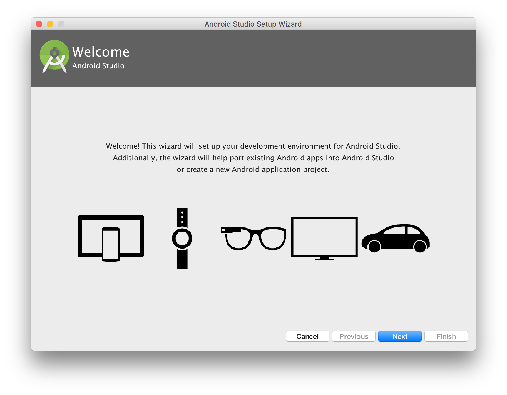

Click **Next** to begin the setup process.  We'll use the standard settings;
with **Standard** selected, click **Next**.

On the next page of the setup wizard, we can select SDK components we'd like to
install.  Select all the available components, and click **Next**.

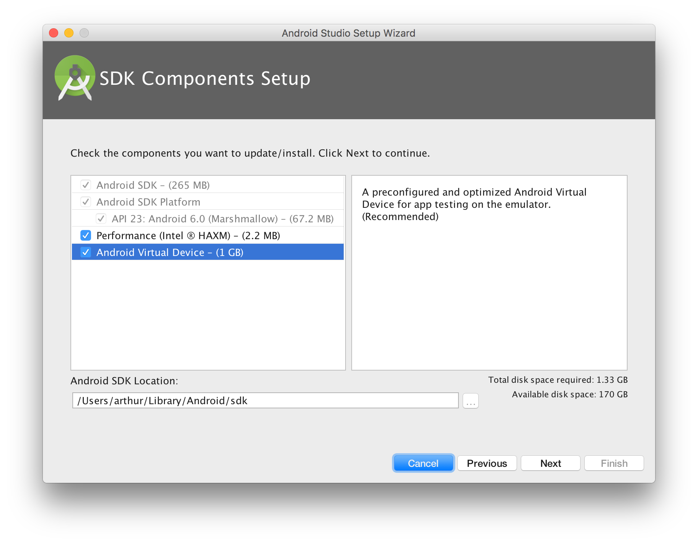

Click **Finish** to begin downloading and installing the SDK components.  When
installation is complete, click **Finish** again.

### Our First App
The initial steps of developing a new application in Android Studio are similar
to the steps of developing a new application in IntelliJ.  When presented with
the Android Studio welcome screen, select **Start a new Android Studio
project**.

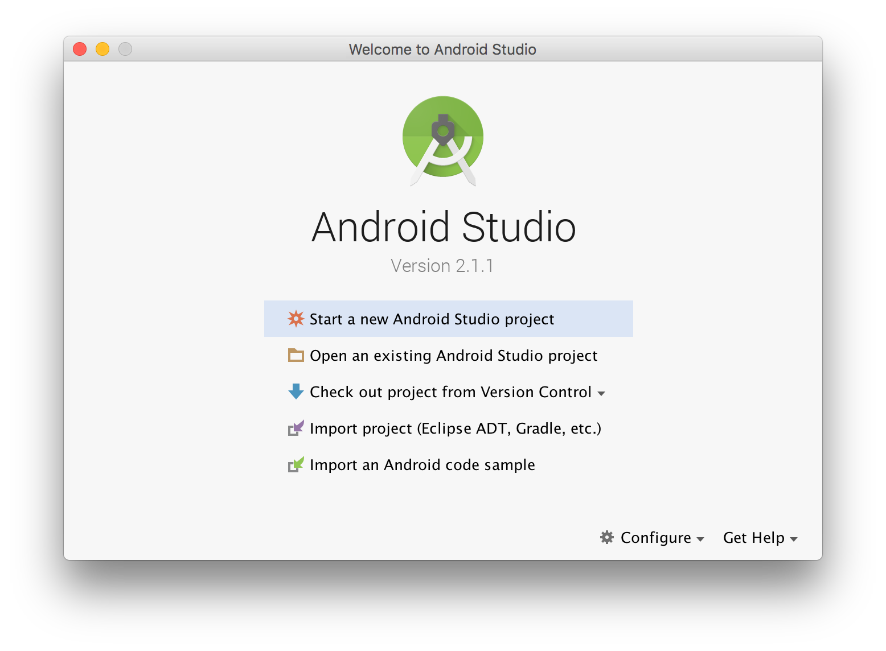

Next, choose an application name, a domain name, and a project location.  
Android Studio will use the domain name to create the appropriate package name.

For our first application, we'll be creating an app that is similar to the
*GeoQuiz* app presented in the *Android Programming* book.  Our app will be
*TriviaQuiz*.

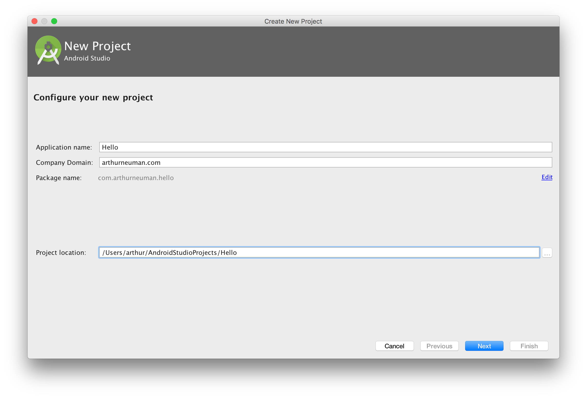

We can now chose the types of devices that our application will run on and
the minimum version of Android that will be required to run our application.
Choosing a lower API version will allow our app to target more devices but
will prevent us from using newer features.  For now, let's select
*API 21: Android 5.0 (Lollipop)* and click **Next**.

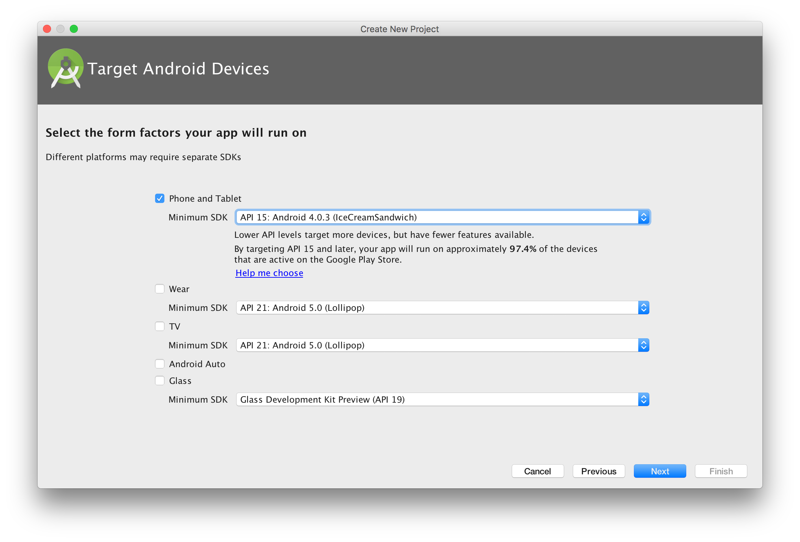

For our first app, we'll start with an *Empty Activity*.  We'll talk about
activities in detail later; for now, click **Next**.

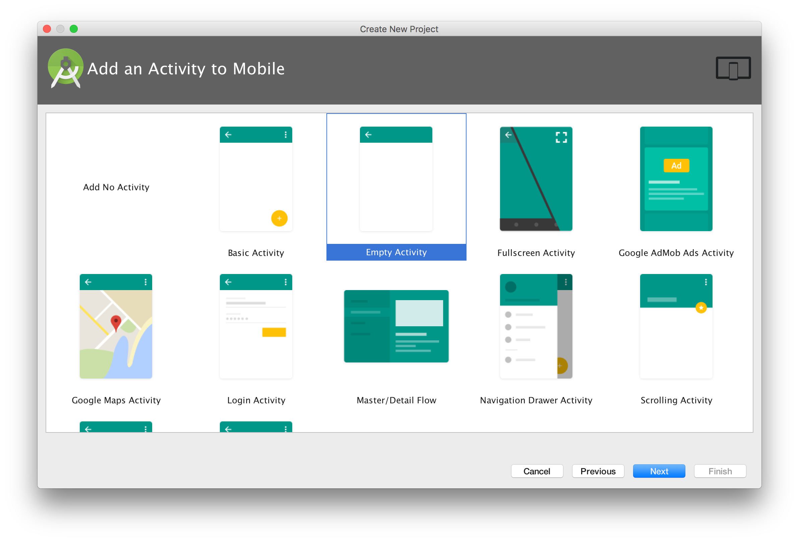

We can customize the name of the activity to be something like *QuizActivity*.
With **Generate Layout File** selected, click **Finish**.

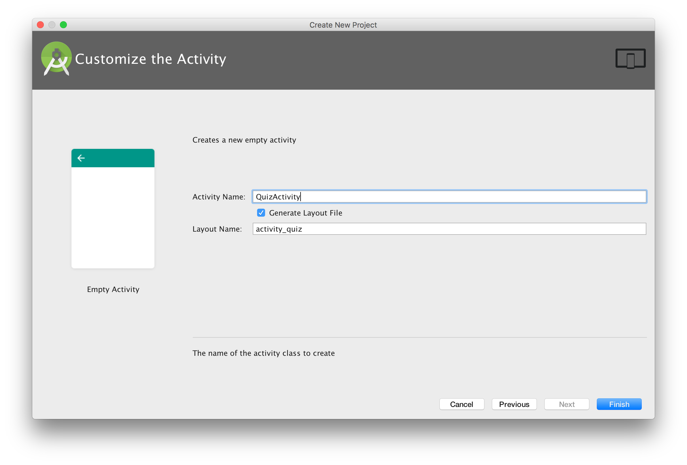

Android Studio will now generate all the files necessary for our first
application.  Once generation is complete, we'll be presented with a window
that looks very similar to IntelliJ.  We can open the *Project* pane and
examine the project's directory structure.  

Two import files are `QuizActivity.java` and `activity_quiz.xml`.  The Java
file contains the code that will be executed when our application is run.  The
XML file contains information about how graphical elements are displayed.  We
will discuss layouts more later.  

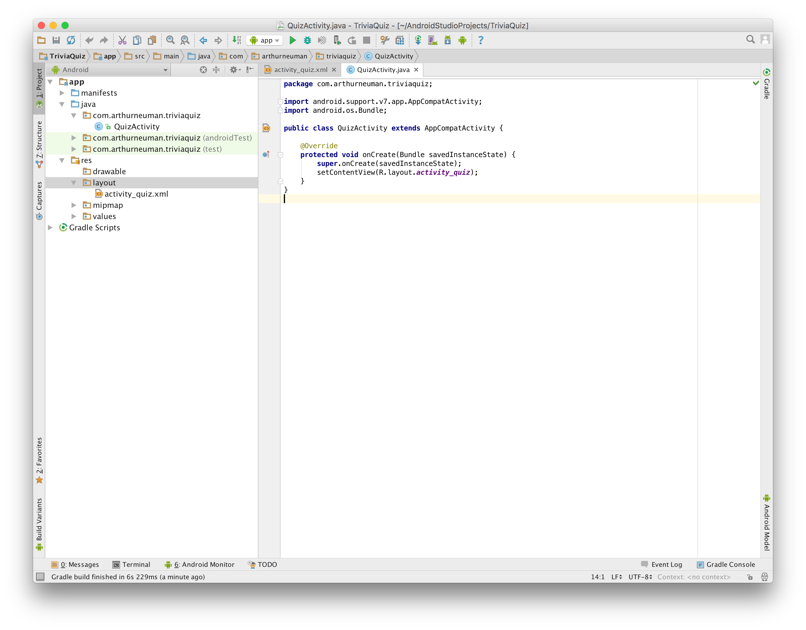

Open the layout file by double-clicking on the file.  A graphical preview will
appear.  While we can modify the underlying XML, we can also modify a layout
by using the layout design view.  Our simple layout already has a *TextView*
widget that contains the string "Hello World!".  

If you are presented with an error about a missing style, click the refresh
button.

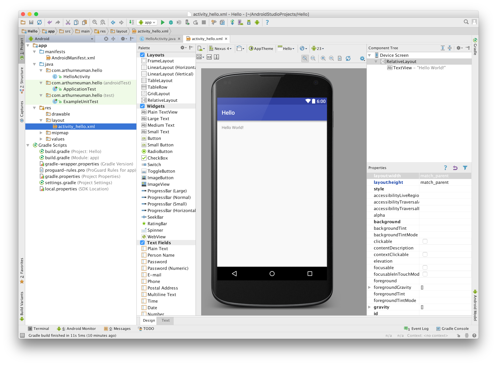

Though our app doesn't do much, we can run it.  To run the app, click the play
icon in the toolbar.  You should be prompted to choose an emulator or connected
device with which to run your app.  If no connected devices or emulators are
detected, you can create a new emulator.  

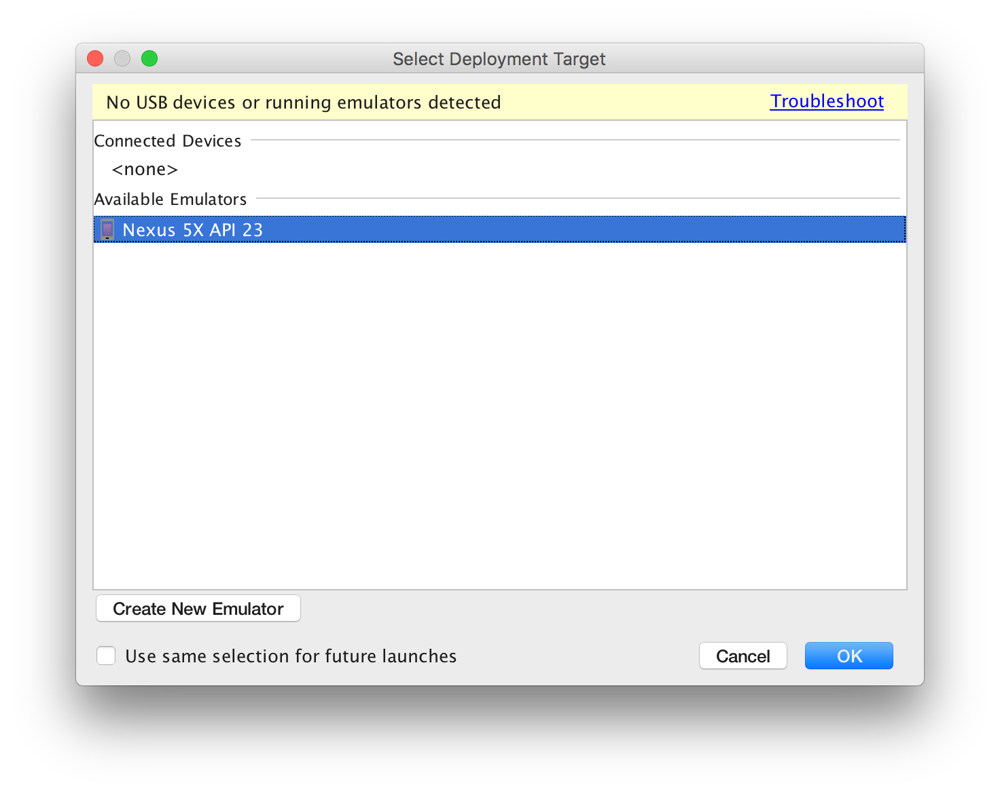

It might take a few seconds to a few minutes to start the emulator and load
your application.

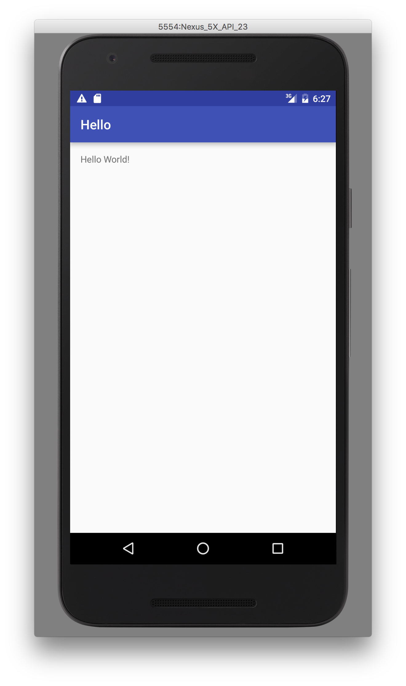

To stop the application, either quit the emulator application or click the stop
icon in the the Android Studio toolbar.

###Adding Functionality
Let's expand on this by adding more functionality to our app.  To add
functionality, we'll need to expand our user interface.  Our user interface
will consist of a text box that displays a question's text and four buttons
that present possible answers to the user. While it's possible to directly
associate text representing labels and such with buttons and text boxes,
Android allows us to specify string values in a string resource file.  Using
a string resource file makes it easier to support different languages.

Open the `res/values/string.xml` file.  This is the default string resource
file created with all new projects.  The content of this file is XML and
strings are defined using *string* tags. A string's name is specified using the
*name* attribute and the string's value is the tag's content.  Replace the
content of the string resource file with the following:

```xml
<resources>
    <string name="app_name">TriviaQuiz</string>
    <string name="question_text">What is the capital of Washington?</string>
    <string name="option_1_button">Seattle</string>
    <string name="option_2_button">Tacoma</string>
    <string name="option_3_button">Olympia</string>
    <string name="option_4_button">Spokane</string>
</resources>
```

We can see that six strings are defined here.  One of them is named
"question_text" and its value is "Seattle is the capital of Washington."  

Now that we've defined the strings we'll need, we can return to the
`activity_quiz.xml` layout file. Examining the *activity_quiz.xml* layout, we
can see that our app layout includes a *RelativeLayout* and a *TextView*
widget.  Layouts are used to arrange items on the screen and widgets are used
to interact with users; we'll talk about both of these more in later lectures.

For the *TriviaQuiz* app we're making, we don't want either of these elements.  
While we can use the design view to add and remove most layouts and widgets, we
can't use it to remove a top-level layout.  We'd like to change the top-level
layout from a *RelativeLayout* to a vertical *LinearLayout*.  To do this, click
the *Text* tab and replace the XML text with the following:

```xml
<?xml version="1.0" encoding="utf-8"?>
<LinearLayout xmlns:android="http://schemas.android.com/apk/res/android"
    android:layout_width="match_parent"
    android:layout_height="match_parent"
    android:gravity="center"
    android:orientation="vertical" >

</LinearLayout>
```

We can now switch back to design view and add a plain *TextView* near the
center of the layout by dragging and dropping a "Plain TextView" widget from
the *Palette* to the design view.  In the *Properties* section, set the text to
`@string/question_text`.  The text should be replaced with "What is the
capital of Washington?"  Additionally, set the padding of the *TextView* to
`24dp`; you can do this by expanding the `padding` property in the *Properties*
section and setting the value for `all`.

Next, drag and drop four *Button* widgets, one-by-one, into the *LinearLayout*
below the *TextView* widget.  


We can set the *Button* widgets' text using the string resources we previously
created; set the buttons' `text` property to `@string/option_1_button`,
`@string/option_2_button`, `@string/option_3_button`, and
`@string/option_4_button` While we're changing *Button* properties, let's also
change their IDs (this will be useful later) and set their `layout:width` to
`fill_parent`.  Change the IDs to `option_1_button`, `option_2_button`,
`option_3_button`, and `option_4_button`.

Though we can design entire interfaces with the Layout Designer, we should be
familiar with the XML associated with layouts and widgets.  The XML for our
current interface should look something like this:

```XML
<?xml version="1.0" encoding="utf-8"?>
<LinearLayout xmlns:android="http://schemas.android.com/apk/res/android"
    android:layout_width="match_parent"
    android:layout_height="match_parent"
    android:gravity="center"
    android:orientation="vertical" >

    <TextView
        android:layout_width="wrap_content"
        android:layout_height="wrap_content"
        android:text="@string/question_text"
        android:id="@+id/textView"
        android:layout_gravity="center_horizontal"
        android:padding="24dp" />

    <Button
        android:layout_width="fill_parent"
        android:layout_height="wrap_content"
        android:text="@string/option_1_button"
        android:id="@+id/option_1_button"
        android:layout_gravity="center_horizontal" />

    <Button
        android:layout_width="fill_parent"
        android:layout_height="wrap_content"
        android:text="@string/option_2_button"
        android:id="@+id/option_2_button"
        android:layout_gravity="center_horizontal" />

    <Button
        android:layout_width="fill_parent"
        android:layout_height="wrap_content"
        android:text="@string/option_3_button"
        android:id="@+id/option_3_button"
        android:layout_gravity="center_horizontal" />

    <Button
        android:layout_width="fill_parent"
        android:layout_height="wrap_content"
        android:text="@string/option_4_button"
        android:id="@+id/option_4_button"
        android:layout_gravity="center_horizontal" />
</LinearLayout>
```

If we run the app, it now looks like this:

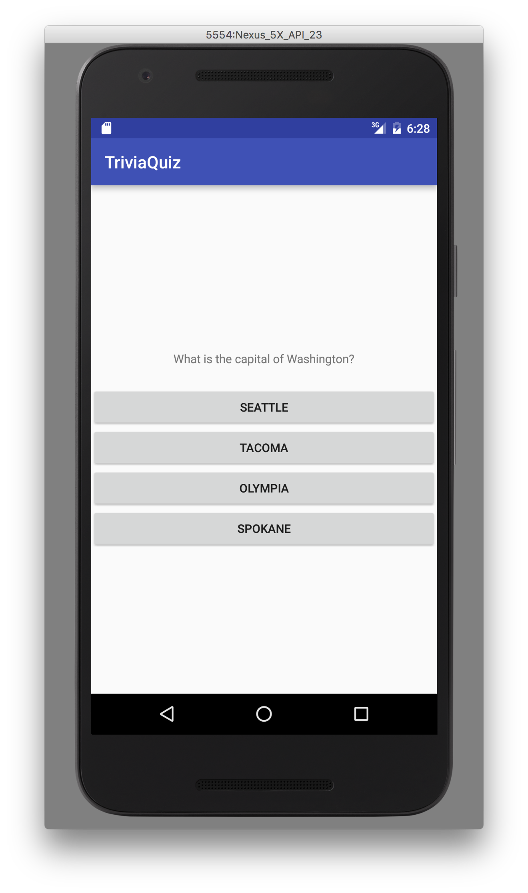

Notice that while the widgets we've added are displayed and we can click the
buttons, nothing happens when we do.  To add functionality to the buttons,
we'll have to write some code.  Before we do that, let's look at the code that
already exists.  

In the `QuizActivity.java` file, you should see code similar to the following:

```java
public class QuizActivity extends AppCompatActivity {

    @Override
    protected void onCreate(Bundle savedInstanceState) {
        super.onCreate(savedInstanceState);
        setContentView(R.layout.activity_quiz);
    }
}
```

This code was automatically generated by Android Studio when we created the
project.  The code defines a single class, *QuizActivity*.  An **activity**
represents some thing a user can do.  The *Activity* class can be used to
create a user interface.  *QuizActivity* inherits from *Activity* and uses the
*onCreate()* method to load the UI when an instance of the class is created.  
The *setContentView()* method call is responsible for taking the layout we
defined earlier and drawing it to the screen.  Here, a layout is identified by
its resource ID - this is similar to how we identified strings for our widgets.  
A **resource** is part of an application that is not code such as media or data
files.  Resources are stored in the `res` folder of a project.  

We'd like to add code that will allow us to interact with our widgets.  The
*Activity* class has a *findViewById()* method with the following signature:

`public View findViewByID(int id)`

Our *Button* widgets are instances of the *Button* class which is a subclass
of *View*.  The IDs we specified for our buttons correspond to unique integers
so we can use the *findViewById()* method to access the buttons.  The following
code defines four instance fields and assigns values to them in the
*onCreate()* method.

```java
public class QuizActivity extends AppCompatActivity {
    private Button option1Button;
    private Button option2Button;
    private Button option3Button;
    private Button option4Button;

    @Override
    protected void onCreate(Bundle savedInstanceState) {
        super.onCreate(savedInstanceState);
        setContentView(R.layout.activity_quiz);

        option1Button = (Button) findViewById(R.id.option_1_button);
        option2Button = (Button) findViewById(R.id.option_2_button);
        option3Button = (Button) findViewById(R.id.option_3_button);
        option4Button = (Button) findViewById(R.id.option_4_button);
    }
}
```
Notice that because *findViewById()* returns a *View* instance and we'd like
to work with *Button* instances, we have to cast the value returned by the
method call.

Android applications are usually event driven, after they start, they wait for
an event to occur before doing something else.  Events include user interaction
with the interface such as through button presses.  

So, how can we make our app respond to events?  We can do this by making use of
**listeners** - objects that respond to the occurrence of an event.  The
Android SDK includes various listener interfaces for handling different types
of events; a listener object simply has to implement the appropriate interface.  
If we'd like to be able to handle a button press/click event, we can implement
the *View.OnClickListener* interface.  We can use anonymous classes to quickly
create listeners and assign them to the objects.  For example, we can add
code to the *QuizActivity.onCreate()* method that creates and logs a debug
message regarding the event.

```java
public class QuizActivity extends AppCompatActivity {
    private Button option1Button;
    private Button option2Button;
    private Button option3Button;
    private Button option4Button;

    @Override
    protected void onCreate(Bundle savedInstanceState) {
        super.onCreate(savedInstanceState);
        setContentView(R.layout.activity_quiz);

        option1Button = (Button) findViewById(R.id.option_1_button);
        option2Button = (Button) findViewById(R.id.option_2_button);
        option3Button = (Button) findViewById(R.id.option_3_button);
        option4Button = (Button) findViewById(R.id.option_4_button);

        option1Button.setOnClickListener(new View.OnClickListener() {
            @Override
            public void onClick(View v) {
                Log.d("button clicked", "option1Button clicked");
            }
        });
    }
}
```

If we run the app and click the top button, we'll see something similar to the
following in Android Studio's logcat window:

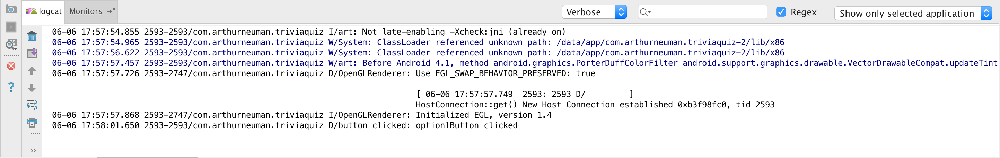

It would be nice if we could provide some sort of feedback in the app itself
when a user presses a button.  An easy way to do this by using toasts.  A
**toast** is a short message that informs the user of something and does not
require user interaction.  Before we add code for our toast, let's add two
strings to the string resource file:

```xml
<resources>
    <string name="app_name">TriviaQuiz</string>
    <string name="question_text">What is the capital of Washington?</string>
    <string name="option_1_button">Seattle</string>
    <string name="option_2_button">Tacoma</string>
    <string name="option_3_button">Olympia</string>
    <string name="option_4_button">Spokane</string>
    <string name="toast_correct">Correct!</string>
    <string name="toast_incorrect">Incorrect</string>
</resources>
```

To create a toast, we can use the *Toast.makeText()* class method and call
the *.show()* method on the resulting object.  *Toast.makeText()* takes three
parameters: a *Context*, an *int* representing a resource ID, and an *int*
representing the duration to display the message; the *Context* is usually an
instance of *Activity* and is used find the resource.  The following code
includes event listeners for each of the four buttons; clicking on one will
result in a "Correct!" toast and clicking on the others will result in an
"Incorrect" toast.  

```java
public class QuizActivity extends AppCompatActivity {
    private Button option1Button;
    private Button option2Button;
    private Button option3Button;
    private Button option4Button;

    @Override
    protected void onCreate(Bundle savedInstanceState) {
        super.onCreate(savedInstanceState);
        setContentView(R.layout.activity_quiz);

        option1Button = (Button) findViewById(R.id.option_1_button);
        option2Button = (Button) findViewById(R.id.option_2_button);
        option3Button = (Button) findViewById(R.id.option_3_button);
        option4Button = (Button) findViewById(R.id.option_4_button);

        option1Button.setOnClickListener(new View.OnClickListener() {
            @Override
            public void onClick(View v) {
                Toast.makeText(QuizActivity.this, R.string.toast_incorrect, Toast.LENGTH_SHORT)
                        .show();
            }
        });

        option2Button.setOnClickListener(new View.OnClickListener() {
            @Override
            public void onClick(View v) {
                Toast.makeText(QuizActivity.this, R.string.toast_incorrect, Toast.LENGTH_SHORT)
                        .show();
            }
        });

        option3Button.setOnClickListener(new View.OnClickListener() {
            @Override
            public void onClick(View v) {
                Toast.makeText(QuizActivity.this, R.string.toast_correct, Toast.LENGTH_SHORT)
                        .show();
            }
        });

        option4Button.setOnClickListener(new View.OnClickListener() {
            @Override
            public void onClick(View v) {
                Toast.makeText(QuizActivity.this, R.string.toast_incorrect, Toast.LENGTH_SHORT)
                        .show();
            }
        });

    }
}
```

If we run the app and click "Olympia", we should now see a message indicating
that we've selected the correct answer.

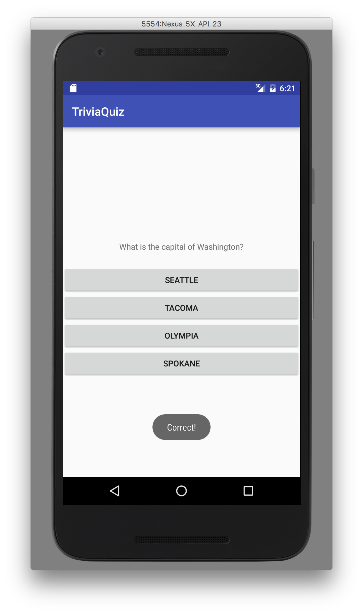

## Collaborating using GitHub
In addition to providing a publicly-accessible place to host our
repositories, GitHub also provides functionality that is helpful when working
with others.  There are several ways multiple people can work together when
using Git and GitHub.  The simplest way is for everyone to pull from and
push to the same repository directly.  Another way to collaborate is by
creating branches within a repository where one branch is dedicated to a
specific feature or to a specific developer and changes made to these branches
are ultimately merged into another branch that consists of the code that is
used for the release or final version of the software.  A third method of
collaboration is to use GitHub's *fork* and *pull request* features.

See [GitHub's documentation on forks](https://help.github.com/articles/fork-a-repo/)
and [GitHub's documentation on pull requests](https://help.github.com/articles/using-pull-requests/)
for details beyond what is presented here.

### Forks
A **fork** of a repository is simply a copy. When you fork someone else's
repository you are simply creating a copy of that repository in your own
collection of repositories.  When forking a repository, GitHub keeps track
of the **upstream**, or original, repository.  To fork a repository, simply
browse to the repository's page on GitHub and click the *fork* button near
the upper right of the page.

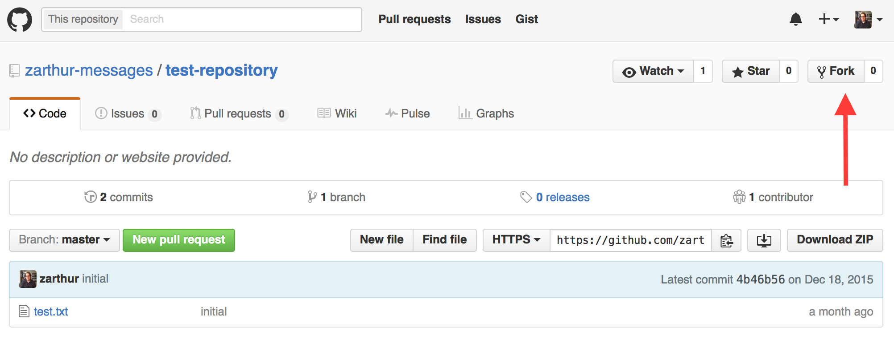

If you belong to any organizations on GitHub, GitHub will ask you if you'd like
to fork the repository to your personal account or the organization's.  For our
class, choose your personal account. After a few moments, you should a copy of
the repository in your account.

In these examples, we'll be working with repository with few files.  The
repository you fork might be more complicated.

### Importing a project into Android Studio
When we open Android Studio, we can choose *Check out from Version Control* and 
*GitHub* from the start up screen.  If you have a project
open, you can choose these options from the *File -> New* menus. We can then
choose the appropriate repository and local destination to store the
repository. Android Studio will prompt you to create a new project using the
repository.  When prompted to choose files to add, make sure the `.idea` and
any files ending in `.iml` are not selected - these files are unique to your
installation of Android Studio and will cause conflicts if you share them in a
repository that is used for collaboration.

We can now add code to the newly cloned project.


### .gitignore
Git provides the option of specifying a list of files or patterns of files that
should not be added to our repository.  This file is named `.gitignore` and is
stored in the root directory of the repository.  For Android projects, a 
typical `.gitignore` file might contain the following:

```
# Built application files
*.apk
*.ap_

# Files for the ART/Dalvik VM
*.dex

# Java class files
*.class

# Generated files
bin/
gen/
out/

# Gradle files
.gradle/
build/

# Local configuration file (sdk path, etc)
local.properties

# Proguard folder generated by Eclipse
proguard/

# Log Files
*.log

# Android Studio Navigation editor temp files
.navigation/

# Android Studio captures folder
captures/

# Intellij
*.iml
.idea/

# Keystore files
*.jks
```

Now, we can add, commit, and push our changes to GitHub.  Select *VCS*, *Git*,
and *Commit File...* from the menus.  Make sure both the new *Main.java* and
*.gitignore* files are selected, enter a commit message, and click *Commit*.
Next, push the code to GitHub by selecting *VCS*, *Git*, *Push*.  You should
now be able to see your changes on the GitHub page of your fork of the repo.  

### Pull Requests
After we've made changes to our fork, we can request that the owner of the
original repository incorporate the changes with their copy.  To do this, we
create a **pull request** on GitHub.  To create the pull request, browse to the
GitHub page for your fork and click the *New pull request* button.

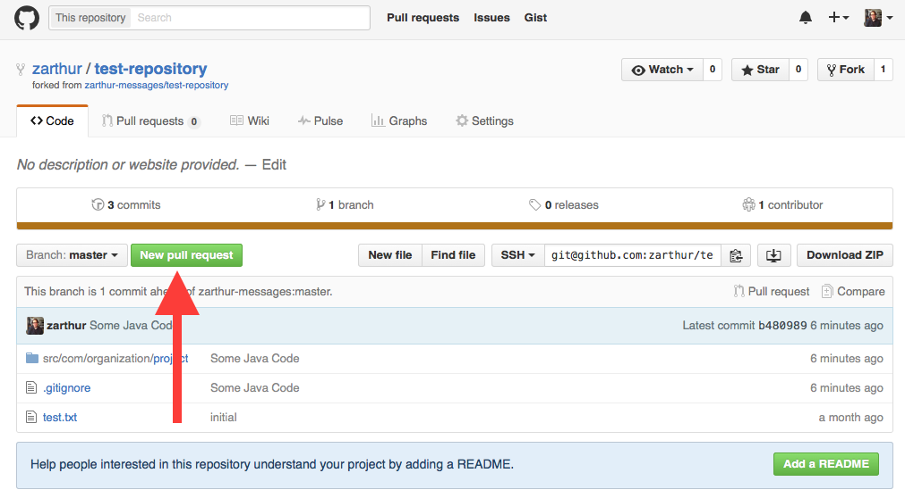

GitHub will load a page summarizing the changes made to your fork that will
constitute the pull request.  Notice the comparison settings.

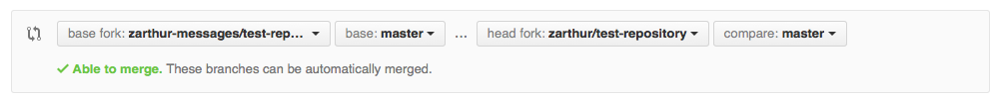

On the left, we have the repository to which changes will be made if the pull
request is accepted.  On the right we have the source of the changes that make
up the pull request.

Once we click *Create pull request*, we have the option to summarize our
changes and create a comment.  Clicking *Create pull request* again will create
the pull request and give the repository owner a chance to accept or reject
our request.  If the owner merges our pull request, our changes will be
incorporated in the original repository.

We can also use pull requests when changes are made to the original repository
and we'd like to update our fork to include those changes.

On the GitHub page for our fork, we can click "New pull request".  Notice that
if our fork doesn't have any new changes, the page indicates that there isn't
anything to compare.  We have to change what is being compared.  Click the
*switching the base* link to change the comparison.  

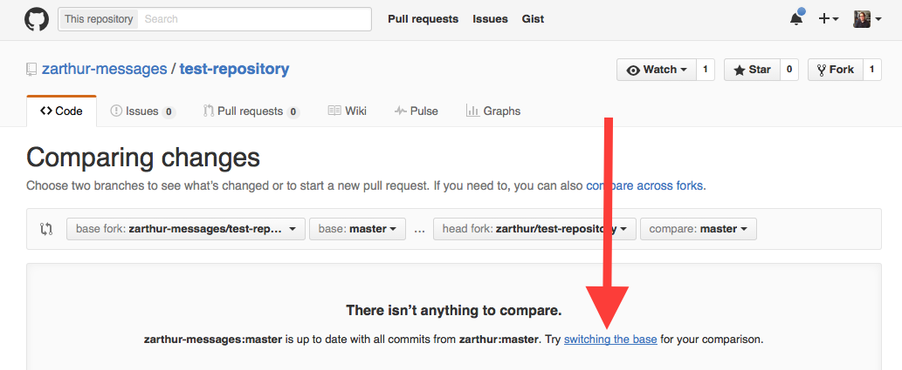

Now, the *base fork*, the destination of the changes, is our own repo and the
*head fork*, the source of the changes, is the original repo.  Create the
pull request.  Because this is an update to a repo we own, we are able to merge
the pull request by clicking *Merge pull request*.

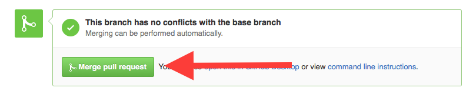

You and people you work with can repeat variations of this process to work
together on a project.

## Material Design
Google provides a set of design/style guides that should be followed when
creating an Android app.  This guide can be found at  
http://www.google.com/design/spec/material-design/introduction.html.  You
should review the guide.
