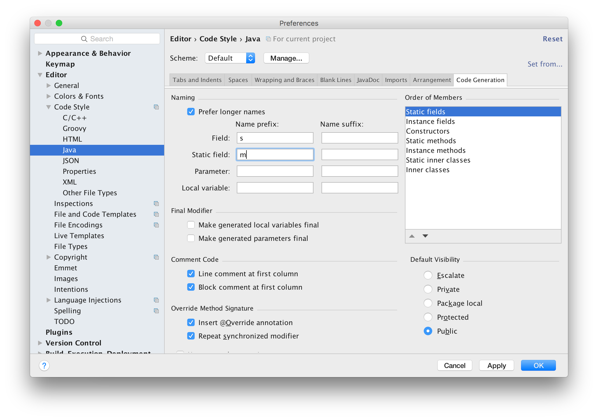
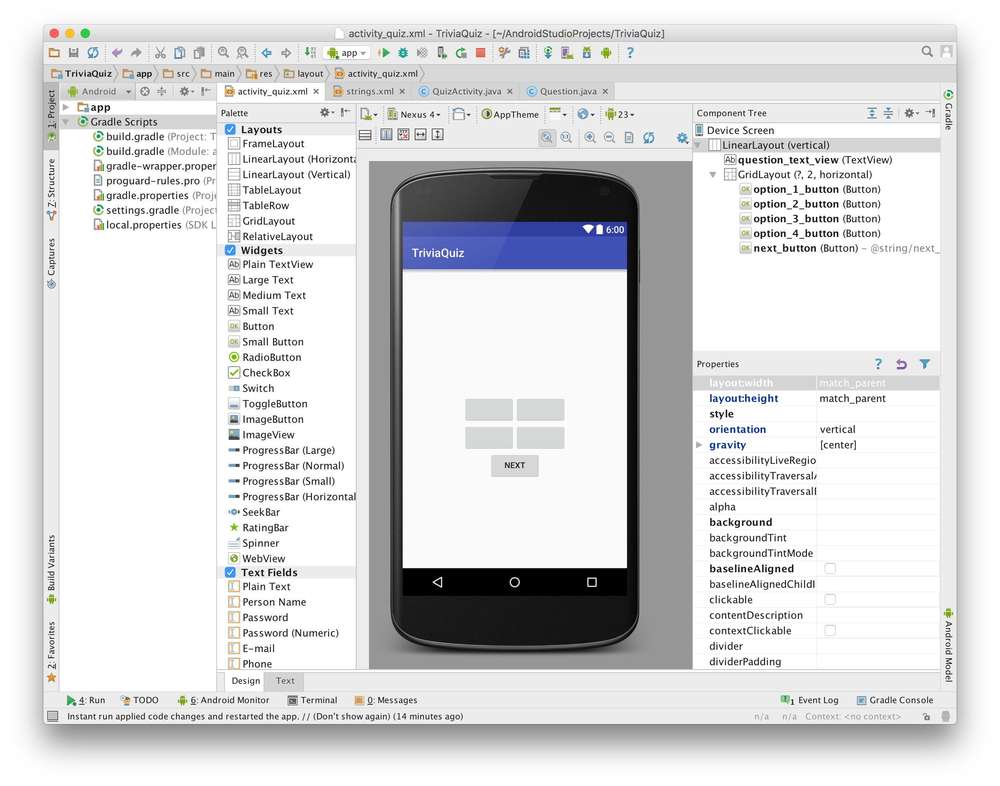
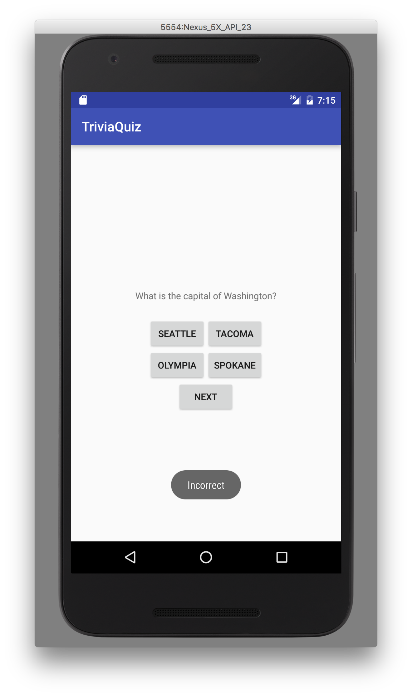

# Week 2 - MVC and Activities

## Corresponding Text
*Android Programming*, pp. 33-46, 57-71

## Adding Functionality
Now that we have a simple app that allows us to quiz a user, we'd like to
expand it beyond a single question.  We'd like to have a collection of
questions we can present to the user.  The first step to doing this is to
create a new class to represent questions - we'll name it *Question*.  With
each question we'll associate question text, four possible answers, and a value
indicating the correct answer.  The question text and possible answers will be
stored as  a string array resource, which we'll look at later, so we'll store
the ID associated with the string array resource.  Our code for the *Question*
class looks like this:

```java
public class Question {
    private int mQuestionResId;
    private int mCorrectAnswer;

    public Question(int questionResId, int correctAnswer) {
        mQuestionResId = questionResId;
        mCorrectAnswer = correctAnswer;
    }

}
```

Notice that instance variables are prefixed with the letter `m`.  By convention
in Android, instance fields are prefixed with the letter `m` and class or
static fields are prefixed with the letter `s`.  While fields have these
prefixes, getters and setters do not.  If we want to automatically generate
getters and setters with Android Studio, we can configure it expect `m`s and
`s`s prefixed to field names.  To do this select **Editor -> Code Style ->
Java** in Android Studio's preferences window, select the **Code Completion**
tab, and type `s` and `m` in the **Name prefix** column and **Field** and
**Static Fields**, respectively.  



We can use Android Studio to generate getters for our fields.  Having set the
code style prevents Android from generating a method name like
*getMQuestionResId*. To generate getters for our fields, right click within
the class body and select **Generate** followed by **Getter**.

Now that we've created a *Question* class to represent each of the questions
our app will present to the user, we'll need to modify *QuizActivity* to make
use of it.  *QuizActivity* will rely on a collection of *Question* instances
that represent question data to determine what is displayed.  Similarly,
*QuestionActivity* will be responsible for handling events that generated by
the interface to determine if a user has chosen a correct answer and to display
a new question.  This separation of the data from the interface with an
intermediary is often referred to as the *Model-View-Controller* pattern.

## Model-View-Controller
In the Model-View-Controller pattern, or MVC, objects in a program are a model
object, a view object, or a controller object.  A **model object** represents
the application's data and data-specific code or "business logic".  A model
object should have no knowledge of the user interface.  Collectively, an
application's model objects make up the **model layer**.  

A **view object** represents everything a user interacts with such as
a *TextView* or a *Button* object. The **view layer** consists of all an
applications view objects.  In our app, the view layers consists of the
the widgets inflated from `activity_quiz.xml`.

**Controller object** tie view and model objects together, controlling the flow
of data between them. The **controller layer** is the collection of controller
objects. Because the code associated with controller objects is often
application-specific, it described as containing the "application logic".  The
*QuizActivity* class represents the TriviaQuiz controller layer.

Using MVC makes it easier to design and keep track of parts of an application.  
We often use classes to group related methods and data; similarly, we can
group similar objects into the model, view, and controller layers based on
their purpose.  In addition to make it easier to understand the function of
various components, separating model code from view code makes it's easier to
reuse objects.  For example, because the *Question* class knows nothing about
how data is displayed on screen, it could be used to display a list of all
questions.  If *Question* were responsible for the interface as well as
question data, we couldn't easily reuse it for different display elements.

### Updating the View and Controller Layers
To accommodate multiple questions, we'll need to update the view layer.  
Currently, we have a *TextView* and four *Button* objects with hard-coded text.  
We'll want to programmatically change the text of these objects, so we can
clear the values of the *text* property for each of them.  We'd also like to
give a more descriptive ID to the *TextView* object; change it to something like
`question_text_view`.  We'll also add a new button that will allow us to move
to the next question.  Before we add the new button, let's clean up the
interface a little bit.  Let's add a *GridLayout* to the app by dragging and
dropping it below the exiting *TextView*.  Once it's placed, set the following
properties:

| Property      | Value        |
|:--------------|:-------------|
| layout:width  | wrap_content |
| layout:height | wrap_content |
| columnCount   | 2            |

Next, in the Components Window, drag and drop each of the buttons into the
newly created *GridLayout*.  Update the *layout:width* property to
`wrap_content` for each button.  

Now, we can add a next button. Place it below the existing buttons in the
*GridLayout* and set the following properties:

| Property          | Value               |
|:------------------|:--------------------|
| layout:width      | wrap_content        |
| layout:columnSpan | 2                   |
| id                | next_button         |
| text              | @string/next_button |

We won't change the text of this button so it's okay for it to be hard-coded.  

The XML for `activity_quiz.xml` should look similar to this:

```xml
<?xml version="1.0" encoding="utf-8"?>
<LinearLayout xmlns:android="http://schemas.android.com/apk/res/android"
    android:layout_width="match_parent"
    android:layout_height="match_parent"
    android:gravity="center"
    android:orientation="vertical" >

    <TextView
        android:layout_width="wrap_content"
        android:layout_height="wrap_content"
        android:id="@+id/question_text_view"
        android:layout_gravity="center_horizontal"
        android:padding="24dp" />

    <GridLayout
        android:layout_width="wrap_content"
        android:layout_height="wrap_content"
        android:layout_gravity="center_horizontal"
        android:columnCount="2">

        <Button
            android:layout_width="wrap_content"
            android:layout_height="wrap_content"
            android:id="@+id/option_1_button"
            android:layout_gravity="center_horizontal" />

        <Button
            android:layout_width="wrap_content"
            android:layout_height="wrap_content"
            android:id="@+id/option_2_button"
            android:layout_gravity="center_horizontal" />

        <Button
            android:layout_width="wrap_content"
            android:layout_height="wrap_content"
            android:id="@+id/option_3_button"
            android:layout_gravity="center_horizontal" />

        <Button
            android:layout_width="wrap_content"
            android:layout_height="wrap_content"
            android:id="@+id/option_4_button"
            android:layout_gravity="center_horizontal" />

        <Button
            android:layout_width="wrap_content"
            android:layout_height="wrap_content"
            android:text="@string/next_button"
            android:id="@+id/next_button"
            android:layout_gravity="center_horizontal"
            android:layout_columnSpan="2"
            />
    </GridLayout>

</LinearLayout>
```

We'll have to update the string resource file to include the text for the
next button.  We can also additional questions.  We'll store our questions and
their associated options as string array resources.  Like a string resource, a
string array must have a name.  To add elements to the string array, we can use
the *item* tag where the content of the tag is an element in the array.  A
string array for our the options of our existing question looks like this:

```xml
<string-array name="question_1">
    <item>What is the capital of Washington?</item>
    <item>Seattle</item>
    <item>Tacoma</item>
    <item>Olympia</item>
    <item>Spokane</item>
</string-array>
```

To access a string array using it's name, we'll use `R.array` instead of
`R.string` in our code. Feel free to add as few or as many questions as you'd
like. The `strings.xml` resource file should looks like this:

```xml
<resources>
    <string name="app_name">TriviaQuiz</string>
    <string name="toast_correct">Correct!</string>
    <string name="toast_incorrect">Incorrect</string>
    <string name="next_button">Next</string>
    <string-array name="question_1">
        <item>What is the capital of Washington?</item>
        <item>Seattle</item>
        <item>Tacoma</item>
        <item>Olympia</item>
        <item>Spokane</item>
    </string-array>
    <string-array name="question_2">
        <item>What is the largest planet in the solar system?</item>
        <item>The Sun</item>
        <item>Earth</item>
        <item>Jupiter</item>
        <item>The Moon</item>
    </string-array>
    <string-array name="options_3">
        <item>What is 2+2?</item>
        <item>4</item>
        <item>22</item>
        <item>0</item>
        <item>1</item>
    </string-array>
</resources>
```

At this point, the design view of the interface will look similar to the
following.



Next, we can update the controller layer, *QuizActivity*, to display questions
and handle user interaction.

Let's add a *Question* array to store our questions and initialize it with
three instances, once for each question. We can store this as a field named
*mQuestions*.  Addtionally, we can rename our existing fields from
*option1Button* to *mOption1Button* and so on, add a field for our
next button, add a field to keep track of our question *TextView*, and add a
field to keep track of the index of the current question.  At this point,
`QuizActivity.java` should look like this:

```java
public class QuizActivity extends AppCompatActivity {
    private Button mOption1Button;
    private Button mOption2Button;
    private Button mOption3Button;
    private Button mOption4Button;
    private Button mNextButton;

    private TextView mQuestionTextView;

    int mCurrentIndex = 0;

    private Question[] mQuestions = new Question[] {
            new Question(R.array.question_1, 3),
            new Question(R.array.question_2, 3),
            new Question(R.array.question_3, 1)
    };

    @Override
    protected void onCreate(Bundle savedInstanceState) {
        super.onCreate(savedInstanceState);
        setContentView(R.layout.activity_quiz);

        mOption1Button = (Button) findViewById(R.id.option_1_button);
        mOption2Button = (Button) findViewById(R.id.option_2_button);
        mOption3Button = (Button) findViewById(R.id.option_3_button);
        mOption4Button = (Button) findViewById(R.id.option_4_button);

        mOption1Button.setOnClickListener(new View.OnClickListener() {
            @Override
            public void onClick(View v) {
                Toast.makeText(QuizActivity.this, R.string.toast_incorrect,
                        Toast.LENGTH_SHORT).show();
            }
        });

        mOption2Button.setOnClickListener(new View.OnClickListener() {
            @Override
            public void onClick(View v) {
                Toast.makeText(QuizActivity.this, R.string.toast_incorrect,
                        Toast.LENGTH_SHORT).show();
            }
        });

        mOption3Button.setOnClickListener(new View.OnClickListener() {
            @Override
            public void onClick(View v) {
                Toast.makeText(QuizActivity.this, R.string.toast_correct,
                        Toast.LENGTH_SHORT).show();
            }
        });

        mOption4Button.setOnClickListener(new View.OnClickListener() {
            @Override
            public void onClick(View v) {
                Toast.makeText(QuizActivity.this, R.string.toast_incorrect,
                        Toast.LENGTH_SHORT).show();
            }
        });

    }
}
```

Now that we've added new fields and updated the names of existing ones, let's
start adding code.  We'll need to assign values to *mNextButton* and
*mQuestionTextView*; we can do this using *findViewById()* like we did for
*mOption1Button*.  

We can use the *setText()* method available on *Button* and *TextView* objects
to display the first question's text and options.  Because we'll update the
*TextView* and each *Button* every time the user advances to the next question,
let's create a method to update the text:

```java
private void displayQuestion() {
    Question currentQuestion = mQuestions[mCurrentIndex];
    String[] questionText = getResources()
            .getStringArray(currentQuestion.getQuestionResId());
    mQuestionTextView.setText(questionText[0]);
    mOption1Button.setText(questionText[1]);
    mOption2Button.setText(questionText[2]);
    mOption3Button.setText(questionText[3]);
    mOption4Button.setText(questionText[4]);
}
```

Here, we retrieve the string array using the *Activity.getResources()* method
to first get a *Resources* object and then use its *getStringArray()* method
to get a specific string array using its ID.  

We can now call *displayQuestion()* from the *onCreate()* method to update the
view layer with text for the current question.  Next, we need to update the
listeners for each of the option buttons and add a listener for the next button.

For each option button, we'll want the listener to check if the the clicked
button corresponds to the correct answer and make the appropriate toast.  Let's
add a function that takes an integer parameter representing the clicked button
and checks the current question for the correct answer, and makes a toast.

```java
private void checkAnswer(int buttonClicked) {
    Question currentQuestion = mQuestions[mCurrentIndex];
    if (currentQuestion.getCorrectAnswer() == buttonClicked) {
        Toast.makeText(QuizActivity.this, R.string.toast_correct,
                Toast.LENGTH_SHORT).show();
    }
    else {
        Toast.makeText(QuizActivity.this, R.string.toast_incorrect,
                Toast.LENGTH_SHORT).show();
    }
}
```

We can now call *checkAnswer()* from each of the option buttons' listeners.  

With updated listeners and a listener for the next button, our code should look
like this:

```java
public class QuizActivity extends AppCompatActivity {
    private Button mOption1Button;
    private Button mOption2Button;
    private Button mOption3Button;
    private Button mOption4Button;
    private Button mNextButton;

    private TextView mQuestionTextView;

    int mCurrentIndex = 0;

    private Question[] mQuestions = new Question[] {
            new Question(R.array.question_1, 3),
            new Question(R.array.question_2, 3),
            new Question(R.array.question_3, 1)
    };

    private void displayQuestion() {
        Question currentQuestion = mQuestions[mCurrentIndex];
        String[] questionText = getResources()
                .getStringArray(currentQuestion.getQuestionResId());
        mQuestionTextView.setText(questionText[0]);
        mOption1Button.setText(questionText[1]);
        mOption2Button.setText(questionText[2]);
        mOption3Button.setText(questionText[3]);
        mOption4Button.setText(questionText[4]);
    }

    private void checkAnswer(int buttonClicked) {
        Question currentQuestion = mQuestions[mCurrentIndex];
        if (currentQuestion.getCorrectAnswer() == buttonClicked) {
            Toast.makeText(QuizActivity.this, R.string.toast_correct,
                    Toast.LENGTH_SHORT).show();
        }
        else {
            Toast.makeText(QuizActivity.this, R.string.toast_incorrect,
                    Toast.LENGTH_SHORT).show();
        }
    }

    @Override
    protected void onCreate(Bundle savedInstanceState) {
        super.onCreate(savedInstanceState);
        setContentView(R.layout.activity_quiz);

        mOption1Button = (Button) findViewById(R.id.option_1_button);
        mOption2Button = (Button) findViewById(R.id.option_2_button);
        mOption3Button = (Button) findViewById(R.id.option_3_button);
        mOption4Button = (Button) findViewById(R.id.option_4_button);
        mNextButton = (Button) findViewById(R.id.next_button);
        mQuestionTextView = (TextView) findViewById(R.id.question_text_view);

        displayQuestion();

        mOption1Button.setOnClickListener(new View.OnClickListener() {
            @Override
            public void onClick(View v) {
                checkAnswer(1);
            }
        });

        mOption2Button.setOnClickListener(new View.OnClickListener() {
            @Override
            public void onClick(View v) {
                checkAnswer(2);
            }
        });

        mOption3Button.setOnClickListener(new View.OnClickListener() {
            @Override
            public void onClick(View v) {
                checkAnswer(3);
            }
        });

        mOption4Button.setOnClickListener(new View.OnClickListener() {
            @Override
            public void onClick(View v) {
                checkAnswer(4);
            }
        });

        mNextButton.setOnClickListener(new View.OnClickListener() {
            @Override
            public void onClick(View v) {
                mCurrentIndex = (mCurrentIndex + 1) % mQuestions.length;
                displayQuestion();
            }
        });

    }
}
```

We can see how changes to the view layer (button clicks) require interaction
with the model layer and how the model layer is used to populate text in the
view layer.  Communication between these two layers is handled by the
controller layer, *QuizActivity*.

When we start the app and answer the first question incorrectly, we should
see something similar to the following:



## The Activity Lifecycle
Previously, we said an **activity** represents something a user can do.  Each
*Activity* object has a lifecycle and can transition between three states:
running, paused, and stopped.  When an app is running, it is visible and in the
foreground; when an app is paused, it is visible; when an app is stopped, it is
not visible. An activity can also stop existing but once it enters this state,
it cannot return to the other three without creating a new *Activity* instance.
For each transition, there is a method that notifies the *Activity* instance of
the state change.  

| Original State | New State    | Activity Method |
|:---------------|:-------------|:----------------|
| Running        | Paused       | onPause()       |
| Paused         | Running      | OnResume()      |
| Paused         | Stopped      | onStop()        |
| Stopped        | Paused       | onStart()       |
| Stopped        | Non-existent | onDestroy()     |
| Non-existent   | Stopped      | onCreate()      |

We've already worked with one of these methods, *onCreate()* to inflate
our layout and set listeners on our widgets.

Activity state should not be confused with process state which accounts for
apps running in the background.  

### Demonstration of the Activity Lifecycle
We can how our app transitions through its various states while we interact
with it.  To do this, we will make use of the *android.util.Log* class to
create log messages.

The *Log* class has several methods for logging.  For now, we'll use the
*Log.d()* method which has the following method header:

`public static int d(String tag, String msg)`

Here, *d* stands for debug which is log message level.  Other levels include
info, warn, and error and can be used to log messages of different severity/
purpose.  The method takes two parameters: *tag* which represents the source
of the message and *msg* which is the log message itself.

For the tag, we can use the name of the class from which the message is being
generate.  We can add the following to the *QuizActivity* class declaration and
use *TAG* whenever we need to log a message:

```java
private static final String TAG = QuizActivity.class.getSimpleName();
```

This sets the value of *TAG* to the the name of the *QuizActivity* class.  One
advantage to using this method over using a string literal is that if we rename
the class with Android Studio, *TAG* will update automatically.  
*getSimpleName()* returns only the class name and not any package information;
this is useful as there is a limit to the tag length.  

To log a message and see when *QuizActivity.onCreate()* is called, we can add
the following to the overridden *onCreate()* method:

```java
Log.d(TAG, "onCrate(Bundle) called");
```

after the call to *super()*.

The code in `QuizActivity.java` should now look similar to the following:

```java
public class QuizActivity extends AppCompatActivity {
    private static final String TAG = QuizActivity.class.getSimpleName();

    private Button mOption1Button;
    private Button mOption2Button;
    private Button mOption3Button;
    private Button mOption4Button;
    private Button mNextButton;

    private TextView mQuestionTextView;

    int mCurrentIndex = 0;

    private Question[] mQuestions = new Question[] {
            new Question(R.array.question_1, 3),
            new Question(R.array.question_2, 3),
            new Question(R.array.question_3, 1)
    };

    private void displayQuestion() {
        Question currentQuestion = mQuestions[mCurrentIndex];
        String[] questionText = getResources()
                .getStringArray(currentQuestion.getQuestionResId());
        mQuestionTextView.setText(questionText[0]);
        mOption1Button.setText(questionText[1]);
        mOption2Button.setText(questionText[2]);
        mOption3Button.setText(questionText[3]);
        mOption4Button.setText(questionText[4]);
    }

    private void checkAnswer(int buttonClicked) {
        Question currentQuestion = mQuestions[mCurrentIndex];
        if (currentQuestion.getCorrectAnswer() == buttonClicked) {
            Toast.makeText(QuizActivity.this, R.string.toast_correct,
                    Toast.LENGTH_SHORT).show();
        }
        else {
            Toast.makeText(QuizActivity.this, R.string.toast_incorrect,
                    Toast.LENGTH_SHORT).show();
        }
    }

    @Override
    protected void onCreate(Bundle savedInstanceState) {
        super.onCreate(savedInstanceState);
        Log.d(TAG, "onCreate(Bundle) called");
        setContentView(R.layout.activity_quiz);

        mOption1Button = (Button) findViewById(R.id.option_1_button);
        mOption2Button = (Button) findViewById(R.id.option_2_button);
        mOption3Button = (Button) findViewById(R.id.option_3_button);
        mOption4Button = (Button) findViewById(R.id.option_4_button);
        mNextButton = (Button) findViewById(R.id.next_button);
        mQuestionTextView = (TextView) findViewById(R.id.question_text_view);

        displayQuestion();

        mOption1Button.setOnClickListener(new View.OnClickListener() {
            @Override
            public void onClick(View v) {
                checkAnswer(1);
            }
        });

        mOption2Button.setOnClickListener(new View.OnClickListener() {
            @Override
            public void onClick(View v) {
                checkAnswer(2);
            }
        });

        mOption3Button.setOnClickListener(new View.OnClickListener() {
            @Override
            public void onClick(View v) {
                checkAnswer(3);
            }
        });

        mOption4Button.setOnClickListener(new View.OnClickListener() {
            @Override
            public void onClick(View v) {
                checkAnswer(4);
            }
        });

        mNextButton.setOnClickListener(new View.OnClickListener() {
            @Override
            public void onClick(View v) {
                mCurrentIndex = (mCurrentIndex + 1) % mQuestions.length;
                displayQuestion();
            }
        });

    }
}
```

When we run the app, we should see a line similar to the following in the
Android Monitor/logcat window:

```
06-28 18:01:46.288 2580-2580/com.arthurneuman.triviaquiz D/QuizActivity: onCreate(Bundle) called
```

We can add logging statements to the other methods associated with the activity
lifecycle.  

```java
@Override
public void onStart() {
    super.onStart();
    Log.d(TAG, "onStart() called");
}

@Override
public void onPause() {
    super.onPause();
    Log.d(TAG, "onPause() called");
}

@Override
public void onResume() {
    super.onResume();
    Log.d(TAG, "onResume() called");
}

@Override
public void onStop() {
    super.onStop();
    Log.d(TAG, "onStop() called");
}

@Override
public void onDestroy() {
    super.onDestroy();
    Log.d(TAG, "onDestroy() called");
}
```

It's important to call the overridden method using *super* to ensure the
*Activity* behaves properly.  

If we restart the app, leave the app, and return to it, we can see
*QuizActivity* transition through the various states of the activity lifecycle
by following the log messages.

What happens when we rotate the Android device while our app is running?  
If you are using the emulator, you can simulate a rotation using the rotate
buttons, which appear inside the red circle in the image below.


Examining the log messages, we can see that *QuizActivity* is paused, stopped,
and destroyed then created, started, and resumed.  Further evidence of this
can be seen if we advance to the second question and then rotate the device.
After rotation, the app presents the first question.  

Rotation the device changes the device configuration.  The *device
configuration* is a set of properties including screen orientation, screen
size, screen density, and language that describe the current state of the
device.  Often, we'll have different resources (such as layouts for widgets)
for different device configurations.  When the device configuration changes,
Android recreates the activity so that a different resource can be loaded.  

In *QuizActivity*, the *mCurrentIndex* instance variable stores the index
of the current question.  We'd like to be able to maintain the value
of *mCurrentIndex* through device rotations.  

### Saving Data
If we look at the overridden *onCreate()* method in *QuizActivity*, we can
see that it takes a single parameter: a *Bundle*.  A **bundle** is a data
structure that maps string keys to values of certain types.  We can add data to  
a bundle to store our activities state when it's stopped or paused and use
that data to restore our activity if it has to be recreated.  Android
handles creating the bundle and keeping track of the appropriate activity as
long as the application's process is running.  

To use a bundle to store the value of *mCurrentIndex*, let's first define
a static field that specifies the key name in the bundle.  We can add the
following to our *QuizActivity* class declaration:

```java
private static final String KEY_INDEX = "index";
```

In addition to the methods we listed above, there is another method that is
called during activity state changes:

```java
public void onSaveInstanceState(Bundle savedInstanceState)
```

We can override this method to add data to the bundle.  Add the following
to *QuizActivity*:

```java
@Override
public void onSaveInstanceState(Bundle savedInstanceState) {
    super.onSaveInstanceState(savedInstanceState);
    Log.d(TAG, "onSaveInstanceState() called");
    savedInstanceState.putInt(KEY_INDEX, mCurrentIndex);
}
```

Now, when the activity is paused or stopped, the value of *mCurrentIndex* will
be stored in the bundle associated with the activity.

To restore the value of *mCurrentIndex*, we can modify *onCreate()* to include
the following after the call to *Log.d()*:

```java
if (savedInstanceState != null) {
    mCurrentIndex = savedInstanceState.getInt(KEY_INDEX, 0);
}
```

It's important to check that *savedInstanceState* is not null; if the
activity is being created for the first time after the application's process
was stopped, *savedInstanceState* will be `null` and calling *getInt()* will
throw a *NullPointerException*.  The second argument to *getInt()* is the
default value to use if the key is not found in the bundle.  

If we restart the application, advance to the second question, and rotate the
device, we should now still see the second question.

The complete code for `QuizActivity.java` appears below.

```java
public class QuizActivity extends AppCompatActivity {
    private static final String TAG = QuizActivity.class.getSimpleName();
    private static final String KEY_INDEX = "index";

    private Button mOption1Button;
    private Button mOption2Button;
    private Button mOption3Button;
    private Button mOption4Button;
    private Button mNextButton;

    private TextView mQuestionTextView;

    int mCurrentIndex = 0;

    private Question[] mQuestions = new Question[] {
            new Question(R.array.question_1, 3),
            new Question(R.array.question_2, 3),
            new Question(R.array.question_3, 1)
    };

    private void displayQuestion() {
        Question currentQuestion = mQuestions[mCurrentIndex];
        String[] questionText = getResources()
                .getStringArray(currentQuestion.getQuestionResId());
        mQuestionTextView.setText(questionText[0]);
        mOption1Button.setText(questionText[1]);
        mOption2Button.setText(questionText[2]);
        mOption3Button.setText(questionText[3]);
        mOption4Button.setText(questionText[4]);
    }

    private void checkAnswer(int buttonClicked) {
        Question currentQuestion = mQuestions[mCurrentIndex];
        if (currentQuestion.getCorrectAnswer() == buttonClicked) {
            Toast.makeText(QuizActivity.this, R.string.toast_correct,
                    Toast.LENGTH_SHORT).show();
        }
        else {
            Toast.makeText(QuizActivity.this, R.string.toast_incorrect,
                    Toast.LENGTH_SHORT).show();
        }
    }

    @Override
    protected void onCreate(Bundle savedInstanceState) {
        super.onCreate(savedInstanceState);
        Log.d(TAG, "onCreate(Bundle) called");

        if (savedInstanceState != null) {
            mCurrentIndex = savedInstanceState.getInt(KEY_INDEX, 0);
        }

        setContentView(R.layout.activity_quiz);

        mOption1Button = (Button) findViewById(R.id.option_1_button);
        mOption2Button = (Button) findViewById(R.id.option_2_button);
        mOption3Button = (Button) findViewById(R.id.option_3_button);
        mOption4Button = (Button) findViewById(R.id.option_4_button);
        mNextButton = (Button) findViewById(R.id.next_button);
        mQuestionTextView = (TextView) findViewById(R.id.question_text_view);

        displayQuestion();

        mOption1Button.setOnClickListener(new View.OnClickListener() {
            @Override
            public void onClick(View v) {
                checkAnswer(1);
            }
        });

        mOption2Button.setOnClickListener(new View.OnClickListener() {
            @Override
            public void onClick(View v) {
                checkAnswer(2);
            }
        });

        mOption3Button.setOnClickListener(new View.OnClickListener() {
            @Override
            public void onClick(View v) {
                checkAnswer(3);
            }
        });

        mOption4Button.setOnClickListener(new View.OnClickListener() {
            @Override
            public void onClick(View v) {
                checkAnswer(4);
            }
        });

        mNextButton.setOnClickListener(new View.OnClickListener() {
            @Override
            public void onClick(View v) {
                mCurrentIndex = (mCurrentIndex + 1) % mQuestions.length;
                displayQuestion();
            }
        });

    }

    @Override
    public void onSaveInstanceState(Bundle savedInstanceState) {
        super.onSaveInstanceState(savedInstanceState);
        Log.d(TAG, "onSaveInstanceState() called");
        savedInstanceState.putInt(KEY_INDEX, mCurrentIndex);
    }

    @Override
    public void onStart() {
        super.onStart();
        Log.d(TAG, "onStart() called");
    }

    @Override
    public void onPause() {
        super.onPause();
        Log.d(TAG, "onPause() called");
    }

    @Override
    public void onResume() {
        super.onResume();
        Log.d(TAG, "onResume() called");
    }

    @Override
    public void onStop() {
        super.onStop();
        Log.d(TAG, "onStop() called");
    }

    @Override
    public void onDestroy() {
        super.onDestroy();
        Log.d(TAG, "onDestroy() called");
    }
}
```
