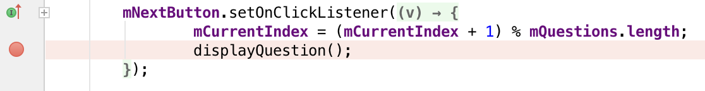
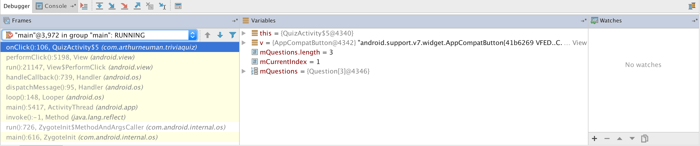
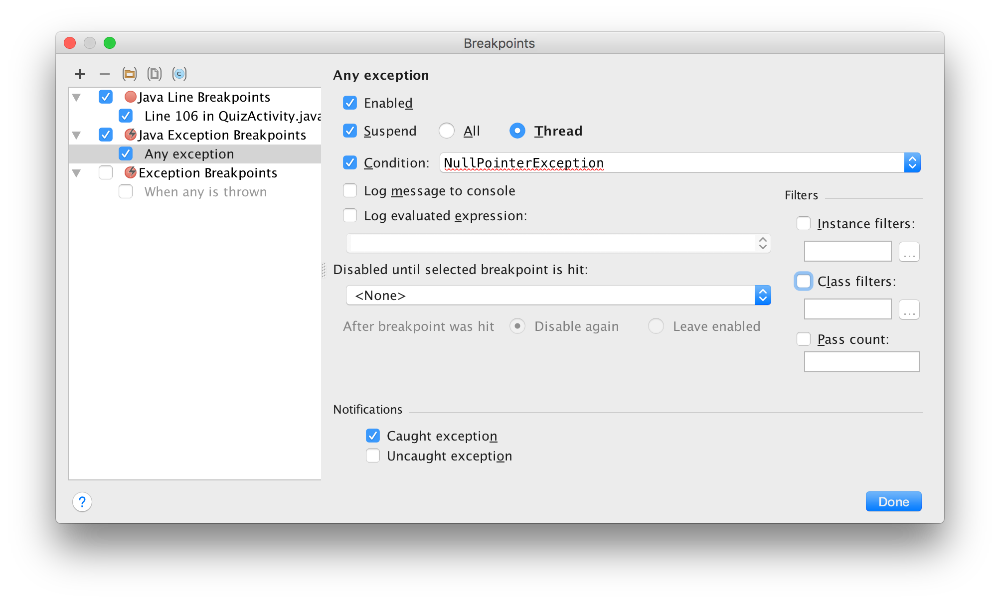
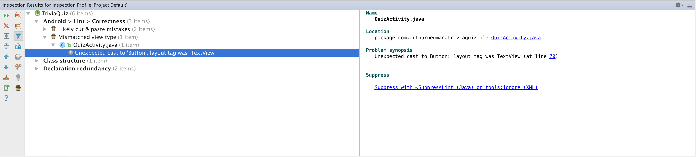

# Week 3 - Debugging

## Corresponding Text
*Android Programming*, pp. 75-85

## Logging
As we develop applications, we're likely to run into unexpected behavior
including thrown exceptions and errors. When this happens, we can debug our
application.  At the most basic level, we can log messages about our
application's state to help determine what the problem is.  We can also use
more advanced tools to find and address issues.

To begin, let's modify our existing code.  If we comment out the following line
in *QuizActivity*, our app will crash.

```java
mQuestionTextView = (TextView) findViewById(R.id.question_text_view);
```

After commenting out the code, try running the application.  The application
should crash.


If you look at the log window in Android Studio you should see a stack trace
that indicates a *RuntimeException* was thrown and was caused by a
*NullPointerException*.  The details of the *NullPointerException* indicate that
we tried to call *setText()* on a *Null* objects.  *mQuestionTextView* is null
because we commented out the code that assigned a value to that field.  Here,
the stack trace is helpful in finding the bug.  Let's uncomment the code we
previously commented out and next comment out the following line in one of
the listeners in *onCreate()*:

```java
mCurrentIndex = (mCurrentIndex + 1) % mQuestions.length;
```

Now, the app shouldn't crash when we run it but the **Next** button doesn't do
anything.  Let's pretend we don't know why the button isn't working.  One thing
we could do is add code to log relevant information when the button is pressed.  

Modify *onCreate()* to include the following code for the the *mNextButton*'s
listener:

```java
mNextButton.setOnClickListener(new View.OnClickListener() {
    @Override
    public void onClick(View v) {
        // mCurrentIndex = (mCurrentIndex + 1) % mQuestions.length;
        Log.d(TAG, "Next clicked: mCurrentIndex = " + mCurrentIndex);
        displayQuestion();
    }
});
```
Before we run our app, let's create a log filter that will only show log
messages generated by code in our package and with the debug level or higher.  
To do this, open the **logcat** window by clicking **Android Monitor** near the
bottom of Android Studio and then by clicking the **logcat** tab if it's not
selected. Near the right of the logcat window, there is a drop-down menu with
the text **Show only selected application**; we can create a new filter  by
selecting **Edit filter**.  Give the filter a name. set the package name to the
package you are working with (like `com.arthurneuman`), unselect the **Regex**
option, and set the log level to debug.

Now if we run the app and click the **Next** button, we should see log messages similar to the following:

```
06-30 18:45:24.450 9681-9681/com.arthurneuman.triviaquiz D/QuizActivity: Next clicked: mCurrentIndex = 0
06-30 18:45:25.265 9681-9681/com.arthurneuman.triviaquiz D/QuizActivity: Next clicked: mCurrentIndex = 0
06-30 18:45:25.993 9681-9681/com.arthurneuman.triviaquiz D/QuizActivity: Next clicked: mCurrentIndex = 0
```

As indicated by the log messages, the value of *mCurrentIndex* is not changing.
We know why (because we commented out the code that increments
*mCurrentIndex*) but often the reason isn't obvious and adding log messages
can be helpful in determining what is causing unexpected behavior.  We can
uncomment the code to increment *mCurrentIndex* to fix the bug and remove the
code to create a log message.

## Breakpoints
Sometimes it's more useful to know the state of several objects or to
execute code line-by-line so we can examine the state of the app at each step.  
Rather than creating a lot of log messages, we can make use of the debugger by
setting breakpoints in our code. A breakpoint is place in code where a
program's execution is paused until execution is resumed.

To add a breakpoint, we can left-click in the grey area immediately to the left
of the line for which we'd like to pause execution.  

Let's set a breakpoint at the call to *displayQuestion()* in the
*mNextButton*'s listener.



The red circle indicates that a breakpoint has been set.  If we run our
application like we have been, we won't notice anything different.  To make
use of the breakpoint we just set, we have to run our program with the
debugger; we can do this by clicking the button next to the run button in the
toolbar.

If we click the **Next** button, we'll see something similar to the following:



In the debug window, we can see the **Frames** and **Variables** views.  The
frames view lets us examine the state of different threads with the current
thread selected by default.  It also presents the current stack trace of the
selected thread.  The variables view allows us to examine variables for the
selected frame in the stack trace.  Notice that *mCurrentIndex* has been
incremented which is what we'd expect prior to calling *displayQuestion()*.  

The toolbar includes some useful buttons.  The **Step Over** button will
execute the current line of code and advance to the next line.  Note that at
the time of this writing, there is a
[bug](https://code.google.com/p/android/issues/detail?id=200880) that causes
the application to crash when stepping over at the end of a method; use **Step
Out** instead.  

**Step Out** allows us to step out of the method we're currently in to the
place where it was called.  **Step Into** allows us to move to a method being
called so we can execute the method line-by-line.  **Run to Cursor** allows us
to run all code until we get to the line on which the cursor is; execution will
then pause.  

In addition to manually setting breakpoints, we can also configure exception
breakpoints that will allow us to pause execution and examine the app's state
when an exception occurs.  To do this, select the **View breakpoints** from
the **Run** menu.  Let's add a breakpoint exception for instances of
*NullPointerException*.  To do this, click the *Add* button, select **Java
Exception Breakpoints**, start typing `NullPointerException`, select it from
the list of suggestions, and click **OK**.  



We can comment out the following line in the *onCreate()* method to cause a
*NullPointerException* to be thrown:

```java
mNextButton = (Button) findViewById(R.id.next_button);
```

Now if we debug the app, we should reach a breakpoint at the call to
*mNextButton.setOnClickListener()* because we have not assigned an object to
*mNextButton* and we cannot call the method on *null*.  Uncomment the
previously commented line to fix this.

## Android Lint
So far the debugging that we've done is no different from the debugging you
might do for any Java application - and most of the time this is the kind of
debugging we'll need to do.  However, there are some bugs that can occur with
Android-specific parts of an application (such as resources) for which the
normal Java debugger might not be helpful.  For these bugs, Android Lint can
help detect these kinds of errors.  

For example, change the following code in *QuizActivity.onCreate()*:

```java
mNextButton = (Button) findViewById(R.id.next_button);
```

to this:

```java
mNextButton = (Button) findViewById(R.id.question_text_view);
```

We can view errors found by Android Lint by selecting **Analyze** and **Inspect
Code** from the menu bar.  Though we have the option to inspect the entire app
or the current module, let's inspect the current file.  In addition to some
Java suggestions, we also see Android Lint messages.  One of the messages
indicates that there's a problem with our attempt to cast a *TextView* to a
*Button*.  If we try to run the app, it will crash due to an
*ClassCastException* - the very thing Android Lint warned us about.



Additionally, notice that the line causing the problem is also underlined in
red in the editor view. We can use Android Lint to help address issues before
they cause our app to crash.

Be sure to revert your code to assign the correct view to *mNextButton*.

## Issues with the *R* class
Occasionally, we'll encounter errors related to resources and the *R* class
used to access them that seem to appear suddenly for no reason. Diagnosing
these error can sometimes be frustrating.  Here are some things to try.

1. Check the XML in the resource files - make sure it's valid and free of
   errors.
2. Clean the project by selecting **Build** and **Clean Project** from the
   menu bar.  This causes Android Studio to rebuild the entire project.
3. Sync Gradle by selecting **Tools**, **Android**, and **Sync Project with
   Gradle Files**.  Changes to Gradle files might cause problems with until
   the project is synced and rebuilt.
4. Run Android Lint.  Android Lint can often uncover unexpected errors.
