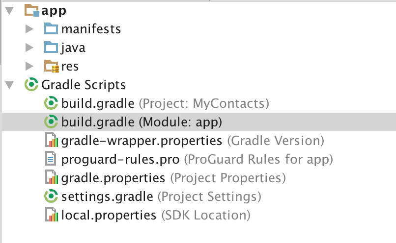
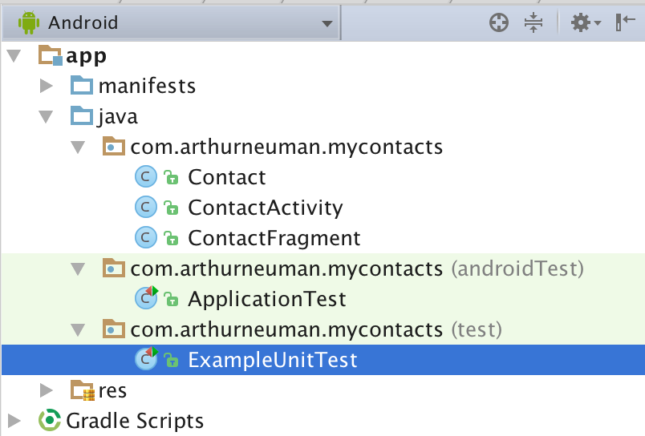
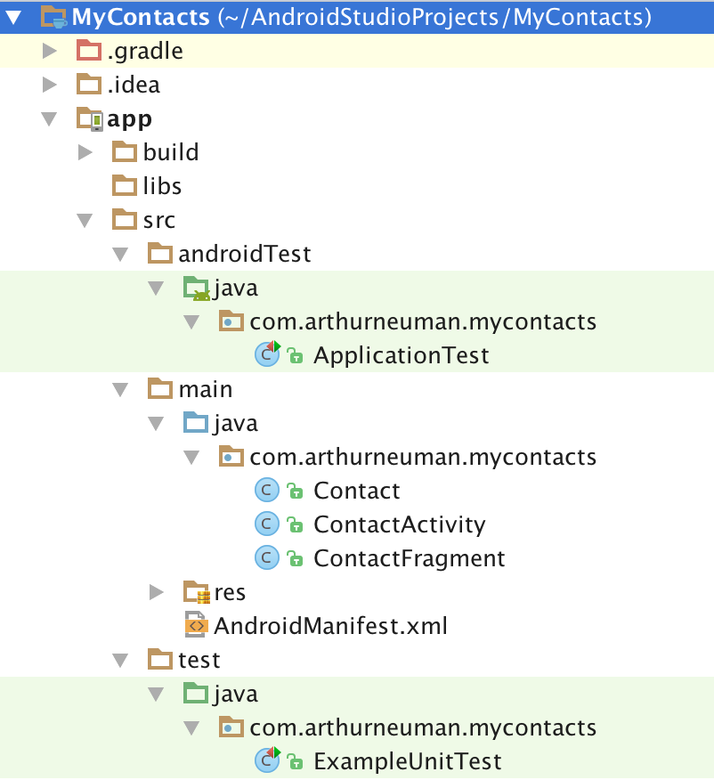

# Week 5 - Unit Tests and Profiling

## Corresponding Text
http://developer.android.com/training/testing/unit-testing/index.html
http://developer.android.com/tools/performance/index.html

## Unit Tests
While it might seem reasonable to manually test features of an app while the 
app is relatively small, as we add features manual testing becomes 
time-consuming and prone to error.  Ideally, we should automate our testing 
whenever possible.

**Unit tests** verify the functionality of a small piece of code: a method, a 
class, or some other component.  For example, if we have a class representing 
contact information that stores a name and email address, we might want to test 
the ability to assign a name and email address and the ability to retrieve 
these values.  

We can create and automate unit tests for our apps.  There are two types of 
unit tests that we can create: local tests and instrumented tests.  Local tests 
don't depend on the Android framework or instrumentation information.  Local 
tests can be run locally on the JVM.  Testing something like a class to store 
contact information would likely make use of local tests. Instrumented tests 
are unit tests that require an Android device or emulator to run. For example, 
if we wanted to test our apps ability to start another activity, we might 
create an instrumented test. If we'd like to test some code that depends on the 
Android framework, we also have the option of using local tests if we **mock**
the components of Android that we need. A mocked object is an object created 
to simulate the behavior of another object.  For example, we might want to 
test some functionality that depends on a *Bundle*; rather than write an 
instrumented test, we can write a local test if we mock *Bundle*.

### Setup
We're going to focus on local tests.  To create and run our tests, we'll make 
use of two testing frameworks: JUnit and Mockito.  This will require that we 
explicitly indicate to the build system, Gradle, that our project depends on 
these frameworks.  To do this, we'll modify the module's `build.gradle` file.



The dependencies section should look similar to this:

```
dependencies {
    compile fileTree(include: ['*.jar'], dir: 'libs')
    testCompile 'junit:junit:4.12'
    compile 'com.android.support:appcompat-v7:23.4.0'
    compile 'com.android.support:support-v4:24.1.0'
}
```

Notice that there's already an entry for JUnit.  Let's add an entry for 
Mockito. The dependencies section should now looks like this:

```
dependencies {
    compile fileTree(include: ['*.jar'], dir: 'libs')
    testCompile 'junit:junit:4.12'
    testCompile 'org.mockito:mockito-core:1.10.19'
    compile 'com.android.support:appcompat-v7:23.4.0'
    compile 'com.android.support:support-v4:24.1.0'
}
```

Once the additional dependency is added, you should be prompted to sync Gradle.

### Creating Tests
When viewing the structure of our app in the Android view, we can see three 
different packages, one that contains the classes we've created for our app and 
two that contain test classes.



If we view the structure as a typical Java project, we can see that these three 
different packages are located in different folders within the `src` folder.



We'll add our local tests to the `test` folder and instrumented tests to the 
`androidTest` folder.  

Notice that there is a simple example of each kind of test in each folder. 
Let's add a local test.

Right-click on the test package/folder and select **New** and **Java Class**. 
Name the new class `ContactTest`.  Let's start by first importing a couple of 
classes:

```Java
import org.junit.Test;
import static org.junit.Assert.assertTrue;
```

The `org.junit.Test` class will be used as a decorator to indicated that a 
method represents a test.  `assertTrue` will be used to determine if the 
test passes or fails.  We can define a test of the getters and setters of 
the *Contact* class so that our entire `ContactTest.java` file looks like this:

```java
package com.arthurneuman.mycontacts;

import org.junit.Test;
import static org.junit.Assert.assertTrue;

public class ContactTest {
    @Test
    public void contactAccessorTest() {
        String name = "Test Name";
        String email = "name@test.com";
        Contact contact = new Contact();
        contact.setName(name);
        contact.setEmail(email);
        assertTrue((contact.getName().equals(name)
                && contact.getEmail().equals(email)));
    }
}
```

In the *ContactTest* class we define one test: *contactAccessorTest()*.  In the 
test we set two strings, one for a name and one for an email address. Next, we 
create a new instance of the *Contact* class and set the name and email fields 
using the appropriate setters.  Finally, we use `assertTrue` to test that 
the getters return the values we supplied to the setters - this is the expected 
behavior.  

If *Contact* had more complex functionality, we could define additional tests 
to verify that *Contact* behaved in the expected manner.
 
To run the test, we can either right-click on the `ContactTest.java` file and 
select **Run 'ContactTest'** or right-click on the "test" folder and select 
**Run 'Tests in 'mycontacts''**.  In either case, if the tests pass, we should 
see a message indicating that the tests passed.

Let's change the *contactAccessorTest()* method so that the last line is 

```java
assertTrue((contact.getName().equals(email)
        && contact.getEmail().equals(name)));
```

We'll see a message indicating that a test failed and an **AssertionError** 
indicating exactly which test failed.

### Mocking Android Dependencies
By default, when we run our tests, they are executed with a modified version 
of the `android.jar` file that normally contains code for the Android 
framework.  The modified version will throw an exception when we attempt to 
use any Android classes or methods - this ensures we are testing our code and 
not implicitly relying on Android functionality. However, some of our code 
will be tightly coupled to the Android framework and will require certain 
Android classes to test.

As a somewhat trivial example, suppose *ContactActivity* includes a method 
for getting the package name from a *Context* object:

```java
    public String getPackage(Context context) {
        return context.getPackageName();
    }
```

Suppose we wanted to test this.  Because it depends on *Context*, a class 
from the Android framework, the test would fail with an exception if we wrote 
it like our previous test.  Instead, we have to mock the *Context* class.  By 
mocking it, we have to define its methods' behaved as necessary.  Specifically,
we'll need to define behavior for *Context.getPackageName()*.

Here's the complete test class:

```java
package com.arthurneuman.mycontacts;

import android.app.Activity;
import android.content.Context;

import org.junit.Test;
import org.junit.runner.RunWith;
import org.mockito.Mock;
import org.mockito.runners.MockitoJUnitRunner;

import static junit.framework.Assert.assertEquals;
import static org.mockito.Mockito.when;

@RunWith(MockitoJUnitRunner.class)
public class ContactActivityTest {
    private static final String PACKAGE_NAME = "com.test.mycontacts";
    @Mock
    Context mContext;

    @Test
    public void contactFragmentCreationTest() {
        when(mContext.getPackageName()).thenReturn(PACKAGE_NAME);
        ContactActivity contactActivity = new ContactActivity();
        String packageName = contactActivity.getPackage(mContext);
        assertEquals(PACKAGE_NAME, packageName);
    }
}

```

First, we have to annotate our class with `@RunWith(MockitoJUnitRunner.class)`. 
Next, we specify the Android classes we'll mock using the the `@Mock` 
annotation. We define the behavior of the mocked objects using the 
`when(...).thenReturn(...)` construction to specify the return value when a 
specific method is called.  In the example, we then create an instance of 
*ContactActivity* and call the *getPackage()* method with the mocked 
context.  If things behave as expected, the value returned by 
*ContactActivity.getPackage()* should be the same as the value returned by 
the *Context*, which we defined.  This trivial example would throw an exception 
if we didn't create a mocked *Context* class. 

### Performance Monitors

### Data Analysis