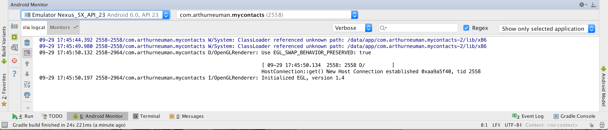
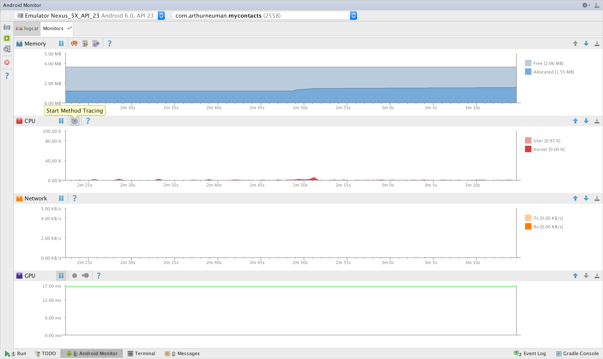
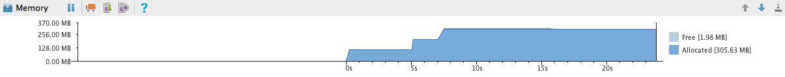
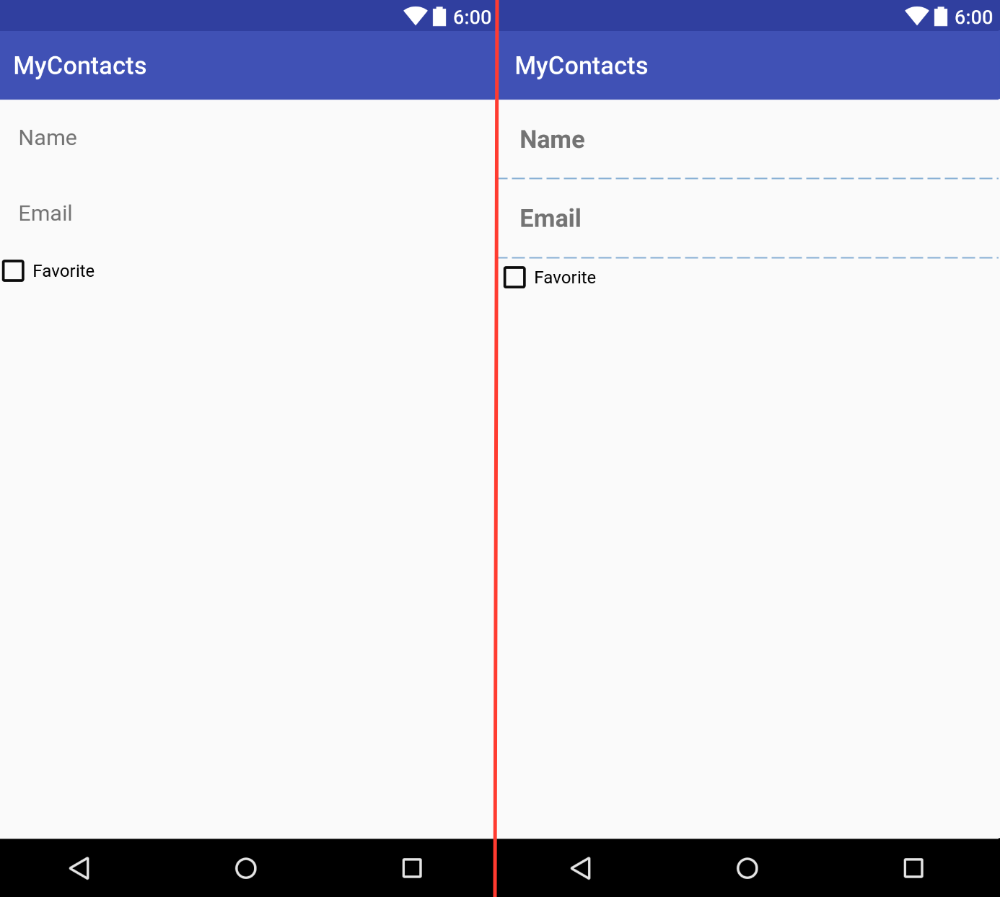
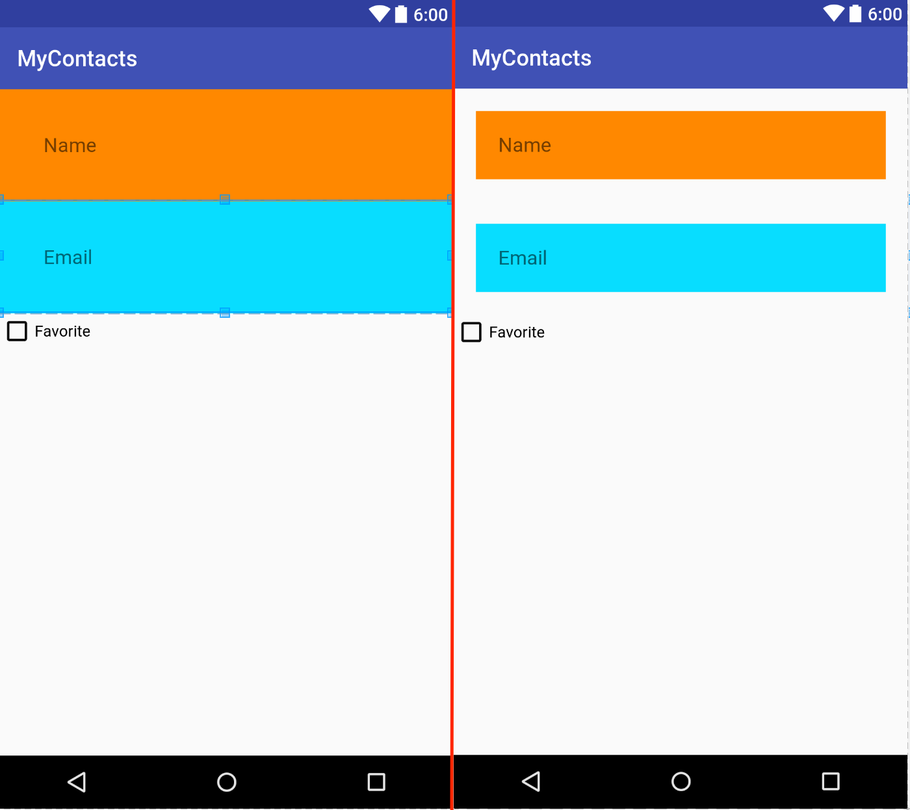

# Week 5 - Unit Tests, Profiling, Layouts, and Widgets

## Corresponding Text
http://developer.android.com/training/testing/unit-testing/index.html
http://developer.android.com/tools/performance/index.html
*Android Programming*, pp. 149-166

## Unit Tests
While it might seem reasonable to manually test features of an app while the 
app is relatively small, as we add features manual testing becomes 
time-consuming and prone to error.  Ideally, we should automate our testing 
whenever possible.

**Unit tests** verify the functionality of a small piece of code: a method, a 
class, or some other component.  For example, if we have a class representing 
contact information that stores a name and email address, we might want to test 
the ability to assign a name and email address and the ability to retrieve 
these values.  

We can create and automate unit tests for our apps.  There are two types of 
unit tests that we can create: local tests and instrumented tests.  Local tests 
don't depend on the Android framework or instrumentation information.  Local 
tests can be run locally on the JVM.  Testing something like a class to store 
contact information would likely make use of local tests. Instrumented tests 
are unit tests that require an Android device or emulator to run. For example, 
if we wanted to test our apps ability to start another activity, we might 
create an instrumented test. If we'd like to test some code that depends on the 
Android framework, we also have the option of using local tests if we **mock**
the components of Android that we need. A mocked object is an object created 
to simulate the behavior of another object.  For example, we might want to 
test some functionality that depends on a *Bundle*; rather than write an 
instrumented test, we can write a local test if we mock *Bundle*.

### Setup
We're going to focus on local tests.  To create and run our tests, we'll make 
use of some testing frameworks: JUnit, Mockito, and PowerMock.  This will 
require that we explicitly indicate to the build system, Gradle, that our 
project depends on these frameworks.  To do this, we'll modify the module's 
`build.gradle` file.


The dependencies section should look similar to this:

```
dependencies {
    compile fileTree(dir: 'libs', include: ['*.jar'])
    androidTestCompile('com.android.support.test.espresso:espresso-core:2.2.2', {
        exclude group: 'com.android.support', module: 'support-annotations'
    })
    compile 'com.android.support:appcompat-v7:25.0.1'
    testCompile 'junit:junit:4.12'
}
```

Notice that there's already an entry for JUnit.  Let's add entries for Mockito 
and PowerMock. The dependencies section should now looks like this:

```
dependencies {
    compile fileTree(dir: 'libs', include: ['*.jar'])
    androidTestCompile('com.android.support.test.espresso:espresso-core:2.2.2', {
        exclude group: 'com.android.support', module: 'support-annotations'
    })
    compile 'com.android.support:appcompat-v7:25.0.1'
    testCompile 'junit:junit:4.12'
    testCompile 'org.mockito:mockito-core:1.10.19'
    testCompile 'org.powermock:powermock-api-mockito:1.6.6'
    testCompile 'org.powermock:powermock-module-junit4:1.6.6'
}
```

Once the additional dependencies are added, you should be prompted to sync 
Gradle.

### Creating Tests
When viewing the structure of our app in the Android view, we can see three 
different packages, one that contains the classes we've created for our app and 
two that contain test classes.


If we view the structure as a typical Java project, we can see that these three 
different packages are located in different folders within the `src` folder.


We'll add our local tests to the `test` folder and instrumented tests to the 
`androidTest` folder.  

Notice that there is a simple example of each kind of test in each folder. 
Let's add a local test.

Right-click on the test package/folder and select **New** and **Java Class**. 
Name the new class `ContactTest`.  Let's start by first importing a couple of 
classes:

```Java
import org.junit.Test;
import static org.junit.Assert.assertEquals;
```

The `org.junit.Test` class will be used as a decorator to indicated that a 
method represents a test.  `assertEquals` will be used to determine if the 
test passes or fails.  We can define tests for the getters and setters of 
the *Contact* class.  If the getters and setters of the *Contact* class depend 
on any component of the Android framework, such as *Log*, the following 
examples will not work; comment out any Android-dependent functionality, create 
different tests, or see the details of mocked tests below.

The following are two tests for the accessor methods in the *Contact* class: 

```java
public class ContactTest {
    @Test
    public void contactNameTest() {
        String name = "Test Name";
        Contact contact = new Contact();
        contact.setName(name);
        assertEquals(name, contact.getName());
    }

    @Test
    public void contactEmailTest() {
        String email = "name@test.com";
        Contact contact = new Contact();
        contact.setEmail(email);
        assertEquals(email, contact.getEmail());
    }
}
```

In the *ContactTest* class we define two tests: *contactNameTest()* and 
*contactEmailTest()*.  In each test we set a value for a string, create a new 
instance of the *Contact* class and use the appropriate setter.  In each test, 
we assert that something must be the case in order for the test to pass: that 
the string we created is equal to the value returned by the appropriate getter. 

To run the tests, we can either right-click on the `ContactTest.java` file and 
select **Run 'ContactTest'** or right-click on the "test" folder and select 
**Run 'Tests in 'mycontacts''**.  In either case, if the tests pass, we should 
see a message indicating that the tests passed.

If we modify the behavior of the Contact class so that the expected value of 
*getName()* or *getEmail()* is not returned, we'll see a message indicating 
that a test failed and an **AssertionError** indicating exactly which test 
failed.

Let's add one more test to ensure that newly created instances of *Contact* 
have non-null IDs:

```java
    @Test
    public void UUIDcreationTest() {
        Contact contact = new Contact();
        assertNotNull(contact.getID());
    }
```

If *Contact* had more complex functionality, we could define additional tests 
to verify that *Contact* behaved in the expected manner.


### Mocking Android Dependencies
By default, when we run our tests, they are executed with a modified version 
of the `android.jar` file that normally contains code for the Android 
framework.  The modified version will throw an exception when we attempt to 
use any Android classes or methods - this ensures we are testing our code and 
not implicitly relying on Android functionality. However, some of our code 
will be tightly coupled to the Android framework and will require certain 
Android classes to test.

As a somewhat trivial example, suppose *ContactActivity* includes a method 
for getting the package name from a *Context* object:

```java
    public String getPackage(Context context) {
        return context.getPackageName();
    }
```

Suppose we wanted to test this.  Because it depends on *Context*, a class 
from the Android framework, the test would fail with an exception if we wrote 
it like our previous test.  Instead, we have to mock the *Context* class.  By 
mocking it, we have to define its methods' behaved as necessary.  Specifically,
we'll need to define behavior for *Context.getPackageName()*.

Here's the complete test class:

```java
@RunWith(MockitoJUnitRunner.class)
public class ContactActivityTest {
    private static final String PACKAGE_NAME = "com.test.mycontacts";
    
    @Mock
    Context mContext;

    @Test
    public void contactFragmentCreationTest() {
        when(mContext.getPackageName()).thenReturn(PACKAGE_NAME);
        ContactActivity contactActivity = new ContactActivity();
        String packageName = contactActivity.getPackage(mContext);
        assertEquals(PACKAGE_NAME, packageName);
    }
}

```

First, we have to annotate our class with `@RunWith(MockitoJUnitRunner.class)` 
which will cause Mockito to process/run the test rather than JUnit directly. 
Next, we specify the Android classes we'll mock using the the `@Mock` 
annotation. We define the behavior of the mocked objects using the 
`when(...).thenReturn(...)` construction to specify the return value when a 
specific method is called.  In the example, we then create an instance of 
*ContactActivity* and call the *getPackage()* method with the mocked 
context.  If things behave as expected, the value returned by 
*ContactActivity.getPackage()* should be the same as the value returned by 
the *Context*, which we defined.  This trivial example would throw an exception 
if we didn't create a mocked *Context* class. 

A weakness of Mockito is that we cannot use it to mock static methods like 
those we'd use from the *Log* class.  We can use PowerMock to do this.  Recall 
that when we updated the app's dependencies, we added two PowerMock libraries. 
One is used to integrated PowerMock with JUnit and the other to interact with 
Mockito.  This allows us to make minimal changes to existing tests to 
incorporate PowerMock functionality.  As an example, modify the 
*contactActivity.getPackageName()* method to include code that generates a log 
message.

```java
public String getPackage(Context context) {
    Log.d(ContactActivity.class.getSimpleName(), "Getting package name");
    return context.getPackageName();
}
```

Running the existing test using Mockito will fail.  Using PowerMock, we can 
indicate that we'll need to mock the *Log* class using the *PrepareForTest* 
class annotation and the *PowerMockito.mockStatic()* method within a test. 
We'll also have to update the *RunWith* class annotation to use 
*PowerMockRunner*.  Here's the updated test using PowerMock:

```java
@RunWith(PowerMockRunner.class)
@PrepareForTest(Log.class)
public class ContactActivityTest {
    private static final String PACKAGE_NAME = "com.test.mycontacts";
    @Mock
    Context mContext;

    @Test
    public void contactFragmentCreationTest() {
        when(mContext.getPackageName()).thenReturn(PACKAGE_NAME);
        PowerMockito.mockStatic(Log.class);
        ContactActivity contactActivity = new ContactActivity();
        String packageName = contactActivity.getPackage(mContext);
        assertEquals(PACKAGE_NAME, packageName);
    }
}
```

## Profiling 
Users expect apps to start quickly and be responsive.  As we develop the app it 
will be important to not only test functionality using unit test but to also 
examine performance using the profiling tools included with Android Studio.

### Performance Monitors
Android Studio includes a collection of tools we can use to monitor resource 
usage of app.  These tools are available in the **Android Monitor** view. 
We've already used one of the monitors, *logcat*, when viewing log messages.



Next to the **logcat** tab, we can find the **Monitors** tab.  There are four 
charts that are displayed providing information about usage over time:

- Memory
- CPU
- Network
- GPU



Each chart has a set of tools available for use.  The memory chart shows our 
app's memory usage over time.  In addition to being able to track the usage,
we can also use the monitor to dump the heap, where all runtime data is stored, 
to determine what is consuming memory; track memory allocations of objects; and 
force the garbage collector to run. A common problem, especially when using 
media, is consuming more memory than is available leading to a crash.  The 
memory monitor and it's tools can help determine what is consuming large 
amounts of memory.

The CPU monitor displays the app's processor usage.  Additionally, we can track 
method execution using the method tracer tool.  The CPU monitor is useful if we 
notice that the app is frequently unresponsive. We might have several 
long-running methods in different threads or a lot of short-running threads.  

The network monitor is useful for tracking network usage.  If we find that our 
app is transmitting or receiving more data than we expect, it might be due to a 
bug.  Given that a lot of users have limited bandwidth, it's important that we 
track down excessive usage.  Similarly, if we expect to connect to an external 
data source and don't appear the be getting/sending data, we can confirm this 
using the network monitor.

The GPU monitor indicates the time required to render the apps interface. 
Unless the app makes use of advanced graphics, we shouldn't expect rendering to 
take a lot of time.  If we have a lot of UI elements, we might see this 
reflected in the GPU monitor. 

To demonstrate a memory leak, consider the following example adapted from 
[Codexpedia.com](http://www.codexpedia.com/android/memory-leak-examples-and-solutions-in-android/). 
First, create a new app with an empty activity.  Update the activity to include 
the following code:

```java
public class MainActivity extends AppCompatActivity {
    private Handler mLeakyHandler = new Handler();
    private int[] mValues = new int[5 * 1024 * 1024];

    @Override
    protected void onCreate(Bundle savedInstanceState) {
        super.onCreate(savedInstanceState);

        // Post a message and delay its execution for 10 seconds.
        mLeakyHandler.postDelayed(new Runnable() {
            @Override
            public void run() {
                Toast.makeText(MainActivity.this, 
                        "Number of items: " + mValues.length, 
                        Toast.LENGTH_LONG)
                .show();
            }
        }, 1000 * 10);
    }
```

Here, we are making use of a *Handler*.  A *Handler* lets us add a *Message*, a 
special object to store data, or a *Runnable* to a queue as well as process 
objects in the queue.  A *Handler* will allow us to create threads that can 
interact with the UI. Here, we add a *Runnable* that displays a message about 
the size of the *mValues* array.  Because the new thread requires information 
about *mValues*, a reference to the object is maintained until the activity is 
destroyed and the thread has executed.  

Now start the app and rotate the device a few times.  Eventually, the app 
should crash.  If we view the log messages using **logcat**, we can see that 
the app crashed due to a lack of memory.  If we restart the app and use the 
memory monitor while rotating the app, we can see that the app slowly consumes 
more and more memory until it crashes.



If we wanted to gain more insight into what was using memory, we could track 
memory allocation by clicking the **Start Allocation Tracking** button.  Once 
the app crashes, click the button again to see what the memory allocation 
looked like - we should see multiple *int* arrays consuming large amounts of 
RAM.  


Though this example exaggerates the issue by initializing a large array , 
the way the code is written is still causing a memory leak - when the activity 
is destroyed, due to rotation or something else, the *Handler* queue is not 
cleared; this can be done by adding the following to the 
*MainActivity.onDestroy()* method:

```java
    mLeakyHandler.removeCallbacksAndMessages(null);
```

## Adding Widgets and Updating Layouts
Let's return to the contacts app and add some additional functionality. 
Eventually, we'll be able to view a list of contacts and it might be helpful to 
select some contacts as "favorites" and view only favorite contacts.  To enable 
the user to designate a contact as a favorite, we'll add a widget to the 
contact fragment layout, update the *Contact* class, and wire the new widget to 
make changes to the corresponding *Contact* instance when the widget's state 
changes.  

To begin, let's add a string resource to the `string.xml` resource file:

```xml
<string name="favorite">Favorite</string>
```

Next, let's add a *CheckBox* widget to the contact fragment layout.  We can 
add it after the email *EditText* in the existing *LinearLayout* by dragging 
and dropping the widget onto the preview of the layout and settting the 
following properties:

| Property | Value            |
|----------|------------------|
| ID       | contact_favorite |
| text     | @string/favorite |

While we're modifying the layout, set the following properties on the other 
widgets:

| Widget           | Property  | Value            |
|------------------|-----------|------------------|
| Name *EditText*  | inputType | textPersonName   |
| Email *EditText* | inputType | textEmailAddress |

Choosing the appropriate input type will affect which keyboard is displayed 
on screen, suggestions provided, and how input will be displayed (masked when 
passwords are entered, for example).

We'll examine the layout further later but for now, it should resemble this:


The XML for the layout should be similar to the following

```xml
<?xml version="1.0" encoding="utf-8"?>
<LinearLayout xmlns:android="http://schemas.android.com/apk/res/android"
              android:orientation="vertical"
              android:layout_width="match_parent"
              android:layout_height="match_parent">
    <EditText
        android:layout_width="match_parent"
        android:layout_height="wrap_content"
        android:id="@+id/contact_name"
        android:hint="@string/name_hint"
        android:padding="20dp"
        android:inputType="textPersonName"/>

    <EditText
        android:layout_width="match_parent"
        android:layout_height="wrap_content"
        android:id="@+id/contact_email"
        android:hint="@string/email_hint"
        android:padding="20dp"
        android:inputType="textEmailAddress"/>

    <CheckBox
        android:text="@string/favorite"
        android:layout_width="match_parent"
        android:layout_height="wrap_content"
        android:id="@+id/contact_favorite"/>
</LinearLayout>
```

To support designating a contact as a favorite, we'll have to update the 
*Contact* class to track this information.  We can do this by adding a 
private boolean field and the corresponding getter and setter.

```java
public class Contact {

    ...

    private boolean mIsFavorite;

    ...

    public boolean isFavorite() {
        return mIsFavorite;
    }

    public void setFavorite(boolean favorite) {
        mIsFavorite = favorite;
    }

}
```

In the code above, the ellipses, `...`, represent additional code left out 
for brevity.

Now we can add code that will toggle a contact's state of being a favorite 
based on the state of the widget we added earlier.  In the *ContactFragment* 
class, we can add a field to represent the favorite *CheckBox* and set an 
*OnCheckedChangeListener* to update the the contact's favorite status.

```java
public class ContactFragment extends Fragment {

    ...

    private CheckBox mFavoriteCheckBox;

    @Override
    public View onCreateView(LayoutInflater inflater, ViewGroup container,
                             Bundle savedInstanceState) {
        View v = inflater.inflate(R.layout.fragment_contact, container, false);

        ...

        mFavoriteCheckBox = (CheckBox)v.findViewById(R.id.contact_favorite);
        mFavoriteCheckBox.setOnCheckedChangeListener(new CompoundButton.OnCheckedChangeListener() {
            @Override
            public void onCheckedChanged(CompoundButton buttonView, boolean isChecked) {
                mContact.setFavorite(isChecked);
            }
        });

        return v;
    }
}
```

## Layout Attributes
### Styles and Themes
Now that we've added a widget and code to do something when the widget is used, 
let's return to our layout `fragment_contact.xml`.  For each widget defined 
in the layout, there are some attributes worth noting beyond what we've made 
use of so far.

A *style* is a resource that contains attributes defining the appearance and 
behavior of a widget.  Styles, like layouts, are specified using XML.  For 
example, the following defines a style named **BigBoldStyle**. 

```xml
    <style name="BigBoldStyle">
        <item name="android:textSize">20sp</item>
        <item name="android:textStyle">bold</item>
    </style>
```

We can define styles in `res/values/styles.xml`.  Be careful when specifying 
attribute names - they are case sensitive.

We can use the style by setting a widget's property or by specifying it in 
the resource XML like this:

```xml
 <EditText style="@style/BigBoldStyle"
        android:layout_width="match_parent"
        android:layout_height="wrap_content"
        android:id="@+id/contact_name"
        android:hint="@string/name_hint"
        android:padding="20dp"
        android:inputType="textPersonName"/>
```

Compare the text in the *EditText* widgets before and after changing the style.



A **theme** is a collection of styles.  Like a style, a theme can be specified 
in the `styles.xml` file.

### Layout Parameters
If we look at the XML representing the layout of our fragment, we can see that 
some of the attributes have names that begin with `layout_`.  Parameters that 
do not start with `layout_` provide configuration information about the widget 
itself when the view is inflated.  Parameters that do begin with `layout_` 
provide information to the widget's parent about how to arrange the widget 
within the parent.   

Two commonly confused attributes are margins and padding.  Margin attributes 
are layout parameters: they are used to determine the distance between widgets.
Because one widget is not responsible for the placement of a second widget 
(unless the first is the parent of the second), it is up to the parent to make 
use of the margin information when placing widgets.  

Padding is not a layout parameter, it defines how much larger than its content 
a widget should be.  To demonstrate the difference, let's change the 
*background* attributes of the two *EditText* widgets we have:

```xml
    <EditText
        android:layout_width="match_parent"
        android:layout_height="wrap_content"
        android:id="@+id/contact_name"
        android:hint="@string/name_hint"
        android:padding="20dp"
        android:inputType="textPersonName"
        android:background="@android:color/holo_orange_dark"/>


    <EditText
        android:layout_width="match_parent"
        android:layout_height="wrap_content"
        android:id="@+id/contact_email"
        android:hint="@string/email_hint"
        android:padding="20dp"
        android:inputType="textEmailAddress"
        android:background="@android:color/holo_blue_bright"/>
``` 

Next, let's double the padding from the default value of `20dp` to `40dp`. 
Notice that the entire widget increased in size (and the text move further 
toward the center).  The space between the widget's content and its edges 
increased when we increased the padding.  

Let's reset the padding to `20dp` and add `android:layout_margin="20dp"` to 
both widgets.  Notice now that rather than the widgets increasing in size, the 
space between each widget and other widgets (and the edges of the parent) 
increased.  The parent layout used the new layout parameter to change the 
placement of the widget.



Be sure to revert changes to margins, padding, and the background.

Another layout parameter that we might have to work with is `layout_weight`. 
When working with linear layouts, the layout makes two passes to examine a 
widget's layout parameters to place it and other widgets.  First, the layout 
will look at the widget's height (if the layout is a vertical layout) or the 
widget's width (if the layout is a horizontal layout).  In the second pass, 
the layout will examine the `layout_weight` attribute to allocate any extra 
space.  If we add `android:layout_weight="1"` to the two *EditText* widgets, we 
can see that the layout allocates enough space for each of the widgets then 
allocates extra space to widgets with the weight attributes.


If we double the weight for the first *EditText* widget, we can see that the 
first *EditText* widget has twice the height of the second one - it's been 
allocated twice the extra space than the second *EditText* widget.


For now, we'll remove the specifications for the `layout_weight` attributes.

### Screen Pixel Densities
When we modified padding of our widgets, you might have noticed that units were 
`dp`.  Because Android runs on many devices with difference screen sizes, 
Android provides a method of specifying sizes in a way that should produce 
similar results across all devices.  We make use of this with 
device-independent dimension units.  We can specify sizes in one of three ways:

| Unit       | Description                                                                                                                                                                                                                                   |
|------------|-----------------------------------------------------------------------------------------------------------------------------------------------------------------------------------------------------------------------------------------------|
| dp         | Density-independent pixel - typically used for margins and padding.  For higher-density displays, a density-independent pixel will expand to fill a lager number of pixels.  By definition 1 dp = 1/160th of an inch on the device's screen.  |
| sp         | Scale-independent pixel - typically used for text size.  These are density-independent pixels that also take a user's font size preference into account.                                                                                      |
| pt, mm, in | Scaled units representing points (1/72nd of an inch), millimeters, and inches.  Many devices are not configured to properly scale items specified with these units so they should be avoided in favor of `dp` or `sp`.                        |
