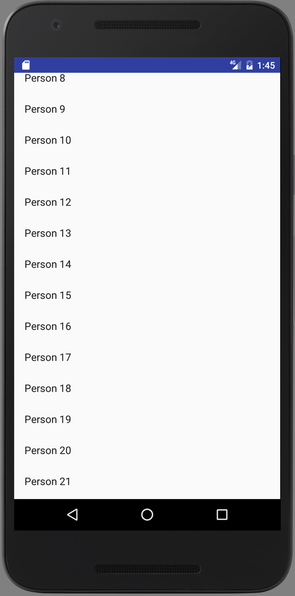

# Week 6 - Views and Adapters

## Corresponding Text
*Android Programming*, pp. 167-191

## Creating a List of Items
Ultimately, we'd like to be able to create contacts, view a list of our 
contacts, and select a contact from the list to view it's details.  Right now, 
we have part of what's needed when viewing an existing contact or creating a 
new one.  As a next step, we'll focus on how we can list a collection of 
contacts.

### Updating the Model
As a first step, we'll need to update our model to include a means of storing 
a collection of *Contact* object, something like an address book.  Because 
we will only every need one instance of this new class, we'll create a 
singleton.  A **singleton** class has at most one instance.  In order to 
create a singleton, we'll create class and make its constructor private; this 
will prevent other objects from creating instances of the class.  So how can 
we create one instance of a class with a private constructor?  Because the 
constructor is private, only methods belonging to the class can use it.  We can 
create a method that checks to see if an instance exists and returns the 
existing instance if it exists or creates it and returns it if the instance 
does not exist.  Let's call the class *AddressBook*.  Here's the necessary code 
to make *AddressBook* a singleton.

```java
public class AddressBook {
    private static AddressBook sAddressBook;

    private AddressBook() {
    }

    public static AddressBook get() {
        if (sAddressBook == null) {
            sAddressBook = new AddressBook();
        }
        return sAddressBook;
    }

}
```

Here, the *AddressBook* class has a static field to store an instance of the 
class and a public, static method named *get()* that will return an instance of 
the class, creating it if necessary.  It's important that the field and method 
be static since we won't have an instance to begin with.

Now that we've made sure we can have at most one *AddressBook*, let's add the 
functionality required to store contacts.  Recall that one of the fields on the 
*Contact* class involved an ID; we'll add functionality to *AddressBook* to 
find a contact using it's ID.

```java
public class AddressBook {
    private static AddressBook sAddressBook;
    private List<Contact> mContacts;

    private AddressBook() {
        mContacts = new ArrayList<>();
    }

    public static AddressBook get() {
        if (sAddressBook == null) {
            sAddressBook = new AddressBook();
        }
        return sAddressBook;
    }

    public List<Contact> getContacts() {
        return mContacts;
    }

    public Contact getContact(UUID id) {
        for (Contact contact: mContacts) {
            if (contact.getID().equals(id)) {
                return contact;
            }
        }
        return null;
    }
}
```

We've added a private field *mContacts* to store a *List* of *Contact* 
instances and assigned a new *ArrayList* to it in the private constructor. 
We've also added two public methods: one to return all the stored contacts and 
one to search for contacts based on a specified ID.

Eventually, we'll add functionality for the user to create new contacts and 
these will be added to the list of contacts but for now, let's pre-populate 
the list with some made-up contacts.  We can do this by adding code to the 
constructor:

```java
    private AddressBook() {
        mContacts = new ArrayList<>();
        for (int i=0; i<100; i++) {
            Contact contact = new Contact();
            contact.setName("Person " + i);
            contact.setEmail("Person" + i + "@email.com");
            
            // set every 10th as a favorite
            if (i % 10 == 0) {
                contact.setFavorite(true);
            }
            
            mContacts.add(contact);
        }

    }
```  
This will create contacts with names like "Person 1", email addresses like 
"Person1@email.com", and every 10<sup>th</sup> contact marked as a favorite.

### Updating the Controller
We will create a fragment to display our list of contacts.  Just like before 
when we created a fragment to display contact information, we had to first 
create an activity to host the fragment.  If we look at the XML defining 
`activity_contact.xml`, we can see that it doesn't make use of any particular 
fragment:

```xml
<?xml version="1.0" encoding="utf-8"?>
<FrameLayout xmlns:android="http://schemas.android.com/apk/res/android"
             android:id="@+id/fragment_container"
             android:layout_width="match_parent"
             android:layout_height="match_parent">
</FrameLayout>
```

We can actually reuse this activity to host a new fragment we create. 
Right-click on `activity_contact.xml` in the **Project** view and select 
**Refactor -> Rename**; enter `activity_fragment.xml` as the new name.  Our 
code in the *ContactActivity* class should have automatically updated to use 
the fragment's new name.  

Looking at the code for the *ContactActivity* class, we can see that if we 
wanted to create a new activity to host a single fragment, we could reuse most 
of the code.  The exception is that code that creates an instance of 
*ContactFragment*:

```java
fragment = new ContactFragment();
```

Rather than copying and repeating most of this code for a new activity, it 
would be nice if we could create a class from which *ContactActivity* and the 
new activity class we will create could inherit from.  One way we can do this 
is by creating an abstract class with the same code that *ContactActivity* 
currently has but replaces `new ContactFragment()` with a call to method that 
creates a fragment.  If we make this new method abstract in the base class, we 
can force any class that extends the base class to implement the method.  

Let's create a new abstract class named `SingleFragmentActivity`; its code will 
be similar to the code already in *ContactActivity*:

```java
public abstract class SingleFragmentActivity extends FragmentActivity{
    public String getPackage(Context context) {
        return context.getPackageName();
    }

    protected abstract Fragment createFragment();

    @Override
    protected void onCreate(Bundle savedInstanceState) {
        super.onCreate(savedInstanceState);
        setContentView(R.layout.activity_fragment);

        FragmentManager fm = getSupportFragmentManager();
        Fragment fragment = fm.findFragmentById(R.id.fragment_container);

        if (fragment==null) {
            fragment = createFragment();
            fm.beginTransaction()
                    .add(R.id.fragment_container, fragment)
                    .commit();
        }

    }
}
```

This new abstract class declares an abstract method, *createFragment()*, that 
will return an instance of the *Fragment* class.  Additionally, the 
*onCreate()* method now calls the *createFragment()* method to assign a value 
to the *fragment* field.  We can now rewrite *ContactActivity* to extend this 
abstract class:

```java
public class ContactActivity extends SingleFragmentActivity {
    @Override
    protected Fragment createFragment() {
        return new ContactFragment();
    }
}
```

Next, we can create the controller classes that will work with the fragment 
used to display a list of contacts.  Let's create two classes: 
*AddressBookFragment* and *AddressBookActivity*. Right now, we won't add any 
code to the *AddressBookFragment* class:

```java
public class AddressBookFragment extends Fragment {
}
```

*AddressBookActivity* will look similar to *ContactActivity* but the 
*createFragment()* will create an instance of *AddressBookFragment*:

```java
public class AddressBookActivity extends SingleFragmentActivity {
    @Override
    protected Fragment createFragment() {
        return new AddressBookFragment();
    }
}
```

In order to use the activity in our app, we have to declare it in the 
application's manifest located in the `app/manifests` folder in the Android 
project view. 

```xml
<?xml version="1.0" encoding="utf-8"?>
<manifest xmlns:android="http://schemas.android.com/apk/res/android"
          package="com.arthurneuman.mycontacts">

    <application
        android:allowBackup="true"
        android:icon="@mipmap/ic_launcher"
        android:label="@string/app_name"
        android:supportsRtl="true"
        android:theme="@style/AppTheme">
        <activity android:name=".ContactActivity">
        </activity>
        <activity android:name=".AddressBookActivity">
            <intent-filter>
                <action android:name="android.intent.action.MAIN"/>
                <category android:name="android.intent.category.LAUNCHER"/>
            </intent-filter>
        </activity>
    </application>

</manifest>
```

Here, we added another **activity** element and moved the **intent-filter** 
element into the new **activity** element; this tells Android which activity 
should be used when the app starts. If we start the app now, we'll see 
the activity with its *FrameLayout* hosting an empty **AddressBookFragment**.

## Creating the View
Now that we've updated the model and started work on updating the controller, 
let's turn our attention to the view.  What we'd like to do is display a list 
of contacts in a way that will allow us to scroll through the list if there are 
more than can be displayed at once on the screen.  To do this, we'll make use 
of a *RecyclerView*.  The *RecyclerView* is a subclass of *ViewGroup* that 
displays a list of child *View* objects with each object corresponding to an 
item in some other list.  For us, the *View* objects will correspond to 
contacts stored in the *AddressBook* instance.  

Our first implementation will be simple: it will display a list of contact 
names using *TextView*s. Right now, our *AddressBook* class creates 100 
contacts but not all of them will be able to be displayed on the screen.  
Rather than creating 100 *TextView*s when only a fraction will be displayed on 
screen, *RecyclerView* handles creating just enough *TextView*s and reusing 
them as we scroll through the list.

The *RecyclerView* is only responsible for recycling its child *View* objects 
and positioning them on the screen; it does not create the *View* objects 
or configure them.  In order to do those tasks, we need to use a *ViewHolder* 
and an *Adapter*.

A *ViewHolder* is responsible for keeping track of a *View* and handles wiring 
a *View* when the corresponding data changes.  An *Adapter* is responsible for 
creating *ViewHolder*s and loading data from the model and binding it to a 
*ViewHolder*.  The *RecyclerView* will use the *Adapter* to create a sufficient 
number of *ViewHolder* depending on how many can be displayed.  When the time 
comes to display data (or as the list is scrolled through), the *RecyclerView* 
will supply a *ViewHolder* to the *Adapter* and the *Adapter* will bind model 
data to the *View* associated with the *ViewHolder*.  

In order to use a *RecyclerView*, we have to add a dependency to our project.  
From the menus, choose **File -> Project Structure...**, select the **app** 
module, then click the **Dependencies** tab.  Click the add button, select 
**Library** and choose the `com.android.support:recyclerview-v7` library.

We'll place a *RecyclerView* in the *AddressBookFragment* layout but first 
we have to create that layout file. Right-click the `res/layout` folder and 
select **New -> Layout resource file"; name it `fragment_address_book` and 
change the root element to `android.support.v7.widget.RecyclerView`.  Set the 
ID attribute to `@+id/address_book_recycler_view`. The XML for the new layout 
should look similar to the following:

```xml
<?xml version="1.0" encoding="utf-8"?>
<android.support.v7.widget.RecyclerView
    xmlns:android="http://schemas.android.com/apk/res/android"
    android:id="@+id/address_book_recycler_view"
    android:layout_width="match_parent"
    android:layout_height="match_parent">
</android.support.v7.widget.RecyclerView>
```
      
Now that we've defined the view in the layout file, let's connect the view to 
the fragment by adding the following code to *AddressBookFragment*:

```java
public class AddressBookFragment extends Fragment {
    private RecyclerView mAddressBookRecyclerView;

    @Override
    public View onCreateView(LayoutInflater inflater, ViewGroup container,
                             Bundle savedInstanceState) {
        View view = inflater.inflate(R.layout.fragment_address_book, container,
                false);

        mAddressBookRecyclerView = 
                (RecyclerView) view.findViewById(R.id.address_book_recycler_view);
        mAddressBookRecyclerView.setLayoutManager(
                new LinearLayoutManager(getActivity()));
        
        return view;
    }
}
```

Notice that this is similar to what we did when we created a *ContactFragment*.
When we create a new *RecyclerView*, we also have to specify a *LayoutManager*. 
The *LayoutManager* will actually positioning *View*s on the screen and define 
the scrolling behavior.  Here, we're creating a new *LinearLayoutManager* and 
setting it as the *LayoutManager*.

If we were to run the app now, we still wouldn't see any of our contacts.  We 
still have to provide implementations for the *Adapter* and the *ViewHolder*. 
Because the *ViewHolder* and *Adapter* will be unique to and work closely with 
the *RecyclerView* in *AddressBookFragment*, we can define them as nested 
classes.  *ViewHolder* is responsible for keeping track of a *View* so its code 
can be as simple as the following:

```java
public class AddressBookFragment extends Fragment {
    ...
    private class ContactHolder extends RecyclerView.ViewHolder {
        public TextView mContactNameTextView;
        
        public ContactHolder(View itemView) {
            super(itemView);
            mContactNameTextView = (TextView) itemView;
        }
    }
}
```

The *Adapter* class will be used with *RecyclerView* when a *ViewHolder* 
has to be created or when the corresponding *View* has to be updated; 
additionally, the *Adapter* has to be able to provide the total number of 
items.  In order to do these things, our implementation of *Adapter* has to 
provide implementations for three methods: *onCreateViewHolder()* when a new 
*View* is needed to display an item, *onBindViewHolder()* when updating 
the view, and *getItemCount()* to get the total number of items.

```java
public class AddressBookFragment extends Fragment {
    ...
    private class ContactAdapter extends RecyclerView.Adapter<ContactHolder> {
        private List<Contact> mContacts;
        
        public ContactAdapter(List<Contact> contacts) {
            mContacts = contacts;
        }
        
        @Override
        public ContactHolder onCreateViewHolder(ViewGroup parent, int viewType) {
            LayoutInflater layoutInflater = LayoutInflater.from(getActivity());
            View view = layoutInflater.inflate(
                    android.R.layout.simple_list_item_1, parent, false);
            return new ContactHolder(view);
        }

        @Override
        public void onBindViewHolder(ContactHolder holder, int position) {
            Contact contact = mContacts.get(position);
            holder.mContactNameTextView.setText(contact.getName());
        }

        @Override
        public int getItemCount() {
            return mContacts.size();
        }
    }
} 
```

The constructor for *ContactAdapter* will require a list of contacts that we'll 
use when the *onBindViewHolder()* and *getItemCount()* methods are called. In 
*onCreateViewHolder()*, notice that we use 
`android.R.layout.simple_list_item_1` as the layout to be inflated; this comes 
from the Android standard library.

Next, we have to connect *ContactAdapter* and the *RecyclerView*.  To do 
this, we'll add a method to *AddressBookFragment* that gets an instance 
of *AddressBook*, uses it to create an instance of *ContactAdapter*, and 
calls the *RecyclerView*'s *setAdapter()* method.  We'll call this new method 
before returning **view** in *onCreateView()*.

```java
public class AddressBookFragment extends Fragment {
    private RecyclerView mAddressBookRecyclerView;
    private ContactAdapter mContactAdapter;
    
    @Override
    public View onCreateView(LayoutInflater inflater, ViewGroup container,
                             Bundle savedInstanceState) {
        View view = inflater.inflate(R.layout.fragment_address_book, container,
                false);

        mAddressBookRecyclerView = (RecyclerView) view.findViewById(
                R.id.address_book_recycler_view);
        mAddressBookRecyclerView.setLayoutManager(
                new LinearLayoutManager(getActivity()));

        updateUI();
        
        return view;
    }
    
    private void updateUI() {
        AddressBook addressBook = AddressBook.get();
        List<Contact> contacts = addressBook.getContacts();
        mContactAdapter = new ContactAdapter(contacts);
        mAddressBookRecyclerView.setAdapter(mContactAdapter);
    }
...
}
```

If we run our app and scroll, we should see something like this:



Finally, we can add support for pressing items.  To do this, let's update 
*ContactHolder* to be the **OnClickListener** for its associated view.  When 
an item is pressed, we'd like it to display a message containing the contact's 
name.  Right now, we directly set the the text displayed by the view in 
*ContactAdapter* by working directly with a *ContactHolder* field.  Let's 
rework this so that the *ContactActivity* has to call a method on 
*ContactHolder* that takes a *Contact* and sets the text.  

Here's what *ContactHolder* looks like now:

```java
public class AddressBookFragment extends Fragment {
    ...
    private class ContactHolder extends RecyclerView.ViewHolder
            implements View.OnClickListener{
        private TextView mContactNameTextView;
        private Contact mContact;

        public ContactHolder(View itemView) {
            super(itemView);
            itemView.setOnClickListener(this);
            mContactNameTextView = (TextView) itemView;
        }

        public void bindContact(Contact contact) {
            mContact = contact;
            mContactNameTextView.setText(contact.getName());
        }

        @Override
        public void onClick(View v) {
            Toast.makeText(getActivity(), mContact.getName() + " clicked.", 
                    Toast.LENGTH_SHORT).show();
        }
    }
    ...
}
```

We can now replace the code in *ContactAdapter* that works with 
*mContactNameTextView* with code tha calls the new *bindContact()* method:

```java
public class AddressBookFragment extends Fragment {
    ...
    private class ContactAdapter extends RecyclerView.Adapter<ContactHolder> {
        ...
        @Override
        public void onBindViewHolder(ContactHolder holder, int position) {
            Contact contact = mContacts.get(position);
            holder.bindContact(contact);
        }
        ...
    }
}
```

The entire `AddressBook.java` file should now look similar to this:

```java
public class AddressBookFragment extends Fragment {
    private RecyclerView mAddressBookRecyclerView;
    private ContactAdapter mContactAdapter;

    @Override
    public View onCreateView(LayoutInflater inflater, ViewGroup container,
                             Bundle savedInstanceState) {
        View view = inflater.inflate(R.layout.fragment_address_book, container,
                false);

        mAddressBookRecyclerView = (RecyclerView) view.findViewById(
                R.id.address_book_recycler_view);
        mAddressBookRecyclerView.setLayoutManager(
                new LinearLayoutManager(getActivity()));

        updateUI();

        return view;
    }

    private void updateUI() {
        AddressBook addressBook = AddressBook.get();
        List<Contact> contacts = addressBook.getContacts();
        mContactAdapter = new ContactAdapter(contacts);
        mAddressBookRecyclerView.setAdapter(mContactAdapter);
    }

    private class ContactHolder extends RecyclerView.ViewHolder
            implements View.OnClickListener{
        private TextView mContactNameTextView;
        private Contact mContact;

        public ContactHolder(View itemView) {
            super(itemView);
            itemView.setOnClickListener(this);
            mContactNameTextView = (TextView) itemView;
        }

        public void bindContact(Contact contact) {
            mContact = contact;
            mContactNameTextView.setText(contact.getName());
        }

        @Override
        public void onClick(View v) {
            Toast.makeText(getActivity(), mContact.getName() + " clicked.",
                    Toast.LENGTH_SHORT).show();
        }
    }

    private class ContactAdapter extends RecyclerView.Adapter<ContactHolder> {
        private List<Contact> mContacts;

        public ContactAdapter(List<Contact> contacts) {
            mContacts = contacts;
        }

        @Override
        public ContactHolder onCreateViewHolder(ViewGroup parent, int viewType) {
            LayoutInflater layoutInflater = LayoutInflater.from(getActivity());
            View view = layoutInflater.inflate(
                    android.R.layout.simple_list_item_1, parent, false);
            return new ContactHolder(view);
        }

        @Override
        public void onBindViewHolder(ContactHolder holder, int position) {
            Contact contact = mContacts.get(position);
            holder.bindContact(contact);
        }

        @Override
        public int getItemCount() {
            return mContacts.size();
        }
    }
}
```