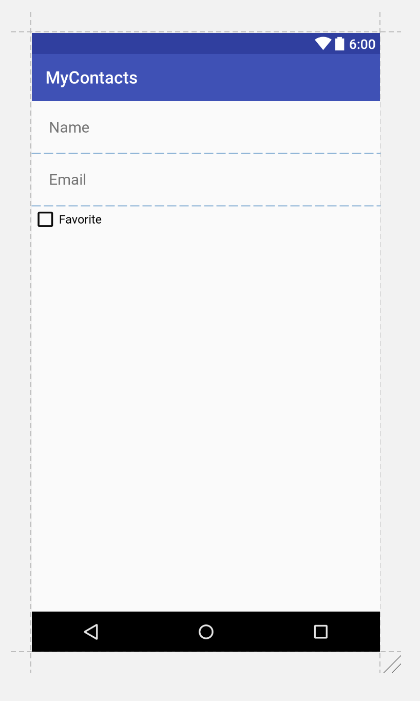
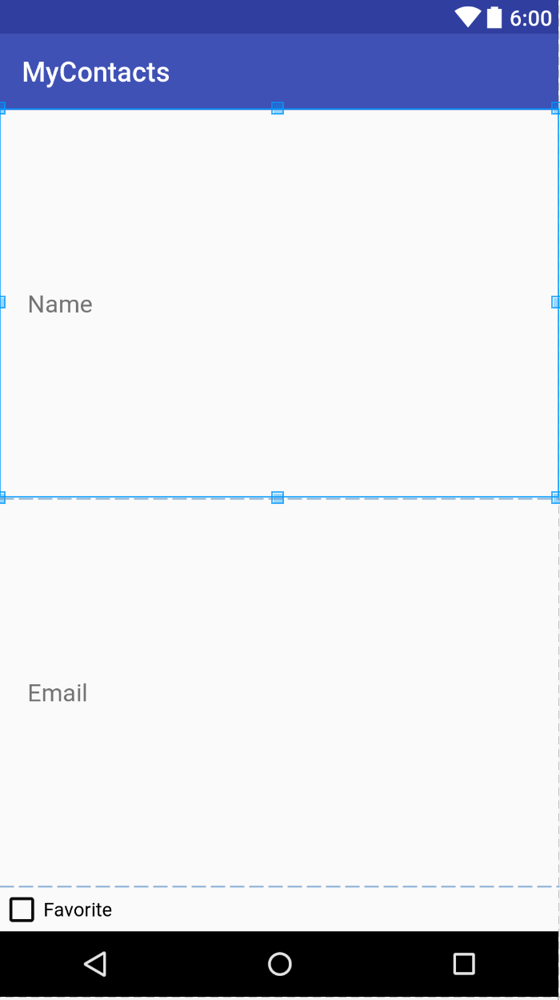
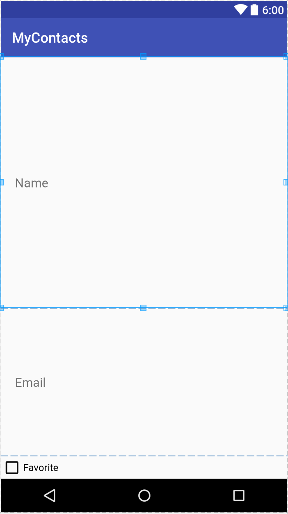

# Week 6 - Layouts and Widgets

## Corresponding Text
*Android Programming*, pp. 149-166

## Adding Widgets and Updating Layouts
Let's start by adding some additional functionality to our app.  Eventually, 
we'll be able to view a list of contacts and it might be helpful to select 
some contacts as "favorites" and view only favorite contacts.  To enable the 
user to designate a contact as a favorite, we'll add a widget to the contact 
fragment layout, update the *Contact* class, and wire the new widget to 
make changes to the corresponding *Contact* instance when the widget's state 
changes.  

To begin, let's add a string resource to the `string.xml` resource file:

```xml
<string name="favorite">Favorite</string>
```

Next, let's add a *CheckBox* widget to the contact fragment layout.  We can 
add it after the email *EditText* in the existing *LinearLayout* by dragging 
and dropping the widget onto the preview of the layout and settting the 
following properties:

| Property | Value            |
|----------|------------------|
| ID       | contact_favorite |
| text     | @string/favorite |

While we're modifying the layout, set the following properties on the other 
widgets:

| Widget           | Property  | Value            |
|------------------|-----------|------------------|
| Name *EditText*  | inputType | textPersonName   |
| Email *EditText* | inputType | textEmailAddress |

Choosing the appropriate input type will affect which keyboard is displayed 
on screen, suggestions provided, and how input will be displayed (masked when 
passwords are entered, for example).

We'll examine the layout further later but for now, it should resemble this:



The XML for the layout should be similar to the following

```xml
<?xml version="1.0" encoding="utf-8"?>
<LinearLayout xmlns:android="http://schemas.android.com/apk/res/android"
              android:orientation="vertical"
              android:layout_width="match_parent"
              android:layout_height="match_parent">
    <EditText
        android:layout_width="match_parent"
        android:layout_height="wrap_content"
        android:id="@+id/contact_name"
        android:hint="@string/name_hint"
        android:padding="20dp"
        android:inputType="textPersonName"/>

    <EditText
        android:layout_width="match_parent"
        android:layout_height="wrap_content"
        android:id="@+id/contact_email"
        android:hint="@string/email_hint"
        android:padding="20dp"
        android:inputType="textEmailAddress"/>

    <CheckBox
        android:text="@string/favorite"
        android:layout_width="match_parent"
        android:layout_height="wrap_content"
        android:id="@+id/contact_favorite"/>
</LinearLayout>
```

To support designating a contact as a favorite, we'll have to update the 
*Contact* class to track this information.  We can do this by adding a 
private boolean field and the corresponding getter and setter.

```java
public class Contact {

    ...

    private boolean mIsFavorite;

    ...

    public boolean isFavorite() {
        return mIsFavorite;
    }

    public void setFavorite(boolean favorite) {
        mIsFavorite = favorite;
    }

}
```

In the code above, the ellipses, `...`, represent additional code left out 
for brevity.

Now we can add code that will toggle a contact's state of being a favorite 
based on the state of the widget we added earlier.  In the *ContactFragment* 
class, we can add a field to represent the favorite *CheckBox* and set an 
*OnCheckedChangeListener* to update the the contact's favorite status.

```java
public class ContactFragment extends Fragment {

    ...

    private CheckBox mFavoriteCheckBox;

    @Override
    public View onCreateView(LayoutInflater inflater, ViewGroup container,
                             Bundle savedInstanceState) {
        View v = inflater.inflate(R.layout.fragment_contact, container, false);

        ...

        mFavoriteCheckBox = (CheckBox)v.findViewById(R.id.contact_favorite);
        mFavoriteCheckBox.setOnCheckedChangeListener(new CompoundButton.OnCheckedChangeListener() {
            @Override
            public void onCheckedChanged(CompoundButton buttonView, boolean isChecked) {
                mContact.setFavorite(isChecked);
            }
        });

        return v;
    }
}
```

## Layout Attributes
### Styles and Themes
Now that we've added a widget and code to do something when the widget is used, 
let's return to our layout `fragment_contact.xml`.  For each widget defined 
in the layout, there are some attributes worth noting beyond what we've made 
use of so far.

A *style* is a resource that contains attributes defining the appearance and 
behavior of a widget.  Styles, like layouts, are specified using XML.  For 
example, the following defines a style named **BigBoldStyle**. 

```xml
    <style name="BigBoldStyle">
        <item name="android:textSize">20sp</item>
        <item name="android:textStyle">bold</item>
    </style>
```

We can define styles in `res/values/styles.xml`.  Be careful when specifying 
attribute names - they are case sensitive.

We can use the style by setting a widget's property or by specifying it in 
the resource XML like this:

```xml
 <EditText style="@style/BigBoldStyle"
        android:layout_width="match_parent"
        android:layout_height="wrap_content"
        android:id="@+id/contact_name"
        android:hint="@string/name_hint"
        android:padding="20dp"
        android:inputType="textPersonName"/>
```

Compare the text in the *EditText* widgets before and after changing the style.


A **theme** is a collection of styles.  Like a style, a theme can be specified 
in the `styles.xml` file.

### Layout Parameters
If we look at the XML representing the layout of our fragment, we can see that 
some of the attributes have names that begin with `layout_`.  Parameters that 
do not start with `layout_` provide configuration information about the widget 
itself when the view is inflated.  Parameters that do begin with `layout_` 
provide information to the widget's parent about how to arrange the widget 
within the parent.   

Two commonly confused attributes are margins and padding.  Margin attributes 
are layout parameters: they are used to determine the distance between widgets.
Because one widget is not responsible for the placement of a second widget 
(unless the first is the parent of the second), it is up to the parent to make 
use of the margin information when placing widgets.  

Padding is not a layout parameter, it defines how much larger than its content 
a widget should be.  To demonstrate the difference, let's change the 
*background* attributes of the two *EditText* widgets we have:

```xml
    <EditText
        android:layout_width="match_parent"
        android:layout_height="wrap_content"
        android:id="@+id/contact_name"
        android:hint="@string/name_hint"
        android:padding="20dp"
        android:inputType="textPersonName"
        android:background="@android:color/holo_orange_dark"/>


    <EditText
        android:layout_width="match_parent"
        android:layout_height="wrap_content"
        android:id="@+id/contact_email"
        android:hint="@string/email_hint"
        android:padding="20dp"
        android:inputType="textEmailAddress"
        android:background="@android:color/holo_blue_bright"/>
``` 

Next, let's double the padding from the default value of `20dp` to `40dp`. 
Notice that the entire widget increased in size (and the text move further 
toward the center).  The space between the widget's content and its edges 
increased when we increased the padding.  

Let's reset the padding to `20dp` and add `android:layout_margin="20dp"` to 
both widgets.  Notice now that rather than the widgets increasing in size, the 
space between each widget and other widgets (and the edges of the parent) 
increased.  The parent layout used the new layout parameter to change the 
placement of the widget.


Be sure to revert changes to margins, padding, and the background.

Another layout parameter that we might have to work with is `layout_weight`. 
When working with linear layouts, the layout makes two passes to examine a 
widget's layout parameters to place it and other widgets.  First, the layout 
will look at the widget's height (if the layout is a vertical layout) or the 
widget's width (if the layout is a horizontal layout).  In the second pass, 
the layout will examine the `layout_weight` attribute to allocate any extra 
space.  If we add `android:layout_weight="1"` to the two *EditText* widgets, we 
can see that the layout allocates enough space for each of the widgets then 
allocates extra space to widgets with the weight attributes.



If we double the weight for the first *EditText* widget, we can see that the 
first *EditText* widget has twice the height of the second one - it's been 
allocated twice the extra space than the second *EditText* widget.



For now, we'll remove the specifications for the `layout_weight` attributes.

### Screen Pixel Densities
When we modified padding of our widgets, you might have noticed that units were 
`dp`.  Because Android runs on many devices with difference screen sizes, 
Android provides a method of specifying sizes in a way that should produce 
similar results across all devices.  We make use of this with 
device-independent dimension units.  We can specify sizes in one of three ways:

| Unit       | Description                                                                                                                                                                                                                                   |
|------------|-----------------------------------------------------------------------------------------------------------------------------------------------------------------------------------------------------------------------------------------------|
| dp         | Density-independent pixel - typically used for margins and padding.  For higher-density displays, a density-independent pixel will expand to fill a lager number of pixels.  By definition 1 dp = 1/160th of an inch on the device's screen.  |
| sp         | Scale-independent pixel - typically used for text size.  These are density-independent pixels that also take a user's font size preference into account.                                                                                      |
| pt, mm, in | Scaled units representing points (1/72nd of an inch), millimeters, and inches.  Many devices are not configured to properly scale items specified with these units so they should be avoided in favor of `dp` or `sp`.                        |
