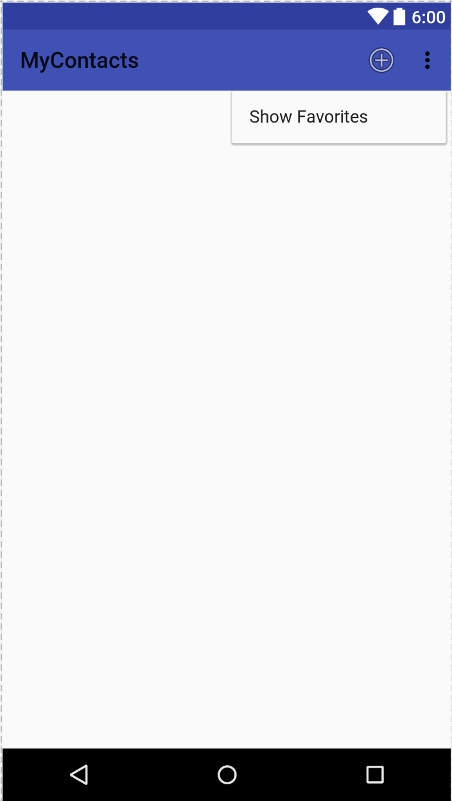

# Week 8 - The Toolbar, Menus, and Navigation

## Corresponding Text
*Android Programming*, pp. 235-254

## The AppCompat Library
We're going to be working with the toolbar.  The toolbar provides a means of 
providing the user with actions, an additional way of navigating through the 
app, and a way of consistently branding the app.  The toolbar was added to 
Android in version 5.0; prior to this, app made us of an action bar.  The 
toolbar builds on the action bar but is more flexible.  Android version 5.0 
corresponds to SDK version 21; since our app support SDK version 19, we won't 
be able to use the native tool bar from the Android library.  Instead, we can 
use a back-ported version from the AppCompat library.  We'll have to make 
a few changes to our app to make use of the AppCompat library and the toolbar 
provided by it.

First, let's add the AppCompat library as a dependency of our app.  In Android 
Studio, select **File -> Project Structure...** from the menus.  With **app**
selected, click the **Dependencies** tab.  Click the **+** button and 
**Add Library dependency**. Search for `com.android.support:appcompat-v7`.
 Click **OK** to close the **Project Structure** dialog.

Next, we need to make sure the app is using one of the AppCompat theme's.  Open 
`app/manifests/AndroidManifest.xml` and note the value of the *android:theme* 
attribute: `@style/AppTheme`.  The theme is defined in `res/values/styles.xml`. 
The file should contain something like this:

```xml
 <style name="AppTheme" parent="Theme.AppCompat.Light.DarkActionBar">
 ```

 If it doesn't, change the parent attribute so it matches the value above.

 Finally, we have to update all our activities to extend *AppCompatActivity*. 
 So far, all our activities have extended *FragmentActivity* or a subclass of 
 *FragmentActivity*.  We won't lose any functionality by extending 
 *AppCompatActivity* instead of *FragmentActivity* because *AppCompatActivity* 
 itself extends *FragmentActivity*.  For our app, we'll need to update 
 *ContactPagerActivity* and *SingleFragmentActivity* to extend 
 *AppCompatActivity*.  We don't need to make any changes to *ContactActivity* 
 or *AddressBookActivity* since they extend *SingleFragmentActivity*. 

 At this point, we can run the app.  The only difference is the new toolbar at 
 the top of our app.      


## Menus
The right area of the toolbar is reserved for the menu.  A menu consists of 
action items that can perform an action on the current screen or on the 
app as a while.  We'll create actions to create a contact and to display 
favorites or all contacts.  We'll need some string resources for use with the 
menu; add these to `res/values/strings.xml`:

```xml
    <string name="new_contact">New Contact</string>
    <string name="show_favorites">Show Favorites</string>
    <string name="show_all">Show All</string>
```

Menus, like layouts, are a type of resource file.  To add a new menu resource 
file, right click on the project's `res` folder and select 
**New -> Android resource file**.  Name the file `fragment_address_book` (since 
we'll be using it with the address book fragment) and set **Resource type** to 
*Menu* 

Using the **Design** view, drag a *Menu Item* and drop it on the toolbar; set 
its **id** to `menu_item_create_contact` and its **title** to 
`@string/new_contact`. Drag another *Menu Item* below the previous one and set 
its **id** to `menu_item_toggle_favorites` and its **title** to 
`@string/show_favorites`.  The XML for the menu resource file should look 
like this:

```xml
<?xml version="1.0" encoding="utf-8"?>
<menu xmlns:app="http://schemas.android.com/apk/res-auto"
      xmlns:android="http://schemas.android.com/apk/res/android">

    <item android:title="@string/new_contact"
          android:id="@+id/menu_item_create_contact"
        />
    <item android:title="@string/show_favorites"
          android:id="@+id/menu_item_toggle_favorites"
        />
</menu>
```

The menu is currently configured such that its menu items appear in the 
overflow menu, accessed by pressing the three dots on the right side of the 
toolbar.  Let's keep the toggle item in the overflow menu but move the 
new contact item out of the overflow menu and use an icon only as well as text, 
provided there's enough room on the screen.

With the new contact menu item selected, click the button next to the **icon** 
field.  Search for and select `ic_menu_add`.  Change the value of 
**showAsAction** to include `ifRoom` and `withText``.  

The XML for the menu resource file should now look like this:

```xml
<?xml version="1.0" encoding="utf-8"?>
<menu xmlns:app="http://schemas.android.com/apk/res-auto"
      xmlns:android="http://schemas.android.com/apk/res/android">

    <item android:title="@string/new_contact"
          android:id="@+id/menu_item_create_contact"
          android:icon="@android:drawable/ic_menu_add"
          app:showAsAction="ifRoom|withText"/>
    <item android:title="@string/show_favorites"
          android:id="@+id/menu_item_toggle_favorites"
        />
</menu>
```

Note that we have to use the *app:showAsAction* attribute rather than 
the default *android:showAsAction* attribute due to legacy support issues 
with the AppCompat library. 

The design view should look like this:

 

Now that we've designed the menu, let's add it to our app.  In Android, menus 
are managed by callbacks from the *Activity* class.  When a menu is needed, 
*Activity.onCreateOptionsMenu()* is called.  Our app, however, relies on 
code to be implemented in fragments.  Fortunately, framgments also have 
a *onCreateOptionsMenu()* that we can override.  The *FragmentManager* is 
responsible for call the appropriate fragment's method when the hosting 
activity's *onCreateOptionsMenu()* method is called.  To notify the 
*FragmentManager* that this fragment can receive callbacks, we have to add 
a call to `setHasOptionsMenu(true)` in the *AddressBookFragment.onCreate()* 
method.  

To add the menu to the address book, add the following code to the 
*AddressBookFragment* class:

```java
public class AddressBookFragment extends Fragment {
    ...
    @Override
    public void onCreate(Bundle savedInstanceState) {
        super.onCreate(savedInstanceState);
        setHasOptionsMenu(true);
    }

    @Override
    public void onCreateOptionsMenu(Menu menu, MenuInflater inflater) {
        super.onCreateOptionsMenu(menu, inflater);
        inflater.inflate(R.menu.fragment_address_book, menu);
    }
    ...
}
```

Here, we call *MenuInflater.inflate()* specifying the id of our menu resource 
and the *Menu* instance that will be populated with our menu items.  We can 
now run the app and we should be able to see the menu items.

 

Now that we have the menu appearing in the app, we need to add code that will 
perform some action when a user selects one of the menu items.  To do this,
we have to override the *onOptionsItemSelected()* method in 
*AddressBookFragment*.  When the method is called, a *MenuItem* is passed as a 
parameter.  We can use *MenuItem.getItemId()* to get the ID of the item and 
determine the appropriate action.  

Before we handle the menu items, let's add a method to *AddressBook*:

```java
public class AddressBook {
    ...
    public List<Contact> getFavoriteContacts() {
        List<Contact> favorites = new ArrayList<>();
        for (Contact c: mContacts) {
            if (c.isFavorite()) {
                favorites.add(c);
            }
        }
        return favorites;
    }
    ...
}
```

This method will return a list of contacts marked as favorites.  Next, we can
add the code necessary to toggle between showing all contacts and those that 
are favorites:

```java
public class AddressBookFragment extends Fragment {
    ...
    private boolean mShowFavoritesOnly = false;
    ...
    @Override
    public boolean onOptionsItemSelected(MenuItem item) {
        switch (item.getItemId()) {
            case R.id.menu_item_create_contact:
                // we'll add this later
                return true;
            case R.id.menu_item_toggle_favorites:
                mShowFavoritesOnly = !mShowFavoritesOnly;
                if (mShowFavoritesOnly) {
                    item.setTitle(R.string.show_all);
                    mContactAdapter.mContacts =
                            AddressBook.get().getFavoriteContacts();
                }
                else {
                    item.setTitle(R.string.show_favorites);
                    mContactAdapter.mContacts =
                            AddressBook.get().getContacts();
                }
                mContactAdapter.notifyDataSetChanged();
                return true;
            default:
                return super.onOptionsItemSelected(item);
        }
    }
    ...
}
```

First, we'll keep track of whether or not we're displaying only favorite 
contacts or all contacts using a private field, *mShowFavoritesOnly*.  In the 
*onOptionsItemSelected()* method, we'll determine what to do based on the 
menu item's ID.  We'll add code to add a new contact shortly.  For now, we 
can toggle between favorites and all contacts by first changing the value of 
*mShowFavoritesOnly* then setting the menu item's title and the adapter's 
list of contacts based on the value of *mShowFavoritesOnly*.  After we 
change the adapter's list of contacts, we have to call 
*Adapter.notifyDataSetChanged()*.  Finally, we return *true* to indicate no 
further processing of the item is necessary.

To support adding new contacts, let's first reduce the number of contacts 
that are automatically generated - we'll keep some so they exist when we start 
the app.  Recall that we create these initial contacts in the *AddressBook* 
constructor.  While we're modifying *AddressBook*, let's also add a method to 
add a contact to the list of contacts.  Here's what *AddressBook* should look 
like:

```java
public class AddressBook {
    ...
    private AddressBook() {
        mContacts = new ArrayList<>();
        for (int i=0; i<5; i++) {
            Contact contact = new Contact();
            contact.setName("Person " + i);
            contact.setEmail("Person" + i + "@email.com");

            // set every 2nd as a favorite
            if (i % 2 == 0) {
                contact.setFavorite(true);
            }

            mContacts.add(contact);
        }
    }
    ...
    public void add(Contact contact) {
        mContacts.add(contact);
    }
    ...
}
```

Next, we can add code to handle the new contact menu item to 
*AddressBookFragment*:

```java
public class AddressBookFragment extends Fragment {
    ...
    @Override
    public boolean onOptionsItemSelected(MenuItem item) {
        switch (item.getItemId()) {
            case R.id.menu_item_create_contact:
                Contact contact = new Contact();
                AddressBook.get().add(contact);
                Intent intent = ContactPagerActivity.newIntent(
                        getActivity(),contact.getID());
                startActivity(intent);
                return true;
            case R.id.menu_item_toggle_favorites:
                mShowFavoritesOnly = !mShowFavoritesOnly;
                if (mShowFavoritesOnly) {
                    item.setTitle(R.string.show_all);
                    mContactAdapter.mContacts =
                            AddressBook.get().getFavoriteContacts();
                }
                else {
                    item.setTitle(R.string.show_favorites);
                    mContactAdapter.mContacts =
                            AddressBook.get().getContacts();
                }
                mContactAdapter.notifyDataSetChanged();
                return true;
            default:
                return super.onOptionsItemSelected(item);
        }
    }
    ...
}
```

This new code creates a *Contact*, adds it to the *AddressBook*, and then 
uses *ContactPagerActivity* to create an intent and display the contact's 
details which we can edit.  We can now run the app, add contacts, and filter 
the list to display only our favorites.

## Hierarchical Navigation
So far, we've been able to use the back button to return to a previous screen 
while using our app.  This type of navigation is called 
**temporal navigation** - using the back button takes us back to the last place 
we were.  An alternative to temporal navigation is **hierarchical navigation**. 
Hierarchical navigation allows users to move up the app hierarchy - returning 
to the parent activity at any time.  Hierarchical navigation is made available 
to users through a up button that appears as a left-pointing arrow in the 
toolbar.  In order to enable this functionality, we have to specify an 
activity's parent in the app's manifest.  The following will allow users to 
return to the AddressBookActivity from the ContactPagerActivity:

```xml
<?xml version="1.0" encoding="utf-8"?>
<manifest xmlns:android="http://schemas.android.com/apk/res/android"
          package="com.arthurneuman.mycontacts">

    <application
        android:allowBackup="true"
        android:icon="@mipmap/ic_launcher"
        android:label="@string/app_name"
        android:supportsRtl="true"
        android:theme="@style/AppTheme">
        <activity android:name=".ContactPagerActivity"
            android:parentActivityName=".AddressBookActivity">
        </activity>
        <activity android:name=".AddressBookActivity">
            <intent-filter>
                <action android:name="android.intent.action.MAIN"/>
                <category android:name="android.intent.category.LAUNCHER"/>
            </intent-filter>
        </activity>
    </application>

</manifest>
``` 

While this performs the same action as pushing the back button in our app, 
in more complicated apps, this could be more useful.  In more complicated 
apps, hierarchical navigation would allow to return to a screen that would 
normally require multiple presses of the back button.