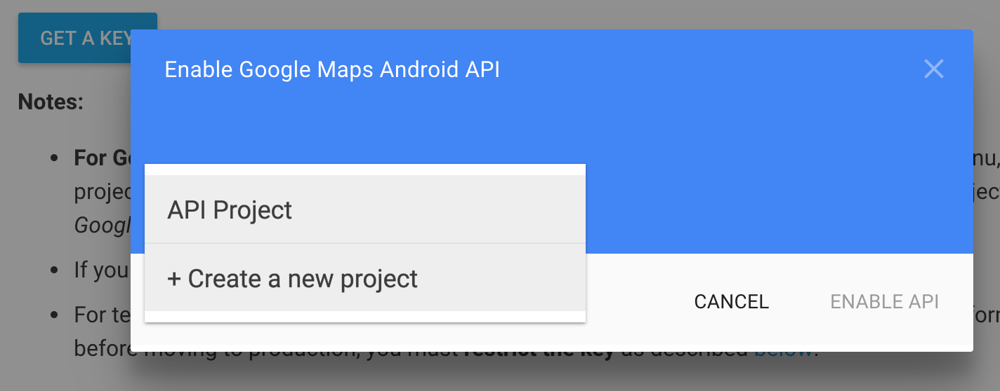
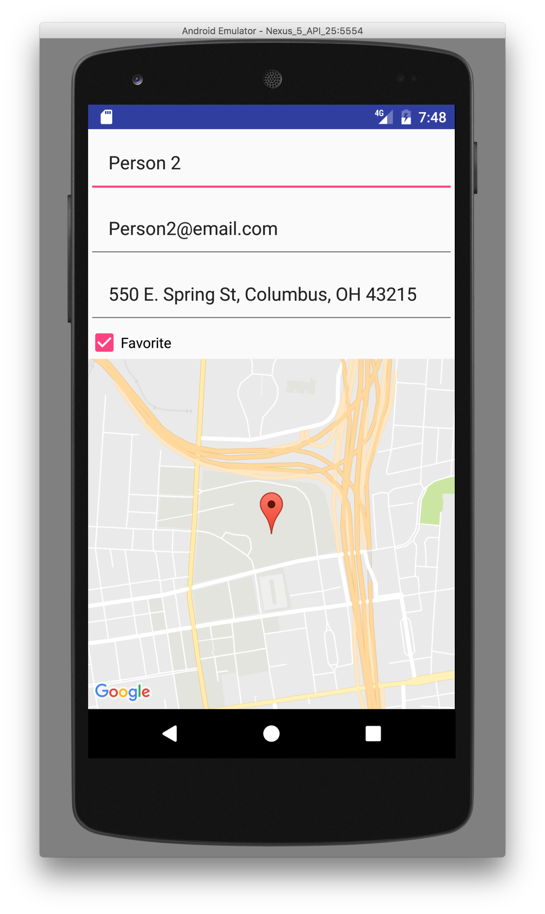

# Week 10 - Maps 

## Corresponding Text
*Android Programming*, pp. 571-584

## The Maps API
Because of Android's dependence on Google's mapping services, the Android maps 
functionality is not a a stand-alone component of Android.  This requires us to 
do several things before we can use maps in our app.  First, we need to add a 
dependency to our app.  Just as we added the support and recyclerview libraries 
to our app's dependencies, we'll have to add the Google Play Services.  When 
adding the library dependency, search for `play-services-maps` and select the 
`com.google.android.gms:play-services-maps` library.  If, after adding the 
dependency, Android Studio is unable to display layouts in the design view, try 
rebuilding the project.

The second thing we need to do is to grant our app permission to do certain 
things: accessing the Internet to download map data, get the device's network 
state, and to store temporary map data locally.  To give add these permissions, 
modify the app's manifest in `app/Manifests/AndroidManifest.xml` so it appears 
similar to the following:

```xml
<?xml version="1.0" encoding="utf-8"?>
<manifest xmlns:android="http://schemas.android.com/apk/res/android"
          package="com.arthurneuman.mycontacts">

    <uses-permission android:name="android.permission.INTERNET" />
    <uses-permission android:name="android.permission.ACCESS_NETWORK_STATE"/> 
    <uses-permission android:name="android.permission.WRITE_EXTERNAL_STORAGE"/>    
    
    <application
        android:allowBackup="true"
        android:icon="@mipmap/ic_launcher"
        android:label="@string/app_name"
        android:supportsRtl="true"
        android:theme="@style/AppTheme">
        <activity android:name=".ContactPagerActivity"
            android:parentActivityName=".AddressBookActivity">
        </activity>
        <activity android:name=".AddressBookActivity">
            <intent-filter>
                <action android:name="android.intent.action.MAIN"/>
                <category android:name="android.intent.category.LAUNCHER"/>
            </intent-filter>
        </activity>
    </application>

</manifest>
```    

Next, open a browser and load 
`https://developers.google.com/maps/documentation/android-api/signup`.  On the 
page, click **GET A KEY**, **Select or create a project**, and 
**Create a new project**.  



Enter the name of the project and click 
**Create and enable API**.  You should be presented with a new API key; copy 
it. Finally, we can add the new key to the `AndroidManifest.xml` file; the file 
should look similar to the following (but with your key):

```xml
<?xml version="1.0" encoding="utf-8"?>
<manifest xmlns:android="http://schemas.android.com/apk/res/android"
          package="com.arthurneuman.mycontacts">

    <uses-permission android:name="android.permission.INTERNET" />
    <uses-permission android:name="android.permission.ACCESS_NETWORK_STATE"/>
    <uses-permission android:name="android.permission.WRITE_EXTERNAL_STORAGE"/>

    <application
        android:allowBackup="true"
        android:icon="@mipmap/ic_launcher"
        android:label="@string/app_name"
        android:supportsRtl="true"
        android:theme="@style/AppTheme">
        <activity android:name=".ContactPagerActivity"
            android:parentActivityName=".AddressBookActivity">
        </activity>
        <activity android:name=".AddressBookActivity">
            <intent-filter>
                <action android:name="android.intent.action.MAIN"/>
                <category android:name="android.intent.category.LAUNCHER"/>
            </intent-filter>
        </activity>
        <meta-data
            android:name="com.google.android.geo.API_KEY"
            android:value="XXXXXXXXXXXXXXXXXXXXXXXXXXXXXXXXXXXXXXX"/>
    </application>

</manifest>
```

Now, we can add mapping functionality to our app.

## Additional Contact Information
Our goal will be to display a map indicating the location of an address we 
assign to each of our contacts.  In order to assign an address, we'll need 
to update the *Contact* class, *ContactFragment*, and the contact fragment 
layout.  To keep the example simple, our app will store a free-form address 
like `550 E. Spring St, Columbus, OH 43215`.  

In the *Contact* class, we can add a new field and create the corresponding 
getter and setter:

```java
public class Contact {
    ...
    private String mAddress;
    ...
    public String getAddress() {
        return mAddress;
    }

    public void setAddress(String address) {
        mAddress = address;
    }
}
```

Let's modify the *AddressBook* class to assign an address to all our contacts:

```java
public class AddressBook {
    ...
    private AddressBook() {
        mContacts = new ArrayList<>();
        for (int i=0; i<5; i++) {
            Contact contact = new Contact();
            contact.setName("Person " + i);
            contact.setEmail("Person" + i + "@email.com");
            contact.setAddress("550 E. Spring St, Columbus, OH 43215");
            // set every 2nd as a favorite
            if (i % 2 == 0) {
                contact.setFavorite(true);
            }

            mContacts.add(contact);
        }
    }
    ...
}
```

Before we modify the layout, let's add a string resource to the `strings.xml` 
resource file:

```xml
<string name="address_hint">Address</string>
```

To the layout, `fragment_contact.xml` we can add another *EditText* widget with 
the following properties: 

| Property      | Value                |
|---------------|----------------------|
| ID            | contact_address      |
| layout_width  | match_parent         |
| layout_height | wrap_content         |
| InputType     | textPostalAddress    |
| hint          | @string/address_hint |
| padding       | 20dp                 |

The corresponding XML should look like this:

```xml
<EditText
    android:layout_width="match_parent"
    android:layout_height="wrap_content"
    android:inputType="textPostalAddress"
    android:id="@+id/contact_address"
    android:padding="20dp"
    android:hint="@string/address_hint"/>
```

Recall that we used *TextWatcher* to update instances of *Contact* when users 
typed values into the name and email fields.  We can do that same thing for the 
address field.  

```java
public class ContactFragment extends Fragment {
    ...
    private EditText mAddressField;
    ...
    @Override
    public View onCreateView(LayoutInflater inflater, ViewGroup container,
                             Bundle savedInstanceState) {
        ...
        mAddressField = (EditText)v.findViewById(R.id.contact_address);
        mAddressField.setText(mContact.getAddress());
        mAddressField.addTextChangedListener(new TextWatcher() {
            @Override
            public void beforeTextChanged(CharSequence s, int start,
                                          int count, int after) { }

            @Override
            public void onTextChanged(CharSequence s, int start, int before, int count) {
                mContact.setAddress(s.toString());
            }

            @Override
            public void afterTextChanged(Editable s) { }
        });
        ...
    }
}
``` 

## Using Maps 
As a next step, let's add a *MapView* to our `fragment_contact.xml` layout; 
drag and drop a *MapView* from the design palette to an area below the favorite 
checkbox. Set the *MapView*'s **id** to `contact_map`.  The layout's XML should 
look similar to the following:

```xml
<?xml version="1.0" encoding="utf-8"?>
<LinearLayout xmlns:android="http://schemas.android.com/apk/res/android"
    android:orientation="vertical"
    android:layout_width="match_parent"
    android:layout_height="match_parent">
    <EditText
        android:layout_width="match_parent"
        android:layout_height="wrap_content"
        android:id="@+id/contact_name"
        android:hint="@string/name_hint"
        android:padding="20dp"
        android:inputType="textPersonName"/>

    <EditText
        android:layout_width="match_parent"
        android:layout_height="wrap_content"
        android:id="@+id/contact_email"
        android:hint="@string/email_hint"
        android:padding="20dp"
        android:inputType="textEmailAddress"/>

    <EditText
        android:layout_width="match_parent"
        android:layout_height="wrap_content"
        android:inputType="textPostalAddress"
        android:id="@+id/contact_address"
        android:padding="20dp"
        android:hint="@string/address_hint"/>

    <CheckBox
        android:text="@string/favorite"
        android:layout_width="match_parent"
        android:layout_height="wrap_content"
        android:id="@+id/contact_favorite"/>

    <com.google.android.gms.maps.MapView
        android:layout_width="match_parent"
        android:layout_height="wrap_content"
        android:id="@+id/contact_map" />

</LinearLayout>
```

Next, we can begin to work with our map by modifying the *ContactFragment* 
class. Before we add any code, it's important that we understand how maps work.
We can access the *MapView* widget in the same we we access the other widgets 
using *View.findViewById()*.  Once we have access to the widget, we have to 
forward all lifecycle calls from our fragment to the widget; this includes 
calls to the following:

- *onCreate()*
- *onResume()*
- *onPause()*
- *onDestroy()*
- *onSaveInstanceState()*
- *onLowMemory()*

We can override the *ContactFragment*'s methods to call the corresponding 
widget's methods; we won't have access to the widget until *onCreateView()* is 
called in *ContactFragment* so we can call the widget's *onCreate()* method 
there.

After we call *onCreate()*, we have to get an instance of a *GoogleMap* object 
that will allow us to display and interact with a Google map.  To do this, we 
use the widget's *getMapAsync()* method.  This method takes one parameter: an 
object that implements the *OnMapReadyCallback* interface.  We can implement 
the interface using an anonymous class.  

In order to display the address, we will need to convert it to a latitude and a 
longitude.  To do this, we will rely on a *Geocoder*.  The *Geocoder* is able 
to find latitude and longitude from a given address and return a list of 
results.  We can use the first result to create a map marker and reposition the 
map to the latitude and longitude.  

With these changes, *ContactFragment* should include the following:

```java
public class ContactFragment extends Fragment implements OnMapReadyCallback {
    ...
    private MapView mMapView;
    ...
    @Override
    public View onCreateView(LayoutInflater inflater, ViewGroup container,
                             Bundle savedInstanceState) {
        ...
        mMapView = (MapView)v.findViewById(R.id.contact_map);
        mMapView.onCreate(savedInstanceState);
        mMapView.getMapAsync(new OnMapReadyCallback() {
            @Override
            public void onMapReady(GoogleMap googleMap) {
                Geocoder geo = new Geocoder(getContext());
                try {
                    List<Address> addresses =
                            geo.getFromLocationName(mAddressField.getText().toString(), 1);
                    if (addresses.size() > 0) {
                        LatLng latLng = new LatLng(addresses.get(0).getLatitude(),
                                addresses.get(0).getLongitude());
                        MarkerOptions marker = new MarkerOptions().position(latLng);
                        googleMap.addMarker(marker);
                        googleMap.moveCamera(CameraUpdateFactory.newLatLngZoom(latLng, 15));
                    }
                } catch (IOException e) {
                }
            }
        });
        ...
    }
    ...
    @Override
    public void onResume() {
        super.onResume();
        mMapView.onResume();
    }

    @Override
    public void onPause() {
        super.onPause();
        mMapView.onPause();
    }

    @Override
    public void onDestroy() {
        super.onDestroy();
        mMapView.onDestroy();
    }

    @Override
    public void onSaveInstanceState(Bundle outState) {
        super.onSaveInstanceState(outState);
        mMapView.onSaveInstanceState(outState);
    }

    @Override
    public void onLowMemory() {
        super.onLowMemory();
        mMapView.onLowMemory();
    }
}
```

When we run the app and select a contact we should now see something similar to 
the following:



If you are running the code on a device and the map does not appear to be 
correct, try rebooting the device.

Finally, let's update the code to update the map if the text in the address 
field changes.

```java
public class ContactFragment extends Fragment {
    @Override
    public View onCreateView(LayoutInflater inflater, ViewGroup container,
                             Bundle savedInstanceState) {
        ...
        mAddressField.setOnFocusChangeListener(new View.OnFocusChangeListener() {
            @Override
            public void onFocusChange(View view, boolean b) {
                if (!b) {
                    updateMap();
                }
            }
        });
        mMapView = (MapView)v.findViewById(R.id.contact_map);
        mMapView.onCreate(savedInstanceState);
        updateMap();

        return v;
    }

    private void updateMap() {
        mMapView.getMapAsync(new OnMapReadyCallback() {
            @Override
            public void onMapReady(GoogleMap googleMap) {
                Geocoder geo = new Geocoder(getContext());
                try {
                    List<Address> addresses =
                            geo.getFromLocationName(mAddressField.getText().toString(), 1);
                    if (addresses.size() > 0) {
                        LatLng latLng = new LatLng(addresses.get(0).getLatitude(),
                                addresses.get(0).getLongitude());
                        MarkerOptions marker = new MarkerOptions().position(latLng);
                        googleMap.addMarker(marker);
                        googleMap.moveCamera(CameraUpdateFactory.newLatLngZoom(latLng, 15));
                    }
                } catch (IOException e) {
                }
            }
        });
    }
...
}
``` 

Here, we've pulled the code to update the map into its own method, 
*updateMap()*, and called this new method from the *onCreateView()* method.  
We've also assigned an *OnFocusChangeListener* listener to the address field. 
This method is called when the field is being used by the user or when the 
user stops using it to begin using some other widget.  In the *onFocusChange()* 
method, we check to see if the widget is losing focus and then update the map - 
this allows the app to wait until the user has finished entering test before 
attempting to update the map.  An alternative would be to update the map using 
one of the *TextWatcher* methods but unless we controlled how often the map 
could update, the app would attempt to update the map with every keystroke.

For clarity, all the code in the *ContactFragment* class is presented below.

```java
public class ContactFragment extends Fragment {
    private Contact mContact;
    private EditText mNameField;
    private EditText mEmailField;
    private CheckBox mFavoriteCheckBox;
    private EditText mAddressField;
    private MapView mMapView;

    private static final String ARG_CONTACT_ID = "contact_id";

    public static ContactFragment newInstance(UUID contactID) {
        ContactFragment contactFragment = new ContactFragment();
        Bundle args = new Bundle();
        args.putSerializable(ARG_CONTACT_ID, contactID);
        contactFragment.setArguments(args);
        return contactFragment;
    }

    @Override
    public void onCreate(Bundle savedInstanceState) {
        super.onCreate(savedInstanceState);
        UUID contactID = (UUID) getArguments().getSerializable(ARG_CONTACT_ID);
        mContact = AddressBook.get().getContact(contactID);
    }

    @Override
    public View onCreateView(LayoutInflater inflater, ViewGroup container,
                             Bundle savedInstanceState) {
        View v = inflater.inflate(R.layout.fragment_contact, container, false);

        mNameField = (EditText)v.findViewById(R.id.contact_name);
        mNameField.setText(mContact.getName());
        mNameField.addTextChangedListener(new TextWatcher() {
            @Override
            public void beforeTextChanged(CharSequence s, int start, int count,
                                          int after) {
                // No new behavior
            }

            @Override
            public void onTextChanged(CharSequence s, int start, int before,
                                      int count) {
                mContact.setName(s.toString());
            }

            @Override
            public void afterTextChanged(Editable s) {
                // No new behavior
            }
        });

        mEmailField = (EditText)v.findViewById(R.id.contact_email);
        mEmailField.setText(mContact.getEmail());
        mEmailField.addTextChangedListener(new TextWatcher() {
            @Override
            public void beforeTextChanged(CharSequence s, int start, int count,
                                          int after) {
                // No new behavior
            }

            @Override
            public void onTextChanged(CharSequence s, int start, int before,
                                      int count) {
                mContact.setEmail(s.toString());
            }

            @Override
            public void afterTextChanged(Editable s) {
                // No new behavior
            }
        });

        mFavoriteCheckBox = (CheckBox)v.findViewById(R.id.contact_favorite);
        mFavoriteCheckBox.setChecked(mContact.isFavorite());
        mFavoriteCheckBox.setOnCheckedChangeListener(new CompoundButton.OnCheckedChangeListener() {
            @Override
            public void onCheckedChanged(CompoundButton buttonView, boolean isChecked) {
                mContact.setFavorite(isChecked);
            }
        });

        mAddressField = (EditText)v.findViewById(R.id.contact_address);
        mAddressField.setText(mContact.getAddress());
        mAddressField.addTextChangedListener(new TextWatcher() {
            @Override
            public void beforeTextChanged(CharSequence s, int start,
                                          int count, int after) { }

            @Override
            public void onTextChanged(CharSequence s, int start, int before, int count) {
                mContact.setAddress(s.toString());
            }

            @Override
            public void afterTextChanged(Editable s) {
            }
        });

        mAddressField.setOnFocusChangeListener(new View.OnFocusChangeListener() {
            @Override
            public void onFocusChange(View view, boolean b) {
                if (!b) {
                    updateMap();
                }
            }
        });
        mMapView = (MapView)v.findViewById(R.id.contact_map);
        mMapView.onCreate(savedInstanceState);
        updateMap();

        return v;
    }

    private void updateMap() {
        mMapView.getMapAsync(new OnMapReadyCallback() {
            @Override
            public void onMapReady(GoogleMap googleMap) {
                Geocoder geo = new Geocoder(getContext());
                try {
                    List<Address> addresses =
                            geo.getFromLocationName(mAddressField.getText().toString(), 1);
                    if (addresses.size() > 0) {
                        LatLng latLng = new LatLng(addresses.get(0).getLatitude(),
                                addresses.get(0).getLongitude());
                        MarkerOptions marker = new MarkerOptions().position(latLng);
                        googleMap.addMarker(marker);
                        googleMap.moveCamera(CameraUpdateFactory.newLatLngZoom(latLng, 15));
                    }
                } catch (IOException e) {
                }
            }
        });
    }

    @Override
    public void onResume() {
        super.onResume();
        mMapView.onResume();
    }

    @Override
    public void onPause() {
        super.onPause();
        mMapView.onPause();
    }

    @Override
    public void onDestroy() {
        super.onDestroy();
        mMapView.onDestroy();
    }

    @Override
    public void onSaveInstanceState(Bundle outState) {
        super.onSaveInstanceState(outState);
        mMapView.onSaveInstanceState(outState);
    }

    @Override
    public void onLowMemory() {
        super.onLowMemory();
        mMapView.onLowMemory();
    }
}
``` 