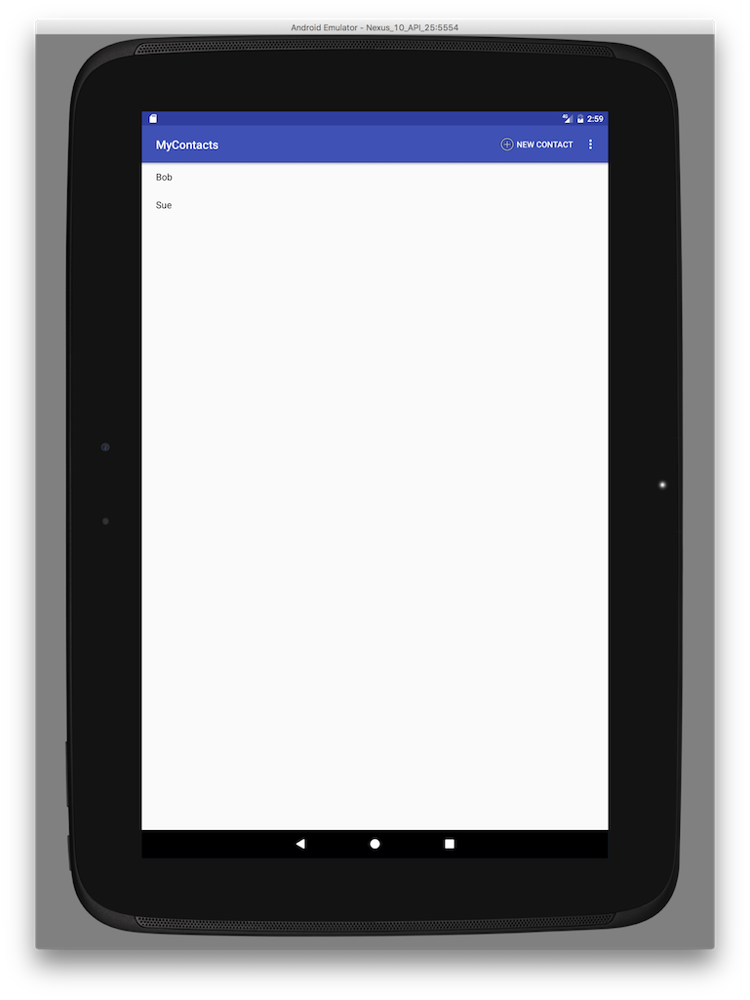

# Week 14 - Layout Flexibility

## Corresponding Text
*Android Programming*, pp. 307-322


We've done a lot of work so far on our app and it looks pretty good when we use 
it in the emulator or when using a small device.  What happens when we try to 
use our app on a tablet?  Let's find out.  If you don't have a tablet with 
which to test, we can create one in the emulator.  Select 
**Tools -> Android -> AVD Manager** from the menus.  In the 
*Android Virtual Device Manager Window*, click the **Create Virtual Device**
button. Select **Tablet** and choose the **Nexus 10**.  Continue through the 
creation wizard, make sure to use the same API level we've been working with. 
Once the new virtual device has been created, start the app.



Notice the excessive amount of white space.  Even if we add lots of contacts to 
our app, most of the screen will be empty white space.  To take advantage 
of space provided by a tablet, we'll modify our app to display both the list 
of contacts as well contact details when the app is run on a tablet.

## Creating a new Layout
Currently, *AddressBookActivity* extends *SingleFragmentActivity* and 
*SingleFragmentActivity* always inflates the *activity_fragment* layout. To be 
more flexible, we'll modify *SingleFragmentActivity* to allow subclasses to 
specify the appropriate layout.  

```java
public abstract class SingleFragmentActivity extends AppCompatActivity {
    ... 

    @LayoutRes
    protected int getLayoutResId() {
        return R.layout.activity_fragment;
    }

    @Override
    protected void onCreate(Bundle savedInstanceState) {
        super.onCreate(savedInstanceState);
        setContentView(getLayoutResId());

        FragmentManager fm = getSupportFragmentManager();
        Fragment fragment = fm.findFragmentById(R.id.fragment_container);

        if (fragment==null) {
            fragment = createFragment();
            fm.beginTransaction()
                    .add(R.id.fragment_container, fragment)
                    .commit();
        }

    }
}
``` 

We've added a *getLayoutResId()* method that returns the ID of a layout; a 
subclass can override this method to indicate a different layout.  The 
`@LayoutRes` annotation indicates that the integer returned by this method 
corresponds to the ID of a layout. In the *onCreate()* method, we've replaced 
the explicit value of `R.layout.activity_fragment` with a call to 
*getLayoutResId()*.

As a next step, we'll create a new layout file to host two fragments.  Create 
a new layout file named `activity_twopane.xml`.  Change the default 
*LinearLayout* properties so that the orientation is set to `horizontal`, 
*showDividers* includes `middle`, and *divider* is set to 
`?attr/dividerHorizontal`. Add two *FrameLayout* widgets to the 
*LinearLayout*.  Set the ID of the first to `fragment_container` and the ID of 
the second to `detail_fragment_container`.  Change the width of both fragment 
containers to `0dp` and set the *layout_weight* of the first to `1` and the 
second to `3` - this will provide 25% of the width to the first container and 
75% to the second.  

The XML for the new layout should look like the following:

```xml
<?xml version="1.0" encoding="utf-8"?>
<LinearLayout xmlns:android="http://schemas.android.com/apk/res/android"
              xmlns:tools="http://schemas.android.com/tools"
              android:orientation="horizontal"
              android:layout_width="match_parent"
              android:layout_height="match_parent"
              android:showDividers="middle"
              android:divider="?attr/dividerHorizontal">

    <FrameLayout
        android:layout_width="0dp"
        android:layout_height="match_parent"
        android:id="@+id/fragment_container"
        android:layout_weight="1">

    </FrameLayout>

    <FrameLayout
        android:layout_width="0dp"
        android:layout_height="match_parent"
        android:id="@+id/detail_fragment_container"
        android:layout_weight="3">

    </FrameLayout>
</LinearLayout>
```

## Alias Resources
An **alias resource** is simply a resource that points to another resource.  
We'll use an alias resource to that points to `activity_fragment.xml` on phones 
and `activity_twopane.xml` on tablets. Alias resources are stored in the 
`res/values` directory and usually in a file named `refs.xml`.  Create a new 
values resource file named `refs.xml` and add the following:

```xml
<?xml version="1.0" encoding="utf-8"?>
<resources>
    <item name="activity_listdetail" type="layout">@layout/activity_fragment</item>
</resources>
```

This defines a new resource named `activity_listdetail` and points to the 
existing `activity_fragment` layout.  Let's update *AddressBookActivity* to use 
the new `activity_listdetail` resource as its layout.

```java
public class AddressBookActivity extends SingleFragmentActivity {
    @Override
    protected int getLayoutResId() {
        return R.layout.activity_listdetail;
    }

    ...
}
```

If we were to run the app now, it wouldnt't look any different.  Because the 
alias is specificed in `res/values/`, it is the default alias; 
*AddressBookActivity* inflates the single-pane layout by default.  To create 
an alternate for tablets, go through the process of creating another values 
resource file named `refs.xml` but don't click **OK** in the 
*New Resource File* window.  In the *Available quantifiers* section, select 
**Smallest Screen Width** and press the **>>** button.  Enter a value of `600` 
and click **OK**.  A new file has been created in the `res/values-sw600dp` 
directory; modify the new file so it looks like this:

```xml
<?xml version="1.0" encoding="utf-8"?>
<resources>
    <item name="activity_listdetail" type="layout">@layout/activity_twopane</item>
</resources>
```

With this new file, Android has two options when evaluating the 
*activity_listdetail* alias.  When the screen's smallest dimension is 600dp or 
greater, use *activity_twopane*; otherwise, use the default value of 
*activity_fragment*.  Note that even though the quantifier is named "smallest 
screen width", it actually refers to the smallest dimension (width or height).

Running that app on a phone should now look like is has looked previously. 
Running it on tablet should show the list of the contacts on the left, an empty 
space on the right, and a divider between them.  Note that the interface will 
likely look better in landscape orientation on a tablet.  

While we could have created *activity_twopane* in a `res/layout-sw600dp` 
directory and avoided the use of alias resources, as our apps become more 
complex, we would find that we would have to copy lots of data between various 
resource files. 

## Showing Contact details
Now that we have a layout for use when using a phone and another for use with 
tablets, we need to make use of the right part of the two-pane layout for 
tablets.  While we could modify *ContactHolders*'s *onClick()* method to add 
a *ContactFragment* to the *detail_fragment_container*, this forces 
*AddressBookFragment* (which contains *ContactHolder*) to make assumptions 
about its hosting Activity.  Instead, we'll rely on the hosting Activity to 
populate *detail_fragment_container* if necessary.  

In order for the hosting activity to handle these tasks, we need to delegate 
some of the fragment's functionality back to the activity.  To do this, we'll 
make use of a callback interface - an interface the hosting activity must 
implement.  This will ensure that activity is able to provide required 
functionality while not requiring that the fragment know anything else about 
the activity.  To begin, modify *AddressBookFragment* to include the following.  

```java
public class AddressBookFragment extends Fragment {
    ...
    private Callbacks mCallbacks;
    
    public interface Callbacks {
        void onContactSelected(Contact contact);
    }

    @Override
    public void onAttach(Context context) {
        super.onAttach(context);
        mCallbacks = (Callbacks) context;
    }
    
    @Override 
    public void onDetach() {
        super.onDetach();
        mCallbacks = null;
    }
    ...
}
```

Here we create a private field, *mCallbacks*, define the *Callbacks* interface, 
and set a value for *mCallbacks* in the *onAttach()* method, a lifecycle 
method. In the *onDetach()* method, another lifecycle method, we set 
*mCallbacks* to null.  The *onAttach()* and *onDetach()* methods are called 
when a fragment is added or removed from an activity.

Next, we can implement *AddressBookFragment.Callbacks* in 
*AddressBookActivity*: 

```java
public class AddressBookActivity extends SingleFragmentActivity
        implements AddressBookFragment.Callbacks{

    ...

    @Override
    public void onContactSelected(Contact contact) {
        // when viewed on a phone
        if (findViewById(R.id.detail_fragment_container) == null) {
            Intent intent = ContactPagerActivity.newIntent(this, contact.getID());
            startActivity(intent);
        }
        // when viewed on a tablet
        else {
            Fragment newDetail = ContactFragment.newInstance(contact.getID());
            getSupportFragmentManager().beginTransaction()
                    .replace(R.id.detail_fragment_container, newDetail)
                    .commit();
        }
    }
}
```

In the *onContactSelected()* method, we've included code to show the contact 
details depending on whether *R.id.detail_fragment_container* is defined or 
not; this determines whether we're viewing the app on a phone or on a tablet. 
On a phone, we start the *ContactPagerActivity*; on a tablet, we replace the 
contents of *R.id.detail_fragment_container* with the content of a new 
*ContactFragment*.

Now we need to update *AddressBookFragment* to call *onContactSelected()* where 
we previously started a new *ContactPagerActivity*:

```java
public class AddressBookFragment extends Fragment {
    ...

    @Override
    public boolean onOptionsItemSelected(MenuItem item) {
        switch (item.getItemId()) {
            case R.id.menu_item_create_contact:
                Contact contact = new Contact();
                AddressBook.get(getContext()).add(contact);
                mCallbacks.onContactSelected(contact);
                return true;
            ...
        }
    }

    private class ContactHolder extends RecyclerView.ViewHolder
            implements View.OnClickListener{
        ...

        @Override
        public void onClick(View v) {
            mCallbacks.onContactSelected(mContact);
        }
    }

    ...
}
```

If you run the app now, it should behave as expected on a phone and should 
display contact details next to the list of contacts on a tablet.  There 
is one small problem on a tablet, however: if we modify a contact's name, the 
change does not appear in the list of contacts.  To resolve this, we'll add 
another callback interface - this time to *ContactFragment*.  

```java
public class ContactFragment extends Fragment {
    ...
    private Callbacks mCallbacks;

    ...

    public interface Callbacks {
        void onContactUpdated(Contact contact);
    }

    ...

    @Override
    public void onAttach(Context context) {
        super.onAttach(context);
        mCallbacks = (Callbacks)context;
    }

    @Override
    public void onDetach() {
        super.onDetach();
        mCallbacks = null;
    }

    ...
}
```

Now we can update *AddressBookActivity* to implement the new interface: 

```java
public class AddressBookActivity extends SingleFragmentActivity
        implements AddressBookFragment.Callbacks, ContactFragment.Callbacks{
 
    ...

    @Override
    public void onContactUpdated(Contact contact) {
        AddressBookFragment addressBookFragment = (AddressBookFragment) getSupportFragmentManager()
                .findFragmentById(R.id.fragment_container);
        addressBookFragment.updateUI();
    }
}
```

Note that *AddressBookFragment.updateUI()* must have public access.

*ContactFragment.Callbacks* must be implemented by all activities that host the 
fragment, so we have to update *ContactPagerActivity* to implement the method. 
In this case, the implementation can be empty.

```java
public class ContactPagerActivity extends AppCompatActivity implements ContactFragment.Callbacks {

    ...

    @Override
    public void onContactUpdated(Contact contact) {
        
    }
}
```

Finally, we can update *ContactFragment* to call *onContactUpdated()* when the 
name is changed:

```java
public class ContactFragment extends Fragment {
    ...

    @Override
    public View onCreateView(LayoutInflater inflater, ViewGroup container,
                             Bundle savedInstanceState) {
        ...

        mNameField.addTextChangedListener(new TextWatcher() {
            ...

            @Override
            public void onTextChanged(CharSequence s, int start, int before,
                                      int count) {
                mContact.setName(s.toString());
                AddressBook.get(getContext()).updateContact(mContact);
                mCallbacks.onContactUpdated(mContact);
            }
            
            ...
        });

        ...
    }

    ...
}
```

If the contacts list included more than just the contact's name, we would need 
to call *mCallbacks.onContactUpdated()* whenever a displayed item was updated.

Test the app on both a phone and tablet to ensure it works as expected.