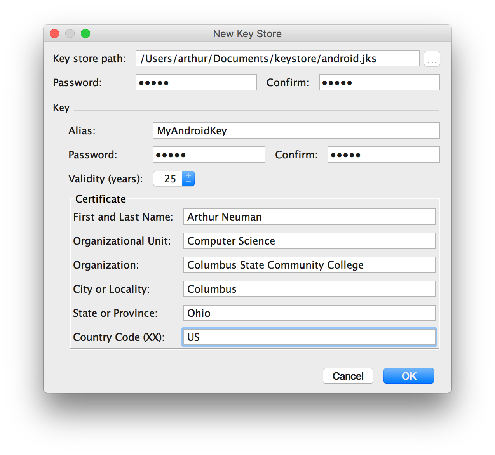

# Week 15 - App Distribution

## Corresponding Text
http://developer.android.com/distribute/tools/launch-checklist.html
https://developer.android.com/studio/publish/preparing.html

Once we've developed a working app, we'd like to be able to distribute it to 
other people.  Typically, this involves publishing the app to the Play store 
but we could also generate an APK (Android application package) to distribute 
without using the Play store.  

## Preparing for Release
### App Icon
Every app should have a unique icon that will allow users to quickly identify 
it among other applications in the launcher.  When choosing or creating icons, 
it's important to create icons for different display densities: hdpi, mdpi, 
xhdpi, xxhdpi, and xxxhdpi. 
[This tool](https://romannurik.github.io/AndroidAssetStudio/icons-launcher.html) 
can be used to create simple icons for the various diplay densities.  

Once you have icons, change the *Project* view in Android Studio to show the 
project structure (rather than the Android app structure).  In the 
`app/src/main/res` folder you will see several folders with names that start 
with `mipmap-`; these are the folders where the app icons should be stored.  


To ensure that the icons are used, make sure that the following appears in the 
app's manifest:

```xml
<?xml version="1.0" encoding="utf-8"?>
<manifest ...>
    <application 
        ...
        android:icon="@mipmap/ic_launcher"
        ...>
        ...
    </application>
</manifest>
```

### Logging
When preparing the app for release, we are required to disable logging and 
debugging in the release build.  To disable debugging, make sure 
`android:debuggable` doesn't appear as an attribute to the `<application>` tag 
in the manifest.

With regard to logging, we could remove uses of the *Log* class in our code.  
An alternative is to wrap calls to the log class in an if-statement like this:

```java
if (BuildConfig.DEBUG) {
    // Log code
}
```

This will prevent logging in any non-debug build. Note that the app must be 
run in debug mode in order to see the log messages. Be careful with this, 
however, as adding too many if-statements could impact performance if they are 
evaluated many times.  Restricting the use of logging to catch-blocks to 
log exception details and using an if-statement might be a good compromise.

### Generating a Signed APK
Android requires that every application be signed with a certificate that only 
the developer has the private key for - this servers to identify and verify the 
author of the application.  To create signing keys for the app, follow these 
steps: 

1. Select **Build -> Generate Signed APK...** from the menus.  
2. Select the default module and click **Next**.
3. Create a new Java keystore by clicking **Create new...**.
4. Chose a location and password for the new keystore and key. 
   Enter the information pictured below. Click **Next**.
5. Be sure that *release* is the selected *Build type* and click **Finish**.

This process will generate an APK in the `app` folder in your app's root 
directory.



## Distribution
Now that we have a signed APK, our next step should be to test the app - fixing 
any errors we encounter and repeating the release process.  Once we've tested 
the app thouroughly, we are ready to distribute the app.  The simplest way to 
distribute the app is by sending the APK via email or making it availalbe for 
download from a website.  Alternatively, we can publish the app in the Play 
store.

In order to publish the app, you'll need to create a publisher account and 
pay the registration fee at https://play.google.com/apps/publish/signup/.  Once 
registered, you'll be able to upload your APK and enter the details of your app 
that will be displayed in the play store. 

